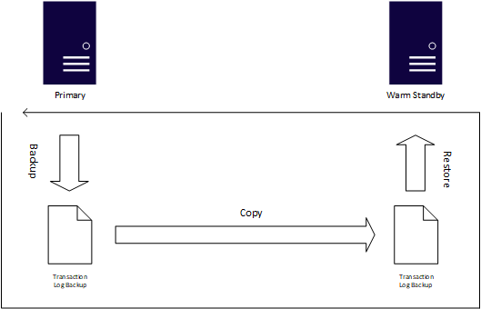
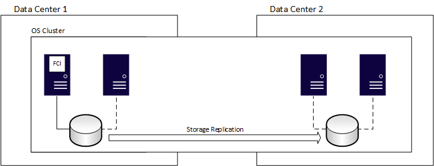
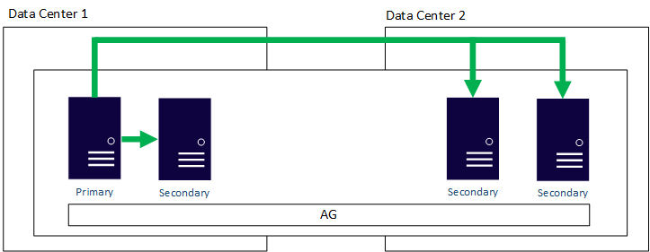
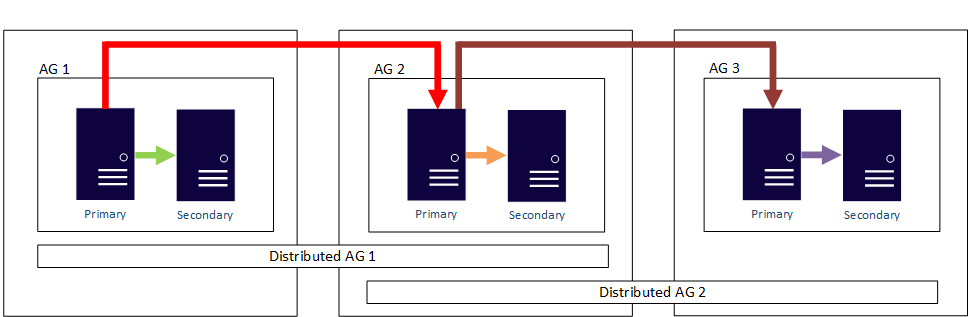
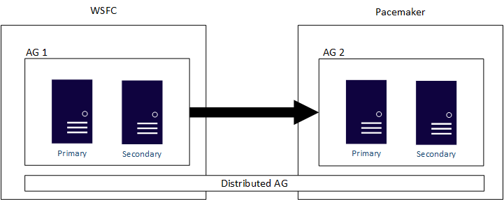
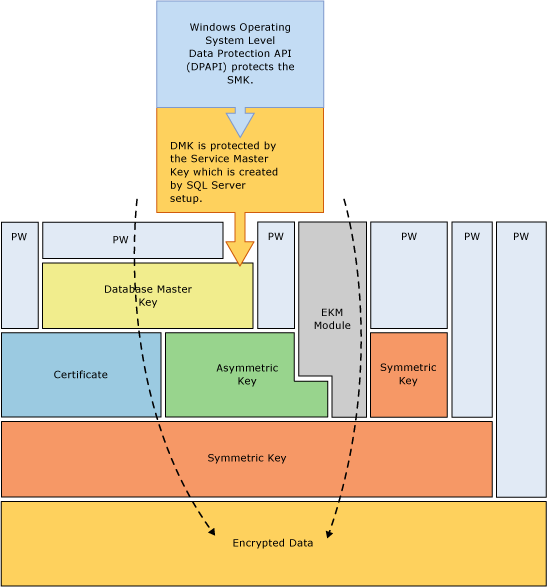
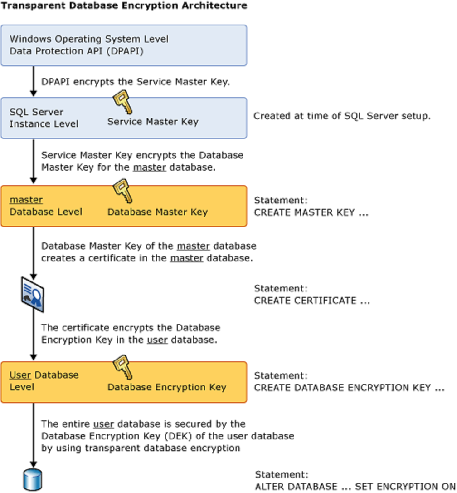

# Restoring databases

Generally:

- Database must be some files.
- Different databases probably are similarly structured files with
  different prefixes.
- Databases monitor/container probably have its configuration
  in separate files
  - it could have in database files in agreed location but then
    it would have to monitor and interpret those files every
    time
- sql can create database
- database can create sql


## MS exemplary databases

There are 2 databases:
- AdventureWorks (older) with few versions
  - normal: AdventureWorks (OLTP)
  - Data Warehouse: AdventureWorksDW
  - lightwaight: AdventureWorksLT
  - in memory: AdventureWorks-oltp-in-memory
- Wide World Importers (newer features architecture)


Databases can be installed by:
- running `.sql` soruce file (which uses `.csv` files). The
  resulting database will be compatible with installed SQL Server
  version
- database backup file (`.bak`). The resulting database will be
  (backward) compatible with SQL Server version from which
  backup was created.

With typical instalations databases content is instantiated
to new database (with name e.g. AdventureWorks).


## Using .bak files 

SQL Server `.bak` backup files are binary.
But it seems they have structure 


To fully restore database from backup file:
`~/programming/server/QandA/backend/data/AdventureWorksLT2019.bak`
than, connect to SQL Server using `sqlcmd` cli:

```sh
sqlcmd -S localhost -U SA -P 'tex78MM!!.kk'
```

And enter following t-sql:

```sql
USE [master]
GO
RESTORE DATABASE AdventureWorksLT2019
-- where binary backup file is?
FROM disk= '~/programming/server/QandA/backend/data/AdventureWorksLT2019.bak'
-- data page:
WITH MOVE 'AdventureWorksLT2019_data' 
TO '/var/opt/mssql/data/AdventureWorksLT2019.mdf',
-- logs page:
MOVE 'AdventureWorksLT2019_Log' 
TO '/var/opt/mssql/data/AdventureWorksLT2019.ldf'
-- dont warry about yesterday! :D
,REPLACE
GO
```


## Using T-SQL

Database can be described by SQL. To import database
one may construct some script. 
(example in `restore_script_scatch.sql`)


# Database Files and Filegroups

At a minimum, every SQL Server database has two operating system
files: 

- a data file containing data and objects such as:
  - tables, 
  - indexes, 
  - stored procedures, and 
  - views
- a log file, containing 
  - the information that is required to recover all transactions in
    the database

Data files can be grouped together in filegroups for allocation and
administration purposes.

SQL Server databases file types:

- **Primary** - Contains startup information for the database and
  points to the other files in the database. Every database has one
  primary data file. The recommended file name extension for primary
  data files is **.mdf**.
- **Secondary** - Optional user-defined data files. Data can be spread
  across multiple disks by putting each file on a different disk
  drive. The recommended file name extension for secondary data files
  is **.ndf**.
- **Transaction Log** - The log holds information used to recover the
  database. There must be at least one log file for each database. The
  recommended file name extension for transaction logs is **.ldf**.

## Multiple instances of SQL Server files folders

When multiple instances of SQL Server are running on a single
computer, each instance receives a different default directory to hold
the files for the databases created in the instance.

Exemple folders names:

- [Windows](https://docs.microsoft.com/en-us/sql/sql-server/install/file-locations-for-default-and-named-instances-of-sql-server?view=sql-server-ver15):
  - `C:\Program Files\Microsoft SQL Server\MSSQL{nn}.MyInstance\`
  - `C:\Program Files\Microsoft SQL Server\MSAS{nn}.MyInstance\`
- Ubuntu:
  - `/var/opt/mssql/data/`


## Data File Pages

Pages:

- Pages in a SQL Server data file are numbered sequentially, starting
  with zero (0) for the first page in the file. 
- Each file in a database has a unique file ID number. 
- To uniquely identify a page in a database, both 
  - the file ID and 
  - the page number are required. 
- A file header page is the first page that contains information about
  the attributes of the file.
- Several of the other pages at the start of the file also contain
  system information, such as allocation maps.
- One of the system pages stored in both the primary data file and the
  first log file is a database boot page that contains information
  about the attributes of the database.


Example hipotetical database has:

- 4-MB primary data file (ID 01), this means that:
  - it has 512 pages, 
  - first page can be identified by: 01:0000, 
  - last: 01:0511
- 1-MB secondary data file (ID 02), this means that:
  - it has 128 pages, 
  - first page can be identified by: 02:0000, 
  - last: 02:0127


## Filegroups

- The filegroup contains the primary data file and any secondary files
  that aren't put into other filegroups.
- User-defined filegroups can be created to group data files together
  for administrative, data allocation, and placement purposes.


Example:

- Data1.ndf, Data2.ndf, and Data3.ndf, can be created on three disk
  drives, respectively, and assigned to the filegroup fgroup1. 
- A table can then be created specifically on the filegroup fgroup1. 
- Queries for data from the table will be spread across the three
  disks; it will improve performance. 
- The same performance improvement can be accomplished by using a
  single file created on a RAID


All data files are stored in the filegroups listed below:

- **Primary** - The filegroup that contains the primary file. All system
  tables are part of the primary filegroup.
- **Memory Optimized Data** - A memory-optimized filegroup is based on
  filestream filegroup
  - To create memory-optimized tables, you must first create a memory-optimized filegroup. 
  - The memory-optimized filegroup holds one or more containers. 
    - Each container contains data files or delta files or both.
- **Filestream** - 
- **User-defined** - Any filegroup that is created by the user when the
  user first creates or later modifies the database.


**Default filegroup**:

- When objects are created in the database without specifying which
  filegroup they belong to, they are assigned to the default
  filegroup.
- At any time, exactly one filegroup is designated as the default
  filegroup. 


**The PRIMARY filegroup** is:

- the default filegroup 
  - unless it is changed by using the ALTER DATABASE statement. 
- Allocation for the system objects and tables remains within the
  PRIMARY filegroup, 
  - not the new default filegroup.


**The Memory Optimized Filegroup**:

- One can only create one memory-optimized filegroup per database. 
  ```sql
  ALTER DATABASE imoltp 
  ADD FILEGROUP imoltp_mod CONTAINS MEMORY_OPTIMIZED_DATA
  ```
- One need to add one or more containers to the MEMORY_OPTIMIZED_DATA
  filegroup.
  ```sql
  ALTER DATABASE imoltp 
  ADD FILE (name='imoltp_mod1', filename='c:\data\imoltp_mod1') 
  TO FILEGROUP imoltp_mod
  ```
- One can add new containers to a memory-optimized filegroup.
- Once you use a memory-optimized filegroup, you can only remove it by dropping the database.
- You cannot drop a non-empty container or move data and delta file pairs to another container in the memory-optimized filegroup.

## Filegroup database example

https://docs.microsoft.com/en-us/sql/relational-databases/databases/database-files-and-filegroups?view=sql-server-ver15

Example:

- Creates a database on an instance of SQL Server.
- The database has 
  - a primary data file (in the primary filegroup), 
  - a user-defined filegroup (with two secondary data files), and 
  - a log file.
- An ALTER DATABASE statement makes the user-defined filegroup the
  default.
- A table is then created specifying the user-defined filegroup.


```sql
USE master;
GO
-- Create the database with the default data
-- filegroup, filestream filegroup and a log file. Specify the
-- growth increment and the max size for the
-- primary data file.
CREATE DATABASE MyDB
ON PRIMARY
  ( NAME='MyDB_Primary',
    FILENAME=
       'c:\Program Files\Microsoft SQL Server\MSSQL.1\MSSQL\data\MyDB_Prm.mdf',
    SIZE=4MB,
    MAXSIZE=10MB,
    FILEGROWTH=1MB),
FILEGROUP MyDB_FG1
  ( NAME = 'MyDB_FG1_Dat1',
    FILENAME =
       'c:\Program Files\Microsoft SQL Server\MSSQL.1\MSSQL\data\MyDB_FG1_1.ndf',
    SIZE = 1MB,
    MAXSIZE=10MB,
    FILEGROWTH=1MB),
  ( NAME = 'MyDB_FG1_Dat2',
    FILENAME =
       'c:\Program Files\Microsoft SQL Server\MSSQL.1\MSSQL\data\MyDB_FG1_2.ndf',
    SIZE = 1MB,
    MAXSIZE=10MB,
    FILEGROWTH=1MB),
FILEGROUP FileStreamGroup1 CONTAINS FILESTREAM
  ( NAME = 'MyDB_FG_FS',
    FILENAME = 'c:\Data\filestream1')
LOG ON
  ( NAME='MyDB_log',
    FILENAME =
       'c:\Program Files\Microsoft SQL Server\MSSQL.1\MSSQL\data\MyDB.ldf',
    SIZE=1MB,
    MAXSIZE=10MB,
    FILEGROWTH=1MB);
GO

-- change user filegroup to default filegroup:
ALTER DATABASE MyDB 
  MODIFY FILEGROUP MyDB_FG1 DEFAULT;
GO

-- Create a table in the user-defined filegroup.
USE MyDB;
CREATE TABLE MyTable
  ( cola int PRIMARY KEY,
    colb char(8) )
ON MyDB_FG1;
GO

-- Create a table in the filestream filegroup
CREATE TABLE MyFSTable
(
	cola int PRIMARY KEY,
  colb VARBINARY(MAX) FILESTREAM NULL
)
GO
```

## File and Filegroup Fill Strategy

Filegroups use a proportional fill strategy across all the files
within each filegroup. As data is written to the filegroup,:

- the SQL Server Database Engine writes an amount proportional to the
  free space in the file to each file within the filegroup, instead of
  writing all the data to the first file until full. 
- It then writes to the next file.

## Rules for designing Files and Filegroups

The following rules pertain to files and filegroups:

- A file or filegroup cannot be used by more than one database. For
  example, file sales.mdf and sales.ndf, which contain data and
  objects from the sales database, can't be used by any other
  database.
- A file can be a member of only one filegroup.
- Transaction log files are never part of any filegroups.


## FILESTREAM

https://docs.microsoft.com/en-us/sql/relational-databases/blob/filestream-sql-server?view=sql-server-ver15#filestream-storage

FILESTREAM enables SQL Server-based applications to:
- store on the file system unstructured data (BLOBs) such as:
  - documents and 
  - images.
- API keeps transactional consistency between the unstructured data
  and corresponding structured data
- Applications can use streaming API
- FILESTREAM integrates the SQL Server Database Engine with an NTFS or
  ReFS file systems by storing varbinary(max) binary large object
  (BLOB) data as files on the file system.
- Transact-SQL statements can insert, update, query, search, and back
  up FILESTREAM data. 
- Win32 file system interfaces provide streaming access to the data.
- The SQL Server buffer pool is not used
- FILESTREAM is not automatically enabled when you install or upgrade
  SQL Server. You must enable FILESTREAM (sql-conf-cli ???)


FILESTREAM storage is implemented as a varbinary(max) column in which
the data is stored as BLOBs in the file system.

The standard varbinary(max) limitation is 2-GB file sizes. It can be
changed.

To specify that a column should store data on the file system, specify
the FILESTREAM attribute on a varbinary(max) column. This causes the
Database Engine to store all data for that column on the file system,
but not in the database file.

FILESTREAM data must be stored in FILESTREAM filegroups. A FILESTREAM
filegroup is a special filegroup that contains file system directories
instead of the files themselves. These file system directories are
called data containers. Data containers are the interface between
Database Engine storage and file system storage.

When you use FILESTREAM storage, consider the following:

- When a table contains a FILESTREAM column, each row must have a
  nonnull unique row ID.
- Multiple data containers can be added to a FILESTREAM filegroup.
- FILESTREAM data containers cannot be nested.
- When you are using failover clustering, the FILESTREAM filegroups
  must be on shared disk resources.
- FILESTREAM filegroups can be on compressed volumes.


**File System Streaming Access**:

- The Win32 streaming support works in the context of a SQL Server
  transaction. 
- Within a transaction, you can use FILESTREAM functions to obtain a
  logical UNC file system path of a file. 
- You then use the OpenSqlFilestream API to obtain a file handle. 
- This handle can then be used by Win32 file streaming interfaces to
  access and update the file by way of the file system: 
  - ReadFile() and 
  - WriteFile().

## Example of FILESTREAM USAGE

FILESTREAM column can be accesed by T-SQL:

```sql
-- https://docs.microsoft.com/en-us/sql/relational-databases/blob/create-a-filestream-enabled-database?view=sql-server-ver15
-- https://docs.microsoft.com/en-us/sql/relational-databases/blob/create-a-table-for-storing-filestream-data?view=sql-server-ver15
-- https://docs.microsoft.com/en-us/sql/relational-databases/blob/access-filestream-data-with-transact-sql?view=sql-server-ver15


-- **********************************
-- create FILESTREAM enabled database
-- **********************************

-- c:\data must exist. 
-- However, the filestream1 subfolder cannot exist

CREATE DATABASE Archive 
ON
PRIMARY ( NAME = Arch1,
    FILENAME = 'c:\data\archdat1.mdf'),
FILEGROUP FileStreamGroup1 CONTAINS FILESTREAM( NAME = Arch3,
    FILENAME = 'c:\data\filestream1')
LOG ON  ( NAME = Archlog1,
    FILENAME = 'c:\data\archlog1.ldf')
GO

-- !!!!!!!!!
-- In c:\Data\filestream1 folder additionally appears:
-- - filestream.hdr (header file for the FILESTREAM container)
-- - $FSLOG folder 

-- **********************************
-- create a table with FILESTREAM column
-- **********************************

-- The Id column is a ROWGUIDCOL column and 
-- is required to use FILESTREAM data with Win32 APIs.
CREATE TABLE Archive.dbo.Records
(
    [Id] [uniqueidentifier] ROWGUIDCOL NOT NULL UNIQUE, 
    [SerialNumber] INTEGER UNIQUE,
    [Chart] VARBINARY(MAX) FILESTREAM NULL
)
GO

-- **********************************
-- INSERT
-- **********************************
-- to insert NULL:
INSERT INTO Archive.dbo.Records
    VALUES (newid (), 1, NULL);
-- to insert Zero-Length Record:
INSERT INTO Archive.dbo.Records
    VALUES (newid (), 2, 
      CAST ('' as varbinary(max)));
-- Create a Data File:
-- - Engine converts the string to a varbinary(max). 
-- - FILESTREAM creates file if it does not already exist.
-- - The data is then added to the data file.
INSERT INTO Archive.dbo.Records
    VALUES (newid (), 3, 
      CAST ('Seismic Data' as varbinary(max)));
GO

-- **********************************
-- SELECT
-- **********************************
SELECT * FROM Archive.dbo.Records;
GO

/*
| Id                                   | SN | Chart        |
|--------------------------------------|----|--------------|
| C871B90F-D25E-47B3-A560-7CC0CA405DAC | 1  | NULL         |
| F8F5C314-0559-4927-8FA9-1535EE0BDF50 | 2  | 0x           |
| 7F680840-B7A4-45D4-8CD5-527C44D35B3F | 3  | 0x5365697... |
*/

-- **********************************
-- UPDATE
-- **********************************
-- replaces any text in the file record with the text Xray 1
UPDATE Archive.dbo.Records
SET [Chart] = CAST('Xray 1' as varbinary(max))
WHERE [SerialNumber] = 2;
GO

-- **********************************
-- DELATE
-- **********************************
/*
- When you delete a row that contains a FILESTREAM field, 
  you also delete its underlying file system files. 
- The only way to delete a row, and therefore the file, 
  is to use the Transact-SQL DELETE statement.
*/
-- delete a row and its associated file system files:
DELETE Archive.dbo.Records
WHERE SerialNumber = 1;
GO
```

Client apps can use Win32 APIs to read and write data to a FILESTREAM
BLOB. The following steps are required:
- Read the FILESTREAM file path.
- Read the current transaction context.
- Obtain a Win32 handle and use the handle to read and write data to
  the FILESTREAM BLOB.

```cs
// https://docs.microsoft.com/en-us/sql/relational-databases/blob/create-client-applications-for-filestream-data?view=sql-server-ver15
// https://docs.microsoft.com/en-us/sql/relational-databases/blob/access-filestream-data-with-opensqlfilestream?view=sql-server-ver15

using System.IO;
using System;
using System.Collections.Generic;
using System.Text;
using System.Data;
using System.Data.SqlClient;
using System.Data.SqlTypes;

namespace FILESTREAM {
class Program {
  static void Main(string[] args) {
    SqlConnection sqlConnection = new SqlConnection(
      "Integrated Security=true;server=(local)");

    SqlCommand sqlCommand = new SqlCommand();
    sqlCommand.Connection = sqlConnection;

    try {
      sqlConnection.Open();

      //The first task is to retrieve the file path
      //of the SQL FILESTREAM BLOB that we want to
      //access in the application.

      sqlCommand.CommandText =
          "SELECT Chart.PathName()"
        + " FROM Archive.dbo.Records"
        + " WHERE SerialNumber = 3";

      String filePath = null;

      Object pathObj = sqlCommand.ExecuteScalar();
      if (DBNull.Value != pathObj)
        filePath = (string)pathObj;
      else
      {
        throw new System.Exception(
          "Chart.PathName() failed"
          + " to read the path name "
          + " for the Chart column.");
      }

      //The next task is to obtain a transaction
      //context. All FILESTREAM BLOB operations
      //occur within a transaction context to
      //maintain data consistency.

      //All SQL FILESTREAM BLOB access must occur in 
      //a transaction. MARS-enabled connections
      //have specific rules for batch scoped transactions,
      //which the Transact-SQL BEGIN TRANSACTION statement
      //violates. To avoid this issue, client applications 
      //should use appropriate API facilities for transaction 
      //management, such as the SqlTransaction class.

      SqlTransaction transaction = sqlConnection
        .BeginTransaction("mainTranaction");
      sqlCommand.Transaction = transaction;

      sqlCommand.CommandText =
        "SELECT GET_FILESTREAM_TRANSACTION_CONTEXT()";

      Object obj = sqlCommand.ExecuteScalar();
      byte[] txContext = (byte[])obj;

      //The next step is to obtain a handle that
      //can be passed to the Win32 FILE APIs.

      SqlFileStream sqlFileStream = new SqlFileStream(
        filePath, txContext, FileAccess.ReadWrite);

      byte[] buffer = new byte[512];

      int numBytes = 0;

      //Write the string, "EKG data." to the FILESTREAM BLOB.
      //In your application this string would be replaced with
      //the binary data that you want to write.

      string someData = "EKG data.";
      Encoding unicode = Encoding.GetEncoding(0);

      sqlFileStream.Write(
        unicode.GetBytes(someData.ToCharArray()),
        0,
        someData.Length);

      //Read the data from the FILESTREAM
      //BLOB.

      sqlFileStream.Seek(0L, SeekOrigin.Begin);

      numBytes = sqlFileStream.Read(buffer, 0, buffer.Length);

      string readData = unicode.GetString(buffer);

      if (numBytes != 0)
        Console.WriteLine(readData);

      //Because reading and writing are finished, FILESTREAM 
      //must be closed. This closes the c# FileStream class, 
      //but does not necessarily close the underlying 
      //FILESTREAM handle. 
      sqlFileStream.Close();

      //The final step is to commit or roll back the read and write
      //operations that were performed on the FILESTREAM BLOB.

      sqlCommand.Transaction.Commit();
    }
    catch (System.Exception ex) {
      Console.WriteLine(ex.ToString());
    }
    finally {
      sqlConnection.Close();
    }
    return;
  }
}
}
```

## FileTables

FileTables: 

- allows to store files and documents 
- in special tables in SQL Server called FileTables,
- but access them from Windows applications as if they were stored in
  the file system, without making any changes to your client
  applications.
- The FileTable feature builds on top of SQL Server FILESTREAM
  technology.

The goals of the FileTable feature include the following:

- Windows API compatibility for file data stored within a SQL Server
  database. Windows API compatibility includes the following:
  - Non-transactional streaming access and in-place updates to
    FILESTREAM data.
  - A hierarchical namespace of directories and files.
  - Storage of file attributes, such as created date and modified
    date.
  - Support for Windows file and directory management APIs.
- Compatibility with other SQL Server features including management
  tools, services, and relational query capabilities over FILESTREAM
  and file attribute data.


Thus FileTables remove a significant barrier to the use of SQL Server
for the storage and management of unstructured data that is currently
residing as files on file servers. Enterprises can move this data from
file servers into FileTables to take advantage of integrated
administration and services provided by SQL Server. 

A FileTable provides the following functionality:

- A FileTable represents a hierarchy of directories and files. It
  stores data related to all the nodes in that hierarchy, for both
  directories and the files they contain. This hierarchy starts from a
  root directory that you specify when you create the FileTable.
- Every row in a FileTable represents a file or a directory.
- Every row contains the following items. 
  - A file_stream column for stream data and a stream_id (GUID)
    identifier. (The file_stream column is NULL for a directory.)
  - Both path_locator and parent_path_locator columns for representing
    and maintaining the current item (file or directory) and directory
    hierarchy.
  - 10 file attributes such as created date and modified date that are
    useful with file I/O APIs.
  - A type column that supports full-text search and semantic search
    over files and documents.
- A FileTable enforces certain system-defined constraints and triggers
  to maintain file namespace semantics.
- When the database is configured for non-transactional access, the
  file and directory hierarchy represented in the FileTable is exposed
  under the FILESTREAM share configured for the SQL Server instance.
  This provides file system access for Windows applications.

Some additional characteristics of FileTables include the following:

- The file and directory data stored in a FileTable is exposed through
  a Windows share for non-transactional file access for Windows API
  based applications. 
- The directory hierarchy surfaced through the share is a purely
  logical directory structure that is maintained within the FileTable.
- Calls to create or change a file or directory through the Windows
  share are intercepted by a SQL Server component and reflected in the
  corresponding relational data in the FileTable.
- Transactional access to FILESTREAM data stored in a FileTable is
  fully supported, as is the case for any FILESTREAM column in a
  regular table.
- You are unable to send an email request through dbmail and attach a
  file located in a filestream directory (and therefore filetable).

About FileTables and non-transactional access:

- You can enable or disable non-transactional access at the database
  level.
- You can configure or fine-tune non-transactional access at the
  database level by turning it off, or by enabling read only or full
  read/write access.

**FileTables Do Not Support Memory-Mapped Files.**


## FileTable example

Moore info at: 
https://docs.microsoft.com/en-us/sql/relational-databases/blob/enable-the-prerequisites-for-filetable?view=sql-server-ver15

and following doc pages.

```sql
-- https://docs.microsoft.com/en-us/sql/relational-databases/blob/enable-the-prerequisites-for-filetable?view=sql-server-ver15

-- check if non-transactional access is enabled
SELECT DB_NAME(database_id), non_transacted_access, non_transacted_access_desc  
    FROM sys.database_filestream_options;  
GO  
--View all objects for all filetables, unsorted  
SELECT * FROM sys.filetable_system_defined_objects;  
GO  
--View sorted list with friendly names  
SELECT OBJECT_NAME(parent_object_id) 
AS 'FileTable', OBJECT_NAME(object_id) 
AS 'System-defined Object'  
    FROM sys.filetable_system_defined_objects  
    ORDER BY FileTable, 'System-defined Object';  
GO

-- create database with Non-Transactional Access
-- Specify a directory for FileTables
CREATE DATABASE database_name  
  WITH FILESTREAM ( 
    NON_TRANSACTED_ACCESS = FULL, 
    DIRECTORY_NAME = N'directory_name' 
  )
GO

-- To view the list of existing directory names for the instance
SELECT DB_NAME ( database_id ), directory_name  
    FROM sys.database_filestream_options;  
GO

-- creates a new FileTable and specifies user-defined values for both
-- FILETABLE_DIRECTORY and FILETABLE_COLLATE_FILENAME.
CREATE TABLE DocumentStore AS FileTable  
    WITH (   
          FileTable_Directory = 'DocumentTable',  
          FileTable_Collate_Filename = database_default  
         );  
GO

-- To Change the Directory for a FileTable 
ALTER TABLE filetable_name  
    SET ( FILETABLE_DIRECTORY = N'directory_name' );  
GO


-- Migrating Files from the File System into a FileTable
/*
1. Create a new FileTable to hold the files. 
2. Use xcopy or a similar tool to copy the .jpg files, 
   with their directory structure, 
   into the root directory of the FileTable 
   ('\\RemoteShare\Photographs')
3. Fix the metadata in the PhotoMetadata table, 
   by using code similar to the following example:
*/
CREATE TABLE PhotoTable AS FileTable  
    WITH (   
          FileTable_Directory = 'DocumentTable',  
          FileTable_Collate_Filename = database_default  
         );  
GO
--  Add a path locator column to the PhotoMetadata table.  
ALTER TABLE PhotoMetadata ADD pathlocator hierarchyid;  
-- Get the root path of the Photo directory on the File Server.  
DECLARE @UNCPathRoot varchar(100) = '\\RemoteShare\Photographs';  
-- Get the root path of the FileTable.  
DECLARE @FileTableRoot varchar(1000);  
SELECT @FileTableRoot = FileTableRootPath('dbo.PhotoTable');  
-- Update the PhotoMetadata table.  
-- Replace the File Server UNC path with the FileTable path.  
UPDATE PhotoMetadata  
    SET UNCPath = REPLACE(UNCPath, @UNCPathRoot, @FileTableRoot);  
-- Update the pathlocator column to contain 
-- the pathlocator IDs from the FileTable.  
UPDATE PhotoMetadata  
    SET pathlocator = GetPathLocator(UNCPath);


-- Disable write access.  
ALTER DATABASE database_name  
SET FILESTREAM ( NON_TRANSACTED_ACCESS = READ_ONLY );  
GO  
  
-- Disable non-transactional access.  
ALTER DATABASE database_name  
SET FILESTREAM ( NON_TRANSACTED_ACCESS = OFF );  
GO  

-- re-enable full non-transactional access
ALTER DATABASE database_name  
SET FILESTREAM ( NON_TRANSACTED_ACCESS = FULL );  
GO
```


## Storage

https://docs.microsoft.com/en-us/sql/relational-databases/in-memory-oltp/comparing-disk-based-table-storage-to-memory-optimized-table-storage?view=sql-server-ver15

## Disk-Based Table Storage

- **DDL (Data Definition Language)** - Metadata information is stored
  in system tables in the primary filegroup of the database and is
  accessible through catalog views.
- **Structure** - Rows are stored in 8K pages. A page stores only rows
  from the same table. 
- Indexes - Indexes are stored in a page structure similar to data
  rows.
- **DML (data manipulation language)** operation: 
  - The first step is to find the page and then load it into
    buffer-pool.
  - **Insert** - SQL Server inserts the row on the page accounting for row
    ordering in case of clustered index.
  - **Delete** - SQL Server locates the row to be deleted on the page and
    marks it deleted.
  - **Update** - SQL Server locates the row on the page. The update is
    done in-place for non-key columns. Key-column update is done by a
    delete and insert operation. After the DML operation completes,
    the affected pages are flushed to disk as part of buffer pool
    policy, checkpoint or transaction commit for minimally-logged
    operations. Both read/write operations on pages leads to
    unnecessary I/O.
- **Data Fragmentation** - Data manipulation fragments data leading to
  partially filled pages and logically consecutive pages that are not
  contiguous on disk. This degrades data access performance and
  requires you to defragment data.


## Memory-Optimized Table Storage

- **DDL (data definition language)** - Metadata information is stored in
  system tables in the primary filegroup of the database and is
  accessible through catalog views.
- **Structure** - Rows are stored as individual rows. There is no page
  structure. Two consecutive rows in a data file can belong to
  different memory-optimized tables.
- **Indexes** - Only the index definition is persisted (not index rows).
  Indexes are maintained in-memory and are regenerated when the
  memory-optimized table is loaded into memory as part of restarting a
  database. Since index rows are not persisted, no logging is done for
  index changes.
- **DML (data manipulation language)** -    For memory-optimized tables,
  since the data resides in memory, the DML operations are done
  directly in memory. There is a background thread that reads the log
  records for memory-optimized tables and persist them into data and
  delta files. An update generates a new row version. But an update is
  logged as a delete followed by an insert.
- **Data Fragmentation** - Memory-optimized data is not stored in pages so
  there is no data fragmentation. However, as rows are updated and
  deleted, the data and delta files need to be compacted. This is done
  by a background MERGE thread based on a merge policy.


## Memory-Optimized Tables

https://docs.microsoft.com/en-us/sql/relational-databases/in-memory-oltp/durability-for-memory-optimized-tables?view=sql-server-ver15

In-Memory OLTP:

- provides full durability for memory-optimized tables. 
  - When a transaction that changed a memory-optimized table commits,
    SQL Server (as it does for disk-based tables), guarantees that the
    changes are permanent (will survive a database restart), provided
    the underlying storage is available. 
- All changes made to disk-based tables or durable memory-optimized
  tables are captured in one or more transaction log records. 
- When a transaction commits, SQL Server writes the log records
  associated with the transaction to disk before communicating to the
  application or user session that the transaction has committed.
- operations on memory-optimized tables are persisted in a set of data
  and delta files
  - The data and delta files are located in one or more containers
  - These containers are part of a memory-optimized filegroup.
  - Data is written to these files in a strictly sequential fashion
  - User transactions do not directly access data and delta files. All
    data reads and writes use in-memory data structures.
- A data file contains rows from one or more memory-optimized tables
  that were inserted by multiple transactions as part of INSERT or
  UPDATE operations.
- Once the data file is full, the rows inserted by new transactions
  are stored in another data file.
- When a row is deleted or updated, the row is not removed or changed
  in-place in the data file but the deleted rows are tracked in
  another type of file: **the delta file**.
- Update operations are processed as a tuple of delete and insert
  operations for each row.
- Each data file is sized approximately to:
  - 128MB for computers with memory greater than 16GB, and 
  - 16MB for computers with less than or equal to 16GB. 
  - In SQL Server 2016 (13.x) SQL Server can use large checkpoint mode
    if it deems the storage subsystem is fast enough. 
  - In large checkpoint mode, data files are sized at 1GB.
- Each data file is paired with a delta file that has the same
  transaction range and tracks the deleted rows inserted by
  transactions in the transaction range.
- This data and delta file is referred to as a Checkpoint File Pair
  (CFP) and it is the unit of allocation and deallocation as well as
  the unit for Merge operations.
- When a row is deleted, the row is not removed from the data file but
  a reference to the row is appended to the delta file associated with
  the transaction range where this data row was inserted.
- Each delta file is sized approximately to:
  - 16MB for computers with memory greater than 16GB, and 
  - 1MB for computers with less than or equal to 16GB. 
  - Starting SQL Server 2016 (13.x) SQL Server can use large
    checkpoint mode if it deems the storage subsystem is fast enough. 
  - In large checkpoint mode, delta files are sized at 128MB.
- A checkpoint needs to occur periodically for memory-optimized data
  in data and delta files to advance the active part of transaction
  log. The checkpoint allows memory-optimized tables to restore or
  recover to the last successful checkpoint and then the active
  portion of transaction log is applied to update the memory-optimized
  tables to complete the recovery. 


# Availability

https://docs.microsoft.com/en-us/sql/database-engine/sql-server-business-continuity-dr?view=sql-server-ver15

Always On Availability Groups (availability groups) provide
database-level protection by sending each transaction of a database to
another instance, known as a replica, that contains a copy of that
database in a special state.


The instances participating in an availability group can be either
standalone or Always On Failover Cluster Instances (FCIs)


An availability group has one fully read/write copy of the database
which is on the primary replica, while all secondary replicas cannot
receive transactions directly from end users or applications.


Because availability groups only provide database-level, and not
instance-level, protection, anything not captured in the transaction
log or configured in the database will need to manually synchronized
for each secondary replica. Some examples of objects that must be
synchronized manually are:

- logins at the instance level, 
- linked servers, and 
- SQL Server Agent jobs.

An availability group also has another component called the listener,
which allows applications and end users to connect without needing to
know which SQL Server instance is hosting the primary replica.

This can be put on cluster, e.g. Windows Server Failover Cluster (WSFC).
An underlying cluster at the OS layer is required for availability
whether it is on Linux or Windows Server.

An availability group 
- in Standard Edition, known as a Basic Availability Group, 
  - supports two replicas (one primary and one secondary) 
  - with only a single database in the availability group. 
- Enterprise Edition 
  - not only allows multiple databases to be configured in a single
    availability group, but also 
  - can have up to nine total replicas (one primary, eight secondary).
    
  - Enterprise edition also provides other optional benefits such as
    readable secondary replicas, the ability to make backups off of a
    secondary replica, and more.

Linux uses Pacemaker cluster solution. To support Pacemaker for both
availability group and FCI configurations including things like
automatic failover, Microsoft provides the mssql-server-ha package,
which is similar to, but not exactly the same as, the resource DLLs in
a WSFC (Windows Server Failover Cluster), for Pacemaker. One of the
differences between a WSFC and Pacemaker is that there is no network
name resource in Pacemaker, which is the component that helps to
abstract the name of the listener (or the name of the FCI) on a WSFC.
DNS provides that name resolution on Linux.

## Cluster types configuration paths

Because of the difference in the cluster stack, some changes needed to
be made for availability groups because SQL Server has to handle some
of the metadata that is natively handled by a WSFC. The most
[!IMPORTANT] change is the introduction of a cluster type for an
availability group. This is stored in sys.availability_groups in the
cluster_type and cluster_type_desc columns. There are three cluster
types:

- WSFC
- External
- None

All availability groups that require availability must use an
underlying cluster, which in the case of SQL Server 2017 means a WSFC
or Pacemaker. For Windows Server-based availability groups that use an
underlying WSFC, the default cluster type is WSFC and does not need to
be set. For Linux-based availability groups, when creating the
availability group, the cluster type must be set to External. The
integration with Pacemaker is configured after the availability group
is created, whereas on a WSFC, it is done at creation time.

A cluster type of None can be used with both Windows Server and Linux
availability groups. Setting the cluster type to None means that the
availability group does not require an underlying cluster.

For those who are only looking to just add additional read only copies
of a database, or like what an availability group provides for
migration/upgrades but do not want to be tied to the additional
complexity of an underlying cluster or even the replication, an
availability group with a cluster type of None is a perfect solution. 


## Log shipping

If recovery point and recovery time objectives are more flexible, or
databases are not considered to be highly mission critical, log
shipping is another proven availability feature in SQL Server. Based
on SQL Server's native backups, the process for log shipping
automatically generates transaction log backups, copies them to one or
more instances known as a warm standby, and automatically applies the
transaction log backups to that standby. Log shipping uses SQL Server
Agent jobs to automate the process of backing up, copying, and
applying the transaction log backups.




While log shipping is easy to configure, switching from the primary to
a warm standby, known as a role change, is always manual.

A role change is initiated via Transact-SQL, and like an availability
group, all objects not captured in the transaction log must be
manually synchronized.


## Failover Cluster Instances (FCIs)

FCIs can be used for disaster recovery. As with a normal availability
group, the underlying cluster mechanism must also be extended to all
locations which adds complexity. There is an additional consideration
for FCIs: the shared storage. The same disks need to be available in
the primary and secondary sites, so an external method such as
functionality provided by the storage vendor at the hardware layer or
using storage Replica in Windows Server, is required to ensure that
the disks used by the FCI exist elsewhere.




## Availability groups

One of the benefits of availability groups is that both high
availability and disaster recovery can be configured using a single
feature. Without the requirement for ensuring that shared storage is
also highly available, it is much easier to have replicas that are
local in one data center for high availability, and remote ones in
other data centers for disaster recovery each with separate storage.




## Distributed availability groups

Outside of an availability group with a cluster type of none, an
availability group requires that all replicas are part of the same
underlying cluster whether it is a WSFC or Pacemaker. This means that
in the picture above, the WSFC is stretched to work in two different
data centers which adds complexity. regardless of the platform
(Windows Server or Linux). Stretching clusters across distance adds
complexity.

But one may use **distributed availability group**.




Distributed AGs are also another method to migrate to a new
configuration or upgrade SQL Server. Because a distributed AG supports
different underlying AGs on different architectures, for example, you
could change from SQL Server 2016 running on Windows Server 2012 R2 to
SQL Server 2017 running on Windows Server 2016.





If an availability group is configured with a cluster type of None, it
can span Windows Server and Linux as well as multiple Linux
distributions. Since this is not a true high availability
configuration, it should not be used for mission critical deployments,
but for read-scale or migration/upgrade scenarios.

## read-scale

Since their introduction in SQL Server 2012, secondary replicas have
had the ability to be used for read-only queries. There are two ways
that can be achieved with an availability group: by allowing direct
access to the secondary as well as configuring read only routing which
requires the use of the listener.

SQL Server 2016 introduced the ability to load balance read-only
connections via the listener using a round robin algorithm, allowing
read-only requests to be spread across all readable replicas.
(Readable secondary replicas is a feature only in Enterprise Edition,
and each instance hosting a readable replica would need a SQL Server
license.)

Scaling readable copies of a database via availability groups was
first introduced with distributed availability groups in SQL Server
2016. This would allow companies to have read-only copies of the
database not only locally, but regionally and globally.

Each primary replica of an availability group can seed two other
availability groups even if it is not the fully read/write copy, so
each distributed availability group can support up to 27 copies of the
data that are readable.

Starting with SQL Server 2017, It is possible to create a near-real
time, read-only solution with availability groups configured with a
cluster type of None. If the goal is to use availability groups for
readable secondary replicas and not availability, doing this removes
the complexity of using a WSFC or Pacemaker, and gives the readable
benefits of an availability group in a simpler deployment method.


# Backup and restore example

https://docs.microsoft.com/en-us/sql/relational-databases/backup-restore/quickstart-backup-restore-database?view=sql-server-ver15

https://docs.microsoft.com/en-us/sql/relational-databases/backup-restore/create-an-encrypted-backup?view=sql-server-ver15


At the oryginal SQL Server instance:

```sql
-- **************************************
-- create and populate database
-- **************************************

USE [master]
GO

-- create database on master namespace
CREATE DATABASE [SQLTestDB]
GO

-- switch to created database namespace
USE [SQLTestDB]
GO
-- create exemplary table
CREATE TABLE SQLTest (
  ID INT NOT NULL PRIMARY KEY,
  c1 VARCHAR(100) NOT NULL,
  dt1 DATETIME NOT NULL DEFAULT getdate()
)
GO

-- switch to created database namespace
USE [SQLTestDB]
GO

-- insert some data..
INSERT INTO SQLTest (ID, c1) VALUES (1, 'test1')
INSERT INTO SQLTest (ID, c1) VALUES (2, 'test2')
INSERT INTO SQLTest (ID, c1) VALUES (3, 'test3')
INSERT INTO SQLTest (ID, c1) VALUES (4, 'test4')
INSERT INTO SQLTest (ID, c1) VALUES (5, 'test5')
GO

-- check if result is as expected
SELECT * FROM SQLTest
GO

-- **************************************
-- create a database master key and a certificate 
-- within the master database
-- **************************************

USE [master]
GO

/*
Create the master key:
- The database master key is a symmetric key
- It is used to protect the private keys of certificates
- It is used to protectasymmetric keys that are present in the database
- When it is created, the master key is encrypted by using the 
  AES_256 algorithm and a user-supplied password.

To enable the automatic decryption of the master key:
- copy of the key is encrypted by using the service master key
- stored in both the database and in master
- Typically, the copy stored in master is silently updated 
  whenever the master key is changed.
- A master key that is not encrypted by the service master key 
  must be opened by using the OPEN MASTER KEY statement and a password.


Info:
- The is_master_key_encrypted_by_server column of the sys.databases 
  catalog view in master indicates whether the database master key 
  is encrypted by the service master key.
- Information about the database master key is visible in the 
  sys.symmetric_keys catalog view.

https://docs.microsoft.com/en-us/sql/t-sql/statements/create-master-key-transact-sql?view=sql-server-ver15

Master key properties:
- the master key is typically protected by the service master key 
  and at least one password
- In case of the database being physically moved to a different server 
  (log shipping, restoring backup, etc.), the database will:
  - contain a copy of the master key encrypted by 
    the original server service master key
  - and a copy of it encrypted by each password specified during either 
    CREATE MASTER KEY or subsequent ALTER MASTER KEY DDL operations
- In order to recover the master key, and all the data encrypted using 
  the master key as the root in the key hierarchy after the database 
  has been moved, the user will have either use:
  - OPEN MASTER KEY statement using **one of the passwords** 
    used to protect the master key (old pass should work)
  - restore a backup of the master key (get master from file)
  - or restore a backup of the original **service** master key on the new server
    (BACKUP SERVICE MASTER KEY whan backing up, and RESTORE SERVICE MASTER KEY 
    at new server) (get service master from file)

*/

-- CREATE MASTER KEY creates a database master key in the master database.
-- (same master key is encrypted with possibly different passwords
-- so if provided password matches one of erlier created, master key can
-- be obtained..)
CREATE MASTER KEY ENCRYPTION BY PASSWORD = '23987hxJ#KL95234nl0zBe';  

-- If the master key already exists, 
-- open it in the same session that you create the certificate (see next step)
OPEN MASTER KEY DECRYPTION BY PASSWORD = '23987hxJ#KL95234nl0zBe'

-- The master key must be open and, 
-- therefore, decrypted before it is backed up. 
-- It is recommended to back up the master key as soon as it is created
BACKUP MASTER KEY TO FILE = '/var/opt/mssql/Backup/MyTestDBBackupMasterKey.key'   
    ENCRYPTION BY PASSWORD = 'sd092735kjnadsg';  
GO   

-- Create the certificate encrypted by the master key
-- it is a self-signed certificate
CREATE CERTIFICATE MyTestDBBackupEncryptCert
WITH SUBJECT = 'Backup Cert', EXPIRY_DATE = '20201031';

-- Backup cert:
BACKUP CERTIFICATE MyTestDBBackupEncryptCert
TO FILE = '/var/opt/mssql/Backup/MyTestDBBackupEncryptCert.cer'
WITH PRIVATE KEY
(
    FILE = '/var/opt/mssql/Backup/MyTestDBBackupEncryptCert.key'
   ,ENCRYPTION BY PASSWORD = '997jkhUbhkw4ez0876hKHJH5gh'
);

-- to create certificate with custom private key:
-- CREATE CERTIFICATE Shipping11   
--     FROM FILE = 'c:\Shipping\Certs\Shipping11.cer'   
--     WITH PRIVATE KEY (FILE = 'c:\Shipping\Certs\Shipping11.pvk',   
--     DECRYPTION BY PASSWORD = 'sldkflk34et6gs%53#v00');  
-- GO   
-- Creating a certificate from a signed executable file:
-- CREATE CERTIFICATE Shipping19   
--     FROM EXECUTABLE FILE = 'c:\Shipping\Certs\Shipping19.dll';  
-- GO
-- Alternatively
-- CREATE ASSEMBLY Shipping19   
--     FROM ' c:\Shipping\Certs\Shipping19.dll'   
--     WITH PERMISSION_SET = SAFE;  
-- GO  
-- CREATE CERTIFICATE Shipping19 FROM ASSEMBLY Shipping19;  
-- GO

-- **************************************
-- time for backup
-- **************************************

BACKUP DATABASE [SQLTestDB] 
TO DISK = N'/var/opt/mssql/Backup/SQLTestDB.bak' 
WITH 
  NAME = N'SQLTestDB-Full Database Backup', -- name of the backup set
  NOFORMAT, -- preserves the existing media header and backup sets
  NOINIT,   -- append to the most recent backup set on the media
  SKIP,     -- check the expiration date of all backup sets on the media 
            -- before allowing them to be overwritten
  NOREWIND, -- dont revind tape after operation
            -- does not apply for non tape TO targets
  NOUNLOAD, -- tape remains loaded on the tape drive
  -- ENCRYPTION   -- enable encryption!!!
  --   (  
  --   ALGORITHM = AES_256,  
  --   SERVER CERTIFICATE = MyTestDBBackupEncryptCert  
  --   ),
  -- COPY_ONLY, -- backup independent of other backups
  STATS = 10 -- show progress every 10 percent
GO

```


And at possibly new instance of SQL Server
(https://dba.stackexchange.com/questions/149776/restoring-encrypted-database-on-another-server-using-backup-encryption/149797)


```sql
-- **************************************
-- create master key if not created
-- (possibly altering it to old master key
-- if working in different SQL Serv instance)
-- **************************************

USE MASTER;
GO

CREATE MASTER KEY
ENCRYPTION BY PASSWORD = 'MasterKey_Password';
GO 

-- **************************************
-- restore certificate
-- **************************************

USE MASTER;
GO
-- restore certificate from the backup taken 
-- (this does not need opened master key)
CREATE CERTIFICATE MyTestDBBackupEncryptCert
    FROM FILE = '/var/opt/mssql/Backup/MyTestDBBackupEncryptCert.cer'
     WITH PRIVATE KEY 
      ( 
        FILE = '/var/opt/mssql/Backup/MyTestDBBackupEncryptCert.key' ,
        DECRYPTION BY PASSWORD = '997jkhUbhkw4ez0876hKHJH5gh'
      ) 

-- **************************************
-- restore old master key and alter new
-- **************************************

USE MASTER;
GO

RESTORE MASTER KEY
FROM FILE = '/var/opt/mssql/Backup/MyTestDBBackupMasterKey.key'
DECRYPTION BY PASSWORD = 'sd092735kjnadsg'
ENCRYPTION BY PASSWORD = 'sd092735kjnadsg';

OPEN MASTER KEY DECRYPTION BY PASSWORD = '23987hxJ#KL95234nl0zBe'

-- **************************************
-- time for restore DB
-- **************************************

-- without encryption
-- or encrypted by certyficate
-- (but than certificate should be loaded)
USE [master]
RESTORE DATABASE [SQLTestDB] 
FROM DISK = N'/var/opt/mssql/Backup/SQLTestDB.bak' 
WITH  FILE = 1,  NOUNLOAD,  STATS = 5
GO


-- encrypted by old master key
-- (this requires erlier altering master key
-- if working on different instance)


-- **************************************
-- cleanup (drop exemplary database)
-- **************************************

-- remove backup history in the MSDB database:
EXEC msdb.dbo.sp_delete_database_backuphistory @database_name = N'SQLTestDB'
GO

-- drop database
USE [master]
DROP DATABASE [SQLTestDB]
GO
```


# Encryption Hierarchy

https://docs.microsoft.com/en-us/sql/relational-databases/security/encryption/encryption-hierarchy?view=sql-server-ver15

The following illustration shows that each layer of the encryption
hierarchy encrypts the layer beneath it, and displays the most common
encryption configurations. The access to the start of the hierarchy is
usually protected by a password.

Legend:
- PW - password
- DMK - database master key
- SMK - Service Master Key (created by MSSQL Server setup)



Important:

- For best performance, encrypt data using symmetric keys instead of
  certificates or asymmetric keys.
- Database master keys are protected by the Service Master Key. The
  Service Master Key is created by SQL Server setup and is encrypted
  with the Windows Data Protection API (DPAPI).
- Other encryption hierarchies stacking additional layers are
  possible.
- An Extensible Key Management (EKM) module holds symmetric or
  asymmetric keys outside of SQL Server.
- Transparent Data Encryption (TDE) must use a symmetric key called
  the database encryption key which is protected by either a
  certificate protected by the database master key of the master
  database, or by an asymmetric key stored in an EKM.
- The Service Master Key and all Database Master Keys are symmetric
  keys.


SQL Server provides the following mechanisms for encryption:

- Transact-SQL functions
- Asymmetric keys
- Symmetric keys
- Certificates
- Transparent Data Encryption


# Media Sets, Media Families, and Backup Sets

https://docs.microsoft.com/en-us/sql/relational-databases/backup-restore/media-sets-media-families-and-backup-sets-sql-server?view=sql-server-ver15

Terms:

- **media set** - An ordered collection of backup media, tapes or disk
  files, to which one or more backup operations have written using a
  fixed type and number of backup devices.
- **media family** - Backups created on a single nonmirrored device or
  a set of mirrored devices in a media set
- **backup set** - The backup content that is added to a media set by
  a successful backup operation.


**Example**: Backup devices associated with a media set might be
three tape drives named `\\.\TAPE0`, `\\.\TAPE1`, and `\\.\TAPE2`:

- That media set contains only tapes, starting with a minimum of three
  tapes (one per drive)
- The type and number of backup devices are established when a media
  set is created, and they cannot be changed
- if necessary, between backup and restore operations a given device
  can be replaced with a device of the same type


## Media set

Media set:

- A media set is created on the backup media during a backup operation
  by formatting the backup media.
- After formatting, each file or tape contains a media header for the
  media set and is ready to receive backup content.
- With the header in place, the backup operation proceeds to back up
  the specified data to the backup media on all of the backup devices
  specified for the operation.
- Media sets can be mirrored to protect against a damaged media volume
  (a tape or disk file).
- Compressed and uncompressed backups cannot occur together in a media
  set.


## Media Families

https://docs.microsoft.com/en-us/sql/t-sql/statements/backup-transact-sql?view=sql-server-ver15#media-families-in-mirrored-media-sets


A **stripe set** is a set of disk files on which:
- data is divided into blocks and 
- distributed in a fixed order. 

The number of backup devices used in a stripe set must stay the same
(unless the media is reinitialized with FORMAT).

The following example writes a backup of the AdventureWorks2012
database to a new striped media set that uses three disk files.

(Each backup device specified in the TO clause of a BACKUP statement
corresponds to a media family. For example, if the TO clauses lists
three devices, BACKUP writes data to three media families.)


```sql
-- first backup (format devices (=files) to allow creation of media set)
BACKUP DATABASE AW2012
TO 
  DISK='X:\Backups\AW1.bak', -- media fam 1, 1/3 back cont 1 |
  DISK='Y:\Backups\AW2.bak', -- media fam 2, 1/3 back cont 1 |- media set 1
  DISK='Z:\Backups\AW3.bak'  -- media fam 3, 1/3 back cont 1 |  backup set 1
WITH 
  FORMAT, -- this creates media set!!
  MEDIANAME = 'AWStripedSet',
  MEDIADESCRIPTION = 'Striped media set for AdventureWorks2012 database';
GO

-- some operations....


-- next backup !!!
BACKUP DATABASE AW2012
TO 
  DISK='X:\Backups\AW1.bak', -- media fam 1, 1/3 back cont 2 |
  DISK='Y:\Backups\AW2.bak', -- media fam 2, 1/3 back cont 2 |- media set 1
  DISK='Z:\Backups\AW3.bak'  -- media fam 3, 1/3 back cont 2 |  backup set 2
WITH 
  NOINIT, -- media set created, just append!!!!
  MEDIANAME = 'AWStripedSet',
GO
```


The following example: 
- writes to a mirrored media set that contains:
  - two mirrors and 
    - uses three devices per mirror

```sql
BACKUP DATABASE AW2012
TO 
  DISK='X:\Backups\AW1a.bak', -- media fam 1, 1/3 back cont 2 |
  DISK='Y:\Backups\AW2a.bak', -- media fam 2, 1/3 back cont 2 |- media set 1
  DISK='Z:\Backups\AW3a.bak'  -- media fam 3, 1/3 back cont 2 |  backup set 1
MIRROR TO 
  DISK='X:\Backups\AW1b.bak', -- media fam 1 |
  DISK='Y:\Backups\AW2b.bak', -- media fam 2 |- mirror media set 1
  DISK='Z:\Backups\AW3b.bak'; -- media fam 3 |  mirror backup set 1
WITH
  FORMAT, -- format storage device (file)
  MEDIANAME = 'AWMirrorSet';
GO

-- some ops...

-- next backup
BACKUP DATABASE AW2012
TO 
  DISK='X:\Backups\AW1a.bak', -- media fam 1, 1/3 back cont 2 |
  DISK='Y:\Backups\AW2a.bak', -- media fam 2, 1/3 back cont 2 |- media set 1
  DISK='Z:\Backups\AW3a.bak'  -- media fam 3, 1/3 back cont 2 |  backup set 2
MIRROR TO 
  DISK='X:\Backups\AW1b.bak', -- media fam 1 |
  DISK='Y:\Backups\AW2b.bak', -- media fam 2 |- mirror media set 1
  DISK='Z:\Backups\AW3b.bak'; -- media fam 3 |  mirror backup set 2
WITH
  NOINIT, -- append to storage device (file)
  MEDIANAME = 'AWMirrorSet';
GO
```

A media family must always be backed up onto the same device within a
specific mirror. Therefore, each time you use an existing media set,
list the devices of each mirror in the same order as they were
specified when the media set was created.

# Backup and Restore History Tables

https://docs.microsoft.com/en-us/sql/relational-databases/backup-restore/backup-history-and-header-information-sql-server?view=sql-server-ver15

The history tables that store backup and restore metadata in the **msdb**
system database:

- **backupfile** - Contains one row for each data or log file that is
  backed up.
- **backupfilegroup** - Contains a row for each filegroup in a backup
  set.
- **backupmediafamily** - Contains one row for each media family. If a
  media family resides in a mirrored media set, the family has a
  separate row for each mirror in the media set 
- **backupmediaset** - Contains one row for each backup media set.
- **backupset** - Contains a row for each backup set.
- **restorefile** - Contains one row for each restored file. This
  includes files restored indirectly by filegroup name.
- **restorefilegroup** - Contains one row for each restored filegroup.
- **restorehistory** - Contains one row for each restore operation.


# Backup media errors

https://docs.microsoft.com/en-us/sql/relational-databases/backup-restore/possible-media-errors-during-backup-and-restore-sql-server?view=sql-server-ver15

An important new error-detection mechanism is the optional creation of
a backup checksum that can be created by a backup operation and
validated by a restore operation. You can control whether an operation
checks for errors and whether the operation stops or continues on
encountering an error. If a backup contains a backup checksum, RESTORE
and RESTORE VERIFYONLY statements can check for errors.

## Backup Checksums

SQL Server supports three types of checksums: 

- a checksum on pages, 
- a checksum in log blocks, and 
- a backup checksum. When generating a backup checksum, BACKUP
  verifies that
  - the data read from the database is consistent with any checksum or
    torn-page indication that is present in the database.


Properties:

- The BACKUP statement optionally computes a backup checksum on the
  backup stream; if page-checksum or torn-page information is present
  on a given page, when backing up the page, BACKUP also verifies the
  checksum and torn-page status and the page ID, of the page. 
- When creating a backup checksum, a backup operation does not add any
  checksums to pages. Pages are backed up as they exist in the
  database, and the pages are unmodified by backup.
- Due to the overhead verifying and generating backup checksums, using
  backup checksums poses a potential performance impact. 
- BACKUP never modifies the source page on disk nor the contents of a
  page.


## Checksum backup/restore example

```sql
BACKUP DATABASE AdventureWorks2012   
 TO DISK = 'Z:\SQLServerBackups\AdvWorksData.bak'  
   WITH CHECKSUM;  
GO

RESTORE DATABASE AdventureWorks2012   
 FROM DISK = 'Z:\SQLServerBackups\AdvWorksData.bak'  
   WITH CHECKSUM;  
GO
```

# system databases

https://docs.microsoft.com/en-us/sql/relational-databases/backup-restore/back-up-and-restore-of-system-databases-sql-server?view=sql-server-ver15

system databases properties:

- SQL Server maintains a set of system-level databases, system
  databases, which are essential for the operation of a server
  instance. 
- Several of the system databases must be backed up after every
  significant update. 
- The system databases that you must always back up include **msdb**,
  **master**, and **model**.
- If any database uses replication on the server instance, there is a
  distribution system database that you must also back up. 
- Backups of these system databases let you restore and recover the
  SQL Server system in the event of system failure, such as the loss
  of a hard disk.


System databases list:

- **master** - The database that records all of the system level
  information for a SQL Server system.
  - Back up master as often as necessary to protect the data
    sufficiently for your business needs. We recommend a regular
    backup schedule, which you can supplement with an additional
    backup after a substantial update.
  - Recovery model is simple
- **model** - The template for all databases that are created on the
  instance of SQL Server.
  - Back up model only when necessary for your business needs; for
    example, immediately after customizing its database options.
  - Recovery model is user configurable
- **msdb** - The database used by SQL Server Agent for scheduling
  alerts and jobs, and for recording operators. msdb also contains
  history tables such as the backup and restore history tables.
  - Back up msdb whenever it is updated
  - Recovery model is simple
- **Resource (RDB)** - A read-only database that contains copies of
  all system objects that ship with SQL Server
  - The Resource database resides in the mssqlsystemresource.mdf file,
    which contains only code. Therefore, SQL Server cannot back up the
    Resource database
  - No backup/restore
- **tempdb** - A workspace for holding temporary or intermediate
  result sets. This database is re-created every time an instance of
  SQL Server is started. When the server instance is shut down, any
  data in tempdb is deleted permanently.
  - Recovery model is simple
  - No restore
- **Configure Distribution** - A database that exists only if the
  server is configured as a replication Distributor. This database
  stores metadata and history data for all types of replication, and
  transactions for transactional replication.
  - Recovery model is simple


# Restore and recovery

https://docs.microsoft.com/en-us/sql/relational-databases/backup-restore/restore-and-recovery-overview-sql-server?view=sql-server-ver15

## Steps to restore a database

Regardless of how data is restored, before a database can be
recovered, the SQL Server Database Engine guarantees that the whole
database is logically consistent.


To perform a file restore, the Database Engine executes two steps:

- Creates any missing database file(s).
- Copies the data from the backup devices to the database file(s).


To perform a database restore, the Database Engine executes three steps:

- Creates the database and transaction log files if they do not
  already exist.
- Copies all the data, log, and index pages from the backup media of a
  database to the database files.
- Applies the transaction log in what is known as the recovery
  process.

## Recovery process

For most restore scenarios, it is necessary to apply a transaction log
backup and allow the SQL Server Database Engine to run the recovery
process for the database to be brought online. 

In case of a failover or other non-clean shut down, the databases may
be left in a state where some modifications were never written from
the buffer cache to the data files, and there may be some
modifications from incomplete transactions in the data files. When an
instance of SQL Server is started, it runs a recovery of each
database, which consists of three phases, based on the last database
checkpoint:


- **Analysis Phase** analyzes the transaction log to determine what is the
  last checkpoint, and creates the Dirty Page Table (DPT) and the
  Active Transaction Table (ATT). The DPT contains records of pages
  that were dirty at the time the database was shut down. The ATT
  contains records of transactions that were active at the time the
  database was not cleanly shut down.

- **Redo Phase** rolls forwards every modification recorded in the log
  that may not have been written to the data files at the time the
  database was shut down. The minimum log sequence number (minLSN)
  required for a successful database-wide recovery is found in the
  DPT, and marks the start of the redo operations needed on all dirty
  pages. At this phase, the SQL Server Database Engine writes to disk
  all dirty pages belonging to committed transactions.

- **Undo Phase** rolls back incomplete transactions found in the ATT to
  make sure the integrity of the database is preserved. After
  rollback, the database goes online, and no more transaction log
  backups can be applied to the database.


Information about the progress of each database recovery stage is
logged in the SQL Server error log. The database recovery progress can
also be tracked using Extended Events. 

## Images of Simple Recovery Model 

https://docs.microsoft.com/en-us/sql/relational-databases/backup-restore/complete-database-restores-simple-recovery-model?view=sql-server-ver15

## Images of 

https://docs.microsoft.com/en-us/sql/relational-databases/backup-restore/complete-database-restores-full-recovery-model?view=sql-server-ver15

## Images of Simple File Restore

https://docs.microsoft.com/en-us/sql/relational-databases/backup-restore/file-restores-simple-recovery-model?view=sql-server-ver15

## Images of Full File Restore

https://docs.microsoft.com/en-us/sql/relational-databases/backup-restore/file-restores-full-recovery-model?view=sql-server-ver15


## Images of Piecemeal Restores

https://docs.microsoft.com/en-us/sql/relational-databases/backup-restore/piecemeal-restores-sql-server?view=sql-server-ver15


# Transaction Log

https://docs.microsoft.com/en-us/sql/relational-databases/backup-restore/apply-transaction-log-backups-sql-server?view=sql-server-ver15


## Marked Transaction

https://docs.microsoft.com/en-us/sql/relational-databases/backup-restore/recovery-of-related-databases-that-contain-marked-transaction?view=sql-server-ver15

SQL Server supports inserting named marks into the transaction log to
allow recovery to that specific mark. Log marks are transaction
specific and are inserted only if their associated transaction
commits. As a result, marks can be tied to specific work, and you can
recover to a point that includes or excludes this work.

Before you insert named marks into the transaction log, consider the
following:

- Because transaction marks consume log space, use them only for
  transactions that play a significant role in the database recovery
  strategy.
- After a marked transaction commits, a row is inserted in the
  logmarkhistory table in msdb.
- If a marked transaction spans multiple databases on the same
  database server or on different servers, the marks must be recorded
  in the logs of all the affected databases. 


# Database design

## Hierarchical data

Moore examples at:
https://docs.microsoft.com/en-us/sql/relational-databases/hierarchical-data-sql-server?view=sql-server-ver15#examples


`hierarchyid` allows represent tree like dependencies:
For example:

```sql
CREATE TABLE SimpleDemo  
(
    Level hierarchyid NOT NULL,  
    Location nvarchar(30) NOT NULL,  
    LocationType nvarchar(9) NULL
);

INSERT SimpleDemo  
    VALUES   
('/1/', 'Europe', 'Continent'),  
('/2/', 'South America', 'Continent'),  
('/1/1/', 'France', 'Country'),  
('/1/1/1/', 'Paris', 'City'),  
('/1/2/1/', 'Madrid', 'City'),  
('/1/2/', 'Spain', 'Country'),  
('/3/', 'Antarctica', 'Continent'),  
('/2/1/', 'Brazil', 'Country'),  
('/2/1/1/', 'Brasilia', 'City'),  
('/2/1/2/', 'Bahia', 'State'),  
('/2/1/2/1/', 'Salvador', 'City'),  
('/3/1/', 'McMurdo Station', 'City');

SELECT CAST(Level AS nvarchar(100)) AS [Converted Level], *   
  FROM SimpleDemo ORDER BY Level;
GO;
```

above will output:

```
Converted Level  Level     Location         LocationType  
/1/              0x58      Europe           Continent  
/1/1/            0x5AC0    France           Country  
/1/1/1/          0x5AD6    Paris            City  
/1/2/            0x5B40    Spain            Country  
/1/2/1/          0x5B56    Madrid           City  
/2/              0x68      South America    Continent  
/2/1/            0x6AC0    Brazil           Country  
/2/1/1/          0x6AD6    Brasilia         City  
/2/1/2/          0x6ADA    Bahia            State  
/2/1/2/1/        0x6ADAB0  Salvador         City  
/3/              0x78      Antarctica       Continent  
/3/1/            0x7AC0    McMurdo Station  City
```

## Databases context

https://docs.microsoft.com/en-us/sql/relational-databases/databases/databases?view=sql-server-ver15

### Entities

A **computer** can have:
- one or more than one instance of **SQL Server** installed.
  Each instance of SQL Server can contain 
  - one or many **databases**. Within a database, there are:
    - **certificates** 
    - **asymmetric keys**
    - one or many object ownership groups called **schemas**.
      Containing:
      - database objects such as:
        - **tables**
        - **views**
        - **stored procedures**

### Storage

SQL Server **databases** are stored:
- in the **filesystem**
  - in **files**
    - Files can be grouped into **filegroups**

### Access

When people gain access to an instance of SQL Server they are
identified as a **login**:

  - When people gain access to a database they are identified as a **database user**.
    - A **database user** can be **based on a login**.
    - If **contained databases** are enabled, a **database user** can
      be created that is **not based on a login**.

### Permissions

A user that has access to a database can be given **permission** to access the objects in the database. 
  - Permissions can be granted to individual users, 
  - Permissions can be associated with database **roles**, 
    - roles can be created/delated
    - roles can be granted access permission, 
    - database users can be added to the roles.

## Database States

https://docs.microsoft.com/en-us/sql/relational-databases/databases/database-states?view=sql-server-ver15

To verify the current state of a database, select the state_desc
column in the sys.databases catalog view or the Status property in the
DATABASEPROPERTYEX function.

Database may be in following states:

- **ONLINE** - Database is available for access. The primary filegroup
  is online, although the undo phase of recovery may not have been
  completed.
- **OFFLINE** - Database is unavailable. A database becomes offline by
  explicit user action and remains offline until additional user
  action is taken. For example, the database may be taken offline in
  order to move a file to a new disk. The database is then brought
  back online after the move has been completed.
- **RESTORING** - One or more files of the primary filegroup are being
  restored, or one or more secondary files are being restored offline.
  The database is unavailable.
- **RECOVERING** - Database is being recovered. The recovering process
  is a transient state; the database will automatically become online
  if the recovery succeeds. If the recovery fails, the database will
  become suspect. The database is unavailable.
- **RECOVERY PENDING** - SQL Server has encountered a resource-related
  error during recovery. The database is not damaged, but files may be
  missing or system resource limitations may be preventing it from
  starting. The database is unavailable. Additional action by the user
  is required to resolve the error and let the recovery process be
  completed.
- **SUSPECT** - At least the primary filegroup is suspect and may be
  damaged. The database cannot be recovered during startup of SQL
  Server. The database is unavailable. Additional action by the user
  is required to resolve the problem.
- **EMERGENCY** - User has changed the database and set the status to
  EMERGENCY. The database is in single-user mode and may be repaired
  or restored. The database is marked READ_ONLY, logging is disabled,
  and access is limited to members of the sysadmin fixed server role.
  EMERGENCY is primarily used for troubleshooting purposes. For
  example, a database marked as suspect can be set to the EMERGENCY
  state. This could permit the system administrator read-only access
  to the database. Only members of the sysadmin fixed server role can
  set a database to the EMERGENCY state.

## Database file state

https://docs.microsoft.com/en-us/sql/relational-databases/databases/file-states?view=sql-server-ver15

- In SQL Server, the state of a database file is maintained
  independently from the state of the database. 
- A file is always in one specific state, such as ONLINE or OFFLINE. 
- To view the current state of a file, use the sys.master_files or
  sys.database_files catalog view. 
- If the database is offline, the state of the files can be viewed
  from the sys.master_files catalog view.
- The state of the files in a filegroup determines the availability of
  the whole filegroup. 
  - For a filegroup to be available, all files within the filegroup
    must be online. 
- To view the current state of a filegroup, use the sys.filegroups
  catalog view. 
- If a filegroup is offline and you try to access the filegroup by a
  Transact-SQL statement, it will fail with an error.

File states:

- **ONLINE** - The file is available for all operations. Files in the
  primary filegroup are always online if the database itself is
  online. If a file in the primary filegroup is not online, the
  database is not online and the states of the secondary files are
  undefined.
- **OFFLINE** - The file is not available for access and may not be
  present on the disk. Files become offline by explicit user action
  and remain offline until additional user action is taken. 

  **Caution** A file state can be set offline when the file is
  corrupted, but it can be restored. A file set to offline can only be
  set online by restoring the file from backup. For more information
  about restoring a single file, see RESTORE (Transact-SQL). 

  A database file is also set OFFLINE when a database is in full or
  bulk logged recovery and a file is dropped. The entry in
  sys.master_files persists until a transaction log is truncated past
  the drop_lsn value. For more information, see Transaction Log
  Truncation.

- **RESTORING** - The file is being restored. Files enter the restoring
  state because of a restore command affecting the whole file, not
  just a page restore, and remain in this state until the restore is
  completed and the file is recovered.
- **RECOVERY PENDING** - The recovery of the file has been postponed. A
  file enters this state automatically because of a piecemeal restore
  process in which the file is not restored and recovered. Additional
  action by the user is required to resolve the error and allow for
  the recovery process to be completed. For more information, see
  Piecemeal Restores (SQL Server).
- **SUSPECT** - Recovery of the file failed during an online restore
  process. If the file is in the primary filegroup, the database is
  also marked as suspect. Otherwise, only the file is suspect and the
  database is still online.
  
  The file will remain in the suspect state until it is made available
  by one of the following methods:
  - Restore and recovery 
  - DBCC CHECKDB with REPAIR_ALLOW_DATA_LOSS

- **DEFUNCT** - The file was dropped when it was not online. All files in
  a filegroup become defunct when an offline filegroup is removed.


## Database Snapshots

https://docs.microsoft.com/en-us/sql/relational-databases/databases/database-snapshots-sql-server?view=sql-server-ver15

Definitions: 

- A database **snapshot** is:
  - transactionally consistent,
  - read-only, 
  - static view of a SQL Server database (the source database)
- **source database** - For a database snapshot, the database on which the
  snapshot was created. Database snapshots are dependent on the source
  database. 
- **sparse file** - A file provided by the NTFS file system that requires
  much less disk space than would otherwise be needed.


Additionally snapshot:

- is transactionally consistent with the source database as of the
  moment of the snapshot's creation.
- resides on the same server instance as its source database.
- it is shallow copy with diff probably (While database snapshots
  provide a read-only view of the data in the same state as when the
  snapshot was created, the size of the snapshot file grows as changes
  are made to the source database.)
- Multiple snapshots can exist on a given source database. 
- Each database snapshot persists until it is explicitly dropped by
  the database owner.
- Database snapshots operate at the data-page level.
  - Before a page of the source database is modified for the first
    time, the original page is copied from the source database to the
    snapshot.
  - The snapshot stores the original page, preserving the data records
    as they existed when the snapshot was created.
  - The same process is repeated for every page that is being modified
    for the first time.


Example:

```sql
-- create snapshot
USE master;
GO

CREATE DATABASE AdventureWorks_dbss1800 ON  
( 
  NAME = AdventureWorks, 
  FILENAME =   
'C:\Program Files\Microsoft SQL Server\MSSQL13.MSSQLSERVER\MSSQL\Data\AdventureWorks_data_1800.ss' 
)  
AS SNAPSHOT OF AdventureWorks;  
GO


-- reverting snapshot:
USE master;  
-- Reverting AdventureWorks to AdventureWorks_dbss1800  
RESTORE DATABASE AdventureWorks from   
DATABASE_SNAPSHOT = 'AdventureWorks_dbss1800';  
GO  


-- drop db snapshot
DROP DATABASE AdventureWorks_dbss1800 ; 
```

Example for database with filegroups:
https://docs.microsoft.com/en-us/sql/t-sql/statements/create-database-transact-sql?view=sql-server-ver15#database-files-and-filegroups

```sql
-- create database

USE master;
GO
CREATE DATABASE Sales
ON PRIMARY
( NAME = SPri1_dat, FILENAME = 'D:\SalesData\SPri1dat.mdf',
  SIZE = 10, MAXSIZE = 50, FILEGROWTH = 15% ),
( NAME = SPri2_dat, FILENAME = 'D:\SalesData\SPri2dt.ndf',
  SIZE = 10, MAXSIZE = 50, FILEGROWTH = 15% ),
FILEGROUP SalesGroup1
  ( NAME = SGrp1Fi1_dat, FILENAME = 'D:\SalesData\SG1Fi1dt.ndf',
    SIZE = 10, MAXSIZE = 50, FILEGROWTH = 5 ),
  ( NAME = SGrp1Fi2_dat, FILENAME = 'D:\SalesData\SG1Fi2dt.ndf',
    SIZE = 10, MAXSIZE = 50, FILEGROWTH = 5 ),
FILEGROUP SalesGroup2
  ( NAME = SGrp2Fi1_dat, FILENAME = 'D:\SalesData\SG2Fi1dt.ndf',
    SIZE = 10, MAXSIZE = 50, FILEGROWTH = 5 ),
  ( NAME = SGrp2Fi2_dat, FILENAME = 'D:\SalesData\SG2Fi2dt.ndf',
    SIZE = 10, MAXSIZE = 50, FILEGROWTH = 5 )
LOG ON ( 
  NAME = Sales_log, FILENAME = 'E:\SalesLog\salelog.ldf',
  SIZE = 5MB, MAXSIZE = 25MB, FILEGROWTH = 5MB 
) ;
GO


--Creating sales_snapshot1200 as snapshot of the  
--Sales database:  
CREATE DATABASE sales_snapshot1200 ON  
( NAME = SPri1_dat, FILENAME = 'C:\data\SPri1dat_1200.ss'),  
( NAME = SPri2_dat, FILENAME = 'C:\data\SPri2dt_1200.ss'),  
( NAME = SGrp1Fi1_dat, FILENAME = 'C:\data\SG1Fi1dt_1200.ss'),  
( NAME = SGrp1Fi2_dat, FILENAME = 'C:\data\SG1Fi2dt_1200.ss'),  
( NAME = SGrp2Fi1_dat, FILENAME = 'C:\data\SG2Fi1dt_1200.ss'),  
( NAME = SGrp2Fi2_dat, FILENAME = 'C:\data\SG2Fi2dt_1200.ss')  
AS SNAPSHOT OF Sales;  
GO

-- revert snapshot:
--Test to see if sales_snapshot0600 exists and if it   
-- does, delete it.  
IF EXISTS (SELECT dbid FROM sys.databases  
    WHERE NAME='sales_snapshot0600')  
    DROP DATABASE SalesSnapshot0600;  
GO  
-- Reverting Sales to sales_snapshot1200  
USE master;  
RESTORE DATABASE Sales FROM DATABASE_SNAPSHOT = 'sales_snapshot1200';  
GO
```

# Database management

## Move databases files

In SQL Server, you can move system and user databases by specifying
the new file location in the FILENAME clause of the ALTER DATABASE
statement. Data, log, and full-text catalog files can be moved in this
way.


Planned relocation example (https://docs.microsoft.com/en-us/sql/relational-databases/databases/move-user-databases?view=sql-server-ver15):

In first SQL server start with disabling database:

```sql
USE master;  
GO  
-- Return the logical file name.  
SELECT name, physical_name AS CurrentLocation, state_desc  
FROM sys.master_files  
WHERE database_id = DB_ID(N'AdventureWorks2012')  
    AND type_desc = N'LOG';  
GO  
-- disable database
ALTER DATABASE AdventureWorks2012 SET OFFLINE;  
GO  
```

copy neccessary files:
(https://www.linux.com/topic/desktop/how-securely-transfer-files-between-servers-scp/)

```sh
# this will ask for password
# copy files from local to remote
scp localmachine/path_to_the_file username@server_ip:/path_to_remote_directory
# copy directory from local to remote
scp -r localmachine/path_to_the_directory username@server_ip:/path_to_remote_directory/
```

continue in second instance of SQL Server:

```sql
-- For each file moved, run the following statement.
ALTER DATABASE AdventureWorks2012   
    MODIFY FILE ( NAME = AdventureWorks2012_Log,   
                  FILENAME = 'C:\NewLoc\AdventureWorks2012_Log.ldf');  
GO  
-- enable database
ALTER DATABASE AdventureWorks2012 SET ONLINE;  
GO  
--Verify the new location.  
SELECT name, physical_name AS CurrentLocation, state_desc  
FROM sys.master_files  
WHERE database_id = DB_ID(N'AdventureWorks2012')  
    AND type_desc = N'LOG';  
```

In similar manner SQL Server system databases can be moved.
This will also need starting/stopping SQL Server instances.

https://docs.microsoft.com/en-us/sql/relational-databases/databases/move-system-databases?view=sql-server-ver15


## Detach and Attach database

https://docs.microsoft.com/en-us/sql/relational-databases/databases/database-detach-and-attach-sql-server?view=sql-server-ver15

```sql
-- at oryginal instance
USE master;  
GO  
EXEC sp_detach_db @dbname = N'AdventureWorks2012';  
GO

/*
copy the database files using external methods:
  AdventureWorks208R2_Data.mdf to: 
    C:\MySQLServer\AdventureWorks208R2_Data.mdf
  AdventureWorks208R2_log to: 
    C:\MySQLServer\AdventureWorks208R2_Log.ldf,
*/

-- at new distance
USE master;  
GO  
CREATE DATABASE MyAdventureWorks   
    ON (FILENAME = 'C:\MySQLServer\AdventureWorks2012_Data.mdf'),  
    (FILENAME = 'C:\MySQLServer\AdventureWorks2012_Log.ldf')  
    FOR ATTACH;  
GO
```

# Contained Databases (Database in container?!)

## Contained Databases

https://docs.microsoft.com/en-us/sql/relational-databases/databases/contained-databases?view=sql-server-ver15

A contained database is a database that is isolated from other
databases and from the instance of SQL Server that hosts the database.

Isolation is done in few ways:

- Much of the metadata that describes a database is maintained in the
  database. (In addition to, or instead of, maintaining metadata in
  the master database.)
- All metadata are defined using the same collation.
- User authentication can be performed by the database, reducing the
  databases dependency on the logins of the instance of SQL Server.
- The SQL Server environment (DMV's, XEvents, etc.) reports and can
  act upon containment information.

## Partially Contained Database

The contained database considers features with regard to containment.

- Any user-defined entity that relies only on functions that reside in
  the database is considered fully contained. 
- Any user-defined entity that relies on functions that reside outside
  the database is considered uncontained. 


A **partially contained database** 
- is a contained database that can allow some features that cross the
  database boundary. 
- SQL Server includes the ability to determine when the containment
  boundary is crossed.


There are two types of users for contained databases.
- Contained database users with passwords are authenticated by the
  database. 
- Authorized Windows users and members of authorized Windows groups
  can connect directly to the database and do not need logins in the
  master database. The database trusts the authentication by Windows.

Users based on logins in the master database can be granted access to
a contained database, but that would create a dependency on the SQL
Server instance. Therefore, creating 
**users based on logins requires partial containment**.

**Enabling partially contained databases delegates control over access
to the instance of SQL Server to the owners of the database.**

Use the sys.dm_db_uncontained_entities and sys.sql_modules
(Transact-SQL) view to return information about uncontained objects or
features.

Maintaining database settings in the database, instead of in the
master database, lets each database owner have more control over their
database, without giving the database owner sysadmin permission.


## Security of Contained Databases

https://docs.microsoft.com/en-us/sql/relational-databases/databases/security-best-practices-with-contained-databases?view=sql-server-ver15


Users in a contained database that have the ALTER ANY USER permission,
such as members of the db_owner and db_accessadmin fixed database
roles, can grant access to the database without the knowledge or
permission or the SQL Server administrator.

All **database owners** have the **ALTER ANY USER** permission.

**Database owners** and **database users with the ALTER ANY USER**
permission can create contained database users. After connecting to a
contained database on an instance of SQL Server, a contained database
user can access other databases on the Database Engine, if the other
databases have enabled the **guest** account.


Some applications might require that a user to have access to more
than one database. This can be done by creating identical contained
database users in each database. Use the SID option when creating the
second user with password.

Example: Creating two identical users in two databases.

```sql
USE DB1;  
GO  
CREATE USER Carlo WITH PASSWORD = '<strong password>';   
-- Return the SID of the user  
SELECT SID FROM sys.database_principals WHERE name = 'Carlo';  


-- Change to the second database  
USE DB2;  
GO  
CREATE USER Carlo WITH PASSWORD = '<same password>', SID = <SID from DB1>;  
GO


-- allow using cross database calls:
ALTER DATABASE DB1 SET TRUSTWORTHY ON;

-- test this:
SELECT * FROM db2.dbo.Table1
```

To execute a cross-database query, you must set the TRUSTWORTHY option
on the calling database. For example if the user (Carlo) defined above
is in DB1, to execute `SELECT * FROM db2.dbo.Table1`; then the
TRUSTWORTHY setting must be on for database DB1. Execute the following
code to set the TRUSTWORTHY setting on.


## Logins

As a best practice, members of the sysadmin fixed server role should
consider always connecting without using the initial catalog option.
This connects the login to the master database and avoids any attempts
by a database owner to misuse the login attempt. Then the
administrator can change to the contained database by using the
USE<database> statement. You can also set the default database of the
login to the contained database, which completes the login to master,
and then transfers the login to the contained database.

## Permissions

Logins that have the ALTER ANY DATABASE permission, such as members of
the dbcreator fixed server role, and users in a non-contained database
that have the CONTROL DATABASE permission, such as members of the
db_owner fixed database role, can change the containment setting of a
database. 

## Passwords storage danger

The password hashes for contained database users with passwords are
stored in the contained database. Anyone with access to the database
files could perform a dictionary attack against the contained database
users with passwords on an unaudited system. To mitigate this threat,
restrict access to the database files, or only permit connections to
contained databases by using Windows Authentication.

# Event notifications

https://docs.microsoft.com/en-us/sql/relational-databases/service-broker/event-notifications?view=sql-server-ver15

Event notifications send information about events to a Service Broker
service. Event notifications execute in response to a variety of
Transact-SQL data definition language (DDL) statements and SQL Trace
events by sending information about these events to a Service Broker
service.

Event notifications can be used to do the following:
- Log and review changes or activity occurring on the database.
- Perform an action in response to an event in an asynchronous instead
  of synchronous manner.

Event notifications can offer a programming alternative to DDL
triggers and SQL Trace.


# Filestream, Filetable & BLOB

https://docs.microsoft.com/en-us/sql/relational-databases/blob/binary-large-object-blob-data-sql-server?view=sql-server-ver15


Those are different solutions for storing BLOBs:
- **FILESTREAM** enables SQL Server-based applications to store
  unstructured data, such as documents and images, on the file system.
  Applications can leverage the rich streaming APIs and performance of
  the file system and at the same time maintain transactional
  consistency between the unstructured data and corresponding
  structured data.
- The **FileTable** feature brings support for the Windows file namespace
  and compatibility with Windows applications to the file data stored
  in SQL Server. FileTable lets an application integrate its storage
  and data management components, and provides integrated SQL Server
  services - including full-text search and semantic search - over
  unstructured data and metadata.

  In other words, you can store files and documents in special tables
  in SQL Server called FileTables, but access them from Windows
  applications as if they were stored in the file system, without
  making any changes to your client applications.

- **Remote BLOB store (RBS)** for SQL Server lets database administrators
  store binary large objects (BLOBs) in commodity storage solutions
  instead of directly on the server. This saves a significant amount
  of space and avoids wasting expensive server hardware resources. RBS
  provides a set of API libraries that define a standardized model for
  applications to access BLOB data. RBS also includes maintenance
  tools, such as garbage collection, to help manage remote BLOB data.


# Available index types

https://docs.microsoft.com/en-us/sql/relational-databases/indexes/indexes?view=sql-server-ver15

# Graph type of relationships!!!

https://docs.microsoft.com/en-us/sql/relational-databases/graphs/sql-graph-overview?view=sql-server-ver15

## Example

https://docs.microsoft.com/en-us/sql/relational-databases/graphs/sql-graph-sample?view=sql-server-ver15

There is hipotetical social network that has:
- People (Person), 
- Restaurant and 
- City nodes

Relations between nodec:

- Person can have other persons as friends
- Person lives in city
- Person likes Restaurant
- Person likes Cities
- Restaurant is located at City

```sql
-- Create a graph demo database
IF NOT EXISTS (SELECT * FROM sys.databases WHERE NAME = 'graphdemo')
	CREATE DATABASE GraphDemo;
GO

USE GraphDemo;
GO

-- Create NODE tables
CREATE TABLE Person (
  ID INTEGER PRIMARY KEY,
  name VARCHAR(100)
) AS NODE;

CREATE TABLE Restaurant (
  ID INTEGER NOT NULL,
  name VARCHAR(100),
  city VARCHAR(100)
) AS NODE;

CREATE TABLE City (
  ID INTEGER PRIMARY KEY,
  name VARCHAR(100),
  stateName VARCHAR(100)
) AS NODE;

-- Create EDGE tables. 
CREATE TABLE likes (rating INTEGER) AS EDGE;
CREATE TABLE friendOf AS EDGE;
CREATE TABLE livesIn AS EDGE;
CREATE TABLE locatedIn AS EDGE;

-- Insert data into node tables. Inserting into a node table is same as inserting into a regular table
INSERT INTO Person (Id, name)
	VALUES (1, 'John')
		 , (2, 'Mary')
		 , (3, 'Alice')
		 , (4, 'Jacob')
		 , (5, 'Julie');

INSERT INTO Restaurant (Id, name, city)
	VALUES (1, 'Taco Dell','Bellevue')
		 , (2, 'Ginger and Spice','Seattle')
		 , (3, 'Noodle Land', 'Redmond');

INSERT INTO City (Id, name, stateName)
	VALUES (1,'Bellevue','wa')
		 , (2,'Seattle','wa')
		 , (3,'Redmond','wa');

-- Insert into edge table. While inserting into an edge table,
-- you need to provide the $node_id from $from_id and $to_id columns.
/* Insert which restaurants each person likes */
INSERT INTO likes 
	VALUES (
    (SELECT $node_id FROM Person WHERE ID = 1), 
    (SELECT $node_id FROM Restaurant WHERE ID = 1), 
    9
  )
  , (
    (SELECT $node_id FROM Person WHERE ID = 2), 
    (SELECT $node_id FROM Restaurant WHERE ID = 2), 
    9
  )
  , (
    (SELECT $node_id FROM Person WHERE ID = 3), 
    (SELECT $node_id FROM Restaurant WHERE ID = 3), 
    9
  )
  , (
    (SELECT $node_id FROM Person WHERE ID = 4), 
    (SELECT $node_id FROM Restaurant WHERE ID = 3), 
    9
  )
  , (
    (SELECT $node_id FROM Person WHERE ID = 5), 
    (SELECT $node_id FROM Restaurant WHERE ID = 3), 
    9
  );

/* Associate in which city live each person*/
INSERT INTO livesIn 
	VALUES (
    (SELECT $node_id FROM Person WHERE ID = 1), 
    (SELECT $node_id FROM City WHERE ID = 1)
  )
  , (
    (SELECT $node_id FROM Person WHERE ID = 2), 
    (SELECT $node_id FROM City WHERE ID = 2)
  )
  , (
    (SELECT $node_id FROM Person WHERE ID = 3), 
    (SELECT $node_id FROM City WHERE ID = 3)
  )
  , (
    (SELECT $node_id FROM Person WHERE ID = 4), 
    (SELECT $node_id FROM City WHERE ID = 3)
  )
  , (
    (SELECT $node_id FROM Person WHERE ID = 5), 
    (SELECT $node_id FROM City WHERE ID = 1)
  );

/* Insert data where the restaurants are located */
INSERT INTO locatedIn 
	VALUES (
    (SELECT $node_id FROM Restaurant WHERE ID = 1), 
    (SELECT $node_id FROM City WHERE ID =1)
  )
  , (
    (SELECT $node_id FROM Restaurant WHERE ID = 2), 
    (SELECT $node_id FROM City WHERE ID =2)
  )
  , (
    (SELECT $node_id FROM Restaurant WHERE ID = 3), 
    (SELECT $node_id FROM City WHERE ID =3)
  );

/* Insert data into the friendOf edge */
INSERT INTO friendOf 
	VALUES (
    (SELECT $NODE_ID FROM Person WHERE ID = 1), 
    (SELECT $NODE_ID FROM Person WHERE ID = 2)
  )
  , (
    (SELECT $NODE_ID FROM Person WHERE ID = 2), 
    (SELECT $NODE_ID FROM Person WHERE ID = 3)
  )
  , (
    (SELECT $NODE_ID FROM Person WHERE ID = 3), 
    (SELECT $NODE_ID FROM Person WHERE ID = 1)
  )
  , (
    (SELECT $NODE_ID FROM Person WHERE ID = 4), 
    (SELECT $NODE_ID FROM Person WHERE ID = 2)
  )
  , (
    (SELECT $NODE_ID FROM Person WHERE ID = 5), 
    (SELECT $NODE_ID FROM Person WHERE ID = 4)
  );


-- Find Restaurants that John likes
SELECT Restaurant.name
FROM Person, likes, Restaurant
WHERE MATCH (Person-(likes)->Restaurant)
AND Person.name = 'John';

-- Find Restaurants that John's friends like
SELECT Restaurant.name 
FROM Person person1, Person person2, likes, friendOf, Restaurant
WHERE MATCH(person1-(friendOf)->person2-(likes)->Restaurant)
AND person1.name='John';

-- Find people who like a restaurant in the same city they live in
SELECT Person.name
FROM Person, likes, Restaurant, livesIn, City, locatedIn
WHERE MATCH (
  Person-(likes)->Restaurant-(locatedIn)->City 
  AND 
  Person-(livesIn)->City
);
```

## Shortest Path Examples

Many good examples at:

https://docs.microsoft.com/en-us/sql/relational-databases/graphs/sql-graph-shortest-path?view=sql-server-ver15

The following example finds the shortest path between Jacob and all
the people that he is connected to in the graph 1-3 hops away from
him.

```sql
SELECT
	Person1.name AS PersonName, 
	STRING_AGG(Person2.name, '->') WITHIN GROUP (GRAPH PATH) AS Friends
FROM
	Person AS Person1,
	friendOf FOR PATH AS fo,
	Person FOR PATH  AS Person2
WHERE MATCH(SHORTEST_PATH(Person1(-(fo)->Person2){1,3}))
AND Person1.name = 'Jacob'
```

# Sequence generators

https://docs.microsoft.com/en-us/sql/relational-databases/sequence-numbers/sequence-numbers?view=sql-server-ver15

```sql
--Create the Test schema  
CREATE SCHEMA Test ;  
GO  
  
-- Create a table  
CREATE TABLE Test.Orders  
    (OrderID int PRIMARY KEY,  
    Name varchar(20) NOT NULL,  
    Qty int NOT NULL);  
GO  
  
-- Create a sequence  
CREATE SEQUENCE Test.CountBy1  
    START WITH 1  
    INCREMENT BY 1 ;  
GO  
  
-- Insert three records  
INSERT Test.Orders (OrderID, Name, Qty)  
    VALUES (NEXT VALUE FOR Test.CountBy1, 'Tire', 2) ;  
INSERT test.Orders (OrderID, Name, Qty)  
    VALUES (NEXT VALUE FOR Test.CountBy1, 'Seat', 1) ;  
INSERT test.Orders (OrderID, Name, Qty)  
    VALUES (NEXT VALUE FOR Test.CountBy1, 'Brake', 1) ;  
GO  
  
-- View the table  
SELECT * FROM Test.Orders ;  
GO
```

# Creating SQL Server services and sending messages

https://docs.microsoft.com/en-us/sql/database-engine/configure-windows/sql-server-service-broker?view=sql-server-ver15

SQL Server Service Broker provide native support for messaging and
queuing in the SQL Server Database Engine and Azure SQL Managed
Instance. Developers can easily create sophisticated applications that
use the Database Engine components to communicate between disparate
databases, and build distributed and reliable applications.

Use Service Broker components to implement native in-database
asynchronous message processing functionalities. Application
developers who use Service Broker can distribute data workloads across
several databases without programming complex communication and
messaging internals.


# Spatial data

https://docs.microsoft.com/en-us/sql/relational-databases/spatial/spatial-data-sql-server?view=sql-server-ver15

Spatial data represents information about the physical location and
shape of geometric objects. These objects can be point locations or
more complex objects such as countries, roads, or lakes.

SQL Server supports two spatial data types: the geometry data type and
the geography data type.

- The geometry type represents data in a Euclidean (flat) coordinate system.
- The geography type represents data in a round-earth coordinate system.

Both data types are implemented as .NET common language runtime (CLR)
data types in SQL Server.

# Stored Procedures

https://docs.microsoft.com/en-us/sql/relational-databases/stored-procedures/stored-procedures-database-engine?view=sql-server-ver15


```sql
-- conect to SQL Server

-- create stored procedure in AdventureWorks2012 DB:

USE AdventureWorks2012;  
GO  
CREATE PROCEDURE HumanResources.uspGetEmployeesTest2   
    @LastName nvarchar(50),   
    @FirstName nvarchar(50)   
AS   
    SET NOCOUNT ON;  
    SELECT FirstName, LastName, Department  
    FROM HumanResources.vEmployeeDepartmentHistory  
    WHERE FirstName = @FirstName AND LastName = @LastName  
    AND EndDate IS NULL;  
GO


-- usage example (same thing, 3 different ways)

EXECUTE HumanResources.uspGetEmployeesTest2 N'Ackerman', N'Pilar';  
EXEC HumanResources.uspGetEmployeesTest2 
  @LastName = N'Ackerman', @FirstName = N'Pilar';  
EXECUTE HumanResources.uspGetEmployeesTest2 
  @FirstName = N'Pilar', @LastName = N'Ackerman';  
GO

-- create another procedure:

IF OBJECT_ID ( 'Purchasing.uspVendorAllInfo', 'P' ) IS NOT NULL   
    DROP PROCEDURE Purchasing.uspVendorAllInfo;  
GO  
CREATE PROCEDURE Purchasing.uspVendorAllInfo  
WITH EXECUTE AS CALLER  
AS  
    SET NOCOUNT ON;  
    SELECT v.Name AS Vendor, p.Name AS 'Product name',   
      v.CreditRating AS 'Rating',   
      v.ActiveFlag AS Availability  
    FROM Purchasing.Vendor v   
    INNER JOIN Purchasing.ProductVendor pv  
      ON v.BusinessEntityID = pv.BusinessEntityID   
    INNER JOIN Production.Product p  
      ON pv.ProductID = p.ProductID   
    ORDER BY v.Name ASC;  
GO

-- alter proceeding procedure:

ALTER PROCEDURE Purchasing.uspVendorAllInfo  
    @Product varchar(25)   
AS  
    SET NOCOUNT ON;  
    SELECT LEFT(v.Name, 25) AS Vendor, LEFT(p.Name, 25) AS 'Product name',   
    'Rating' = CASE v.CreditRating   
        WHEN 1 THEN 'Superior'  
        WHEN 2 THEN 'Excellent'  
        WHEN 3 THEN 'Above average'  
        WHEN 4 THEN 'Average'  
        WHEN 5 THEN 'Below average'  
        ELSE 'No rating'  
        END  
    , Availability = CASE v.ActiveFlag  
        WHEN 1 THEN 'Yes'  
        ELSE 'No'  
        END  
    FROM Purchasing.Vendor AS v   
    INNER JOIN Purchasing.ProductVendor AS pv  
      ON v.BusinessEntityID = pv.BusinessEntityID   
    INNER JOIN Production.Product AS p   
      ON pv.ProductID = p.ProductID   
    WHERE p.Name LIKE @Product  
    ORDER BY v.Name ASC;  
GO

-- use altered procedure:

EXEC Purchasing.uspVendorAllInfo N'LL Crankarm';  
GO

-- find all names of stored procedures :

SELECT name AS procedure_name   
    ,SCHEMA_NAME(schema_id) AS schema_name  
    ,type_desc  
    ,create_date  
    ,modify_date  
FROM sys.procedures;

-- delete for example one of earlies selected procedures
-- from the current database
DROP PROCEDURE stored_procedure_name;  
GO

-- unqualified stored procedures:
/*
If a nonqualified user-defined procedure is specified, 
the Database Engine searches for the procedure 
in the following order:

1. The sys schema of the current database.
2. 
   
   The caller's default schema if it is executed in a 
   batch or in dynamic SQL. 

   Or, if the nonqualified procedure name appears inside 
   the body of another procedure definition, the schema 
   that contains this other procedure is searched next.

3. The dbo schema in the current database.
*/

USE AdventureWorks2012;  
GO  
EXEC dbo.uspGetEmployeeManagers @BusinessEntityID = 50;


-- fully qualified stored procedures:

EXEC AdventureWorks2012.dbo.uspGetEmployeeManagers 50;  
GO


-- automatic procedures:
/*
Procedures marked for automatic execution are 
executed every time SQL Server starts and the 
master database is recovered during that startup process.
*/

USE AdventureWorks2012;  
GO  
EXEC sp_procoption 
  @ProcName = '<procedure name>'   
  , @OptionValue = 'off';


-- strored procedures with output parameters:

USE AdventureWorks2012;  
GO  
IF OBJECT_ID ( 'Production.uspGetList', 'P' ) IS NOT NULL   
    DROP PROCEDURE Production.uspGetList;  
GO  
CREATE PROCEDURE Production.uspGetList @Product varchar(40)   
    , @MaxPrice money   
    , @ComparePrice money OUTPUT  
    , @ListPrice money OUT  
AS  
    SET NOCOUNT ON;  
    SELECT p.[Name] AS Product, p.ListPrice AS 'List Price'  
    FROM Production.Product AS p  
    JOIN Production.ProductSubcategory AS s   
      ON p.ProductSubcategoryID = s.ProductSubcategoryID  
    WHERE s.[Name] LIKE @Product AND p.ListPrice < @MaxPrice;  
-- Populate the output variable @ListPprice.  
SET @ListPrice = (SELECT MAX(p.ListPrice)  
        FROM Production.Product AS p  
        JOIN  Production.ProductSubcategory AS s   
          ON p.ProductSubcategoryID = s.ProductSubcategoryID  
        WHERE s.[Name] LIKE @Product AND p.ListPrice < @MaxPrice);  
-- Populate the output variable @compareprice.  
SET @ComparePrice = @MaxPrice;  
GO

DECLARE @ComparePrice money, @Cost money ;  
EXECUTE Production.uspGetList '%Bikes%', 700,   
    @ComparePrice OUT,   
    @Cost OUTPUT  
IF @Cost <= @ComparePrice   
BEGIN  
    PRINT 'These products can be purchased for less than   
    $'+RTRIM(CAST(@ComparePrice AS varchar(20)))+'.'  
END  
ELSE  
    PRINT 'The prices for all products in this category exceed   
    $'+ RTRIM(CAST(@ComparePrice AS varchar(20)))+'.';


-- granting permissions
USE AdventureWorks2012;   
GRANT EXECUTE ON OBJECT::HumanResources.uspUpdateEmployeeHireInfo  
    TO Recruiting11;  
GO


-- returning values:
/*
The following example shows a stored procedure that 
returns the LastName and SalesYTD values 
for all SalesPerson rows 
that also appear in the vEmployee view.
*/

USE AdventureWorks2012;  
GO  
IF OBJECT_ID('Sales.uspGetEmployeeSalesYTD', 'P') IS NOT NULL  
   DROP PROCEDURE Sales.uspGetEmployeeSalesYTD;  
GO  
CREATE PROCEDURE Sales.uspGetEmployeeSalesYTD  
AS    
 
   SET NOCOUNT ON;  
   SELECT LastName, SalesYTD  
   FROM Sales.SalesPerson AS sp  
   JOIN HumanResources.vEmployee AS e 
   ON e.BusinessEntityID = sp.BusinessEntityID  
   
RETURN  
GO

/*
Returning Data Using an Output Parameter:
In fallowing example the SELECT statement 
also assigns the value to the @SalesYTD output parameter, 
which returns the value to the calling program 
when the procedure exits.
*/
USE AdventureWorks2012;  
GO  
IF OBJECT_ID('Sales.uspGetEmployeeSalesYTD', 'P') IS NOT NULL  
    DROP PROCEDURE Sales.uspGetEmployeeSalesYTD;  
GO  
CREATE PROCEDURE Sales.uspGetEmployeeSalesYTD  
@SalesPerson nvarchar(50) = NULL,  -- NULL default value  
@SalesYTD money OUTPUT  
AS    
  
    SET NOCOUNT ON;  
    SELECT @SalesYTD = SalesYTD, LastName  
    FROM Sales.SalesPerson AS sp  
    JOIN HumanResources.vEmployee AS e 
    ON e.BusinessEntityID = sp.BusinessEntityID  
    WHERE LastName = @SalesPerson;  
RETURN  
GO


-- view definition of stored procedure
-- System Stored Procedure:
USE AdventureWorks2012;  
GO  
EXEC sp_helptext N'AdventureWorks2012.dbo.uspLogError';
-- System Function: 
USE AdventureWorks2012;  
GO  
SELECT OBJECT_DEFINITION (OBJECT_ID(N'AdventureWorks2012.dbo.uspLogError'));
-- Object Catalog View:
USE AdventureWorks2012;  
GO  
SELECT definition  
FROM sys.sql_modules  
WHERE object_id = (OBJECT_ID(N'AdventureWorks2012.dbo.uspLogError'));


-- View the Dependencies of a Stored Procedure
-- https://docs.microsoft.com/en-us/sql/relational-databases/stored-procedures/view-the-dependencies-of-a-stored-procedure?view=sql-server-ver15

USE AdventureWorks2008R2;  
GO  
IF OBJECT_ID ( 'Purchasing.uspVendorAllInfo', 'P' ) IS NOT NULL   
    DROP PROCEDURE Purchasing.uspVendorAllInfo;  
GO  
CREATE PROCEDURE Purchasing.uspVendorAllInfo  
WITH EXECUTE AS CALLER  
AS  
    SET NOCOUNT ON;  
    SELECT v.Name AS Vendor, p.Name AS 'Product name',   
      v.CreditRating AS 'Rating',   
      v.ActiveFlag AS Availability  
    FROM Purchasing.Vendor v   
    INNER JOIN Purchasing.ProductVendor pv  
      ON v.BusinessEntityID = pv.BusinessEntityID   
    INNER JOIN Production.Product p  
      ON pv.ProductID = p.ProductID   
    ORDER BY v.Name ASC;  
GO

-- view object that depends on stored procedure
USE AdventureWorks2012;  
GO  
SELECT referencing_schema_name, referencing_entity_name, 
  referencing_id, referencing_class_desc, is_caller_dependent  
FROM sys.dm_sql_referencing_entities ('Purchasing.uspVendorAllInfo', 'OBJECT');   
GO


-- the objects a procedure depends on
USE AdventureWorks2008R2;  
GO  
IF OBJECT_ID ( 'Purchasing.uspVendorAllInfo', 'P' ) IS NOT NULL   
    DROP PROCEDURE Purchasing.uspVendorAllInfo;  
GO  
CREATE PROCEDURE Purchasing.uspVendorAllInfo  
WITH EXECUTE AS CALLER  
AS  
    SET NOCOUNT ON;  
    SELECT v.Name AS Vendor, p.Name AS 'Product name',   
      v.CreditRating AS 'Rating',   
      v.ActiveFlag AS Availability  
    FROM Purchasing.Vendor v   
    INNER JOIN Purchasing.ProductVendor pv  
      ON v.BusinessEntityID = pv.BusinessEntityID   
    INNER JOIN Production.Product p  
      ON pv.ProductID = p.ProductID   
    ORDER BY v.Name ASC;  
GO

USE AdventureWorks2012;  
GO  
SELECT referenced_schema_name, referenced_entity_name,  
referenced_minor_name,referenced_minor_id, referenced_class_desc,  
is_caller_dependent, is_ambiguous  
FROM sys.dm_sql_referenced_entities ('Purchasing.uspVendorAllInfo', 'OBJECT');  
GO
```

# Temporal tables

https://docs.microsoft.com/en-us/sql/relational-databases/tables/temporal-tables?view=sql-server-ver15

Use cases for temporal tables include:

- Auditing all data changes and performing data forensics when
  necessary
- Reconstructing state of the data as of any time in the past
- Calculating trends over time
- Maintaining a slowly changing dimension for decision support
  applications
- Recovering from accidental data changes and application errors


A system-versioned temporal table is a type of user table designed to
keep a full history of data changes to allow easy point in time
analysis. 

This type of temporal table is referred to as a system-versioned
temporal table because the period of validity for each row is managed
by the system (i.e. database engine).

Every temporal table has two explicitly defined columns, each with a
datetime2 data type. These columns are referred to as period columns.
These period columns are used exclusively by the system to record
period of validity for each row whenever a row is modified.

Temporal table also contains a reference to another table with a
mirrored schema. The system uses this table to automatically store the
previous version of the row each time a row in the temporal table gets
updated or deleted. 

This additional table is referred to as the history table, while the
main table that stores current (actual) row versions is referred to as
the current table or simply as the temporal table.

During temporal table creation users can specify existing history
table (must be schema compliant) or let system create default history
table.

## Basic example

The following simple example illustrates a scenario with Employee
information in hypothetical HR database:

```sql
CREATE TABLE dbo.Employee
(
  [EmployeeID] int NOT NULL PRIMARY KEY CLUSTERED
  , [Name] nvarchar(100) NOT NULL
  , [Position] varchar(100) NOT NULL
  , [Department] varchar(100) NOT NULL
  , [Address] nvarchar(1024) NOT NULL
  , [AnnualSalary] decimal (10,2) NOT NULL
  , [ValidFrom] datetime2 GENERATED ALWAYS AS ROW START
  , [ValidTo] datetime2 GENERATED ALWAYS AS ROW END
  , PERIOD FOR SYSTEM_TIME (ValidFrom, ValidTo)
 )
WITH (SYSTEM_VERSIONING = ON (HISTORY_TABLE = dbo.EmployeeHistory));
```

## query temporal data

The following query searches for row versions for Employee row with
EmployeeID = 1000 that were active at least for a portion of period
between 1st January of 2014 and 1st January 2015 

```sql
SELECT * FROM Employee
  FOR SYSTEM_TIME
    BETWEEN '2014-01-01 00:00:00.0000000' AND '2015-01-01 00:00:00.0000000'
      WHERE EmployeeID = 1000 ORDER BY ValidFrom;
```

# Change Data Capture or Change Tracking

https://docs.microsoft.com/en-us/sql/relational-databases/track-changes/track-data-changes-sql-server?view=sql-server-ver15

The ability to query for data that has changed in a database is an
important requirement for some applications to be efficient.
Typically, to determine data changes, application developers must
implement a custom tracking method in their applications by using a
combination of triggers, timestamp columns, and additional tables.
Creating these applications usually involves a lot of work to
implement, leads to schema updates, and often carries a high
performance overhead.

# Triggers

## Logon Triggers

https://docs.microsoft.com/en-us/sql/relational-databases/triggers/logon-triggers?view=sql-server-ver15

Logon triggers fire stored procedures in response to a LOGON event.
This event is raised when a user session is established with an
instance of SQL Server. Logon triggers fire after the authentication
phase of logging in finishes, but before the user session is actually
established. Therefore, all messages originating inside the trigger
that would typically reach the user, such as error messages and
messages from the PRINT statement, are diverted to the SQL Server
error log. Logon triggers do not fire if authentication fails.

```sql
USE master;  
GO  
CREATE LOGIN login_test WITH PASSWORD = '3KHJ6dhx(0xVYsdf' MUST_CHANGE,  
    CHECK_EXPIRATION = ON;  
GO  
GRANT VIEW SERVER STATE TO login_test;  
GO  
CREATE TRIGGER connection_limit_trigger  
ON ALL SERVER WITH EXECUTE AS 'login_test'  
FOR LOGON  
AS  
BEGIN  
IF ORIGINAL_LOGIN()= 'login_test' AND  
    (SELECT COUNT(*) FROM sys.dm_exec_sessions  
            WHERE is_user_process = 1 AND  
                original_login_name = 'login_test') > 3  
    ROLLBACK;  
END;
```

## DDL Triggers

https://docs.microsoft.com/en-us/sql/relational-databases/triggers/ddl-triggers?view=sql-server-ver15

DDL triggers fire in response to a variety of Data Definition Language
(DDL) events. These events primarily correspond to Transact-SQL
statements that start with the keywords CREATE, ALTER, DROP, GRANT,
DENY, REVOKE or UPDATE STATISTICS. Certain system stored procedures
that perform DDL-like operations can also fire DDL triggers.


Use DDL triggers when you want to do the following:
- Prevent certain changes to your database schema.
- Have something occur in the database in response to a change in your
  database schema.
- Record changes or events in the database schema.


Example:

```sql
CREATE TRIGGER safety   
ON DATABASE   
FOR DROP_TABLE, ALTER_TABLE   
AS   
   PRINT 'You must disable Trigger "safety" to drop or alter tables!'   
   ROLLBACK;
```

## DML Triggers

https://docs.microsoft.com/en-us/sql/relational-databases/triggers/dml-triggers?view=sql-server-ver15

DML triggers is a special type of stored procedure that automatically
takes effect when a data manipulation language (DML) event takes place
that affects the table or view defined in the trigger. DML events
include INSERT, UPDATE, or DELETE statements. DML triggers can be used
to enforce business rules and data integrity, query other tables, and
include complex Transact-SQL statements. The trigger and the statement
that fires it are treated as a single transaction, which can be rolled
back from within the trigger. If a severe error is detected (for
example, insufficient disk space), the entire transaction
automatically rolls back.

Example:

```sql
-- Trigger valid for multirow and single row inserts  
-- and optimal for single row inserts.  
USE AdventureWorks2012;  
GO  
CREATE TRIGGER NewPODetail3  
ON Purchasing.PurchaseOrderDetail  
FOR INSERT AS  
IF @@ROWCOUNT = 1  
BEGIN  
   UPDATE Purchasing.PurchaseOrderHeader  
   SET SubTotal = SubTotal + LineTotal  
   FROM inserted  
   WHERE PurchaseOrderHeader.PurchaseOrderID = inserted.PurchaseOrderID  

END  
ELSE  
BEGIN  
      UPDATE Purchasing.PurchaseOrderHeader  
   SET SubTotal = SubTotal +   
      (SELECT SUM(LineTotal)  
      FROM inserted  
      WHERE PurchaseOrderHeader.PurchaseOrderID  
       = inserted.PurchaseOrderID)  
   WHERE PurchaseOrderHeader.PurchaseOrderID IN  
      (SELECT PurchaseOrderID FROM inserted)  
END;
```

## Create CLR Triggers

https://docs.microsoft.com/en-us/sql/relational-databases/triggers/create-clr-triggers?view=sql-server-ver15

You can create a database object inside SQL Server that is programmed
in an assembly created in the Microsoft .NET Framework common language
runtime (CLR). Database objects that can leverage the rich programming
model provided by the CLR include DML triggers, DDL triggers, stored
procedures, functions, aggregate functions, and types.

Creating a CLR trigger (DML or DDL) in SQL Server involves the
following steps:
- Define the trigger as a class in a .NET. Then, compile the class to
  build an assembly in the .NET Framework using the appropriate
  language compiler.
- Register the assembly in SQL Server using the CREATE ASSEMBLY
  statement. 
- Create the trigger that references the registered assembly.


# User defined functions (those are pure functions)

https://docs.microsoft.com/en-us/sql/relational-databases/user-defined-functions/user-defined-functions?view=sql-server-ver15


Like functions in programming languages, SQL Server user-defined
functions are routines that accept parameters, perform an action, such
as a complex calculation, and return the result of that action as a
value. The return value can either be a single scalar value or a
result set.

UDFs cannot have side effects.

## Scalar Functions

The following example creates a multi-statement scalar function
(scalar UDF) in the AdventureWorks2012 database. The function takes
one input value, a ProductID, and returns a single data value, the
aggregated quantity of the specified product in inventory.

```sql
IF OBJECT_ID (N'dbo.ufnGetInventoryStock', N'FN') IS NOT NULL  
    DROP FUNCTION ufnGetInventoryStock;  
GO  
CREATE FUNCTION dbo.ufnGetInventoryStock(@ProductID int)  
RETURNS int   
AS   
-- Returns the stock level for the product.  
BEGIN  
    DECLARE @ret int;  
    SELECT @ret = SUM(p.Quantity)   
    FROM Production.ProductInventory p   
    WHERE p.ProductID = @ProductID   
        AND p.LocationID = '6';  
     IF (@ret IS NULL)   
        SET @ret = 0;  
    RETURN @ret;  
END;
```

## Table-Valued Functions

The following example creates an inline table-valued function (TVF) in
the AdventureWorks2012 database. The function takes one input
parameter, a customer (store) ID, and returns the columns ProductID,
Name, and the aggregate of year-to-date sales as YTD Total for each
product sold to the store

```sql
IF OBJECT_ID (N'Sales.ufn_SalesByStore', N'IF') IS NOT NULL  
    DROP FUNCTION Sales.ufn_SalesByStore;  
GO  
CREATE FUNCTION Sales.ufn_SalesByStore (@storeid int)  
RETURNS TABLE  
AS  
RETURN   
(  
    SELECT P.ProductID, P.Name, SUM(SD.LineTotal) AS 'Total'  
    FROM Production.Product AS P   
    JOIN Sales.SalesOrderDetail AS SD ON SD.ProductID = P.ProductID  
    JOIN Sales.SalesOrderHeader AS SH ON SH.SalesOrderID = SD.SalesOrderID  
    JOIN Sales.Customer AS C ON SH.CustomerID = C.CustomerID  
    WHERE C.StoreID = @storeid  
    GROUP BY P.ProductID, P.Name  
);
```


## CLR Scalar Functions

https://docs.microsoft.com/en-us/sql/relational-databases/clr-integration-database-objects-user-defined-functions/clr-scalar-valued-functions?view=sql-server-ver15


Scalar-valued user-defined functions may be deterministic or
non-deterministic. A deterministic function always returns the same
result when it is called with a specific set of input parameters. A
non-deterministic function may return different results when it is
called with a specific set of input parameters.

`FirstUdf.cs`:

```cs
using Microsoft.SqlServer.Server;  
using System.Data.SqlClient;  
  
public class T  
{  
  [SqlFunction(DataAccess = DataAccessKind.Read)]  
  public static int ReturnOrderCount()  
  {  
    using (SqlConnection conn   
      = new SqlConnection("context connection=true"))  
    {  
      conn.Open();  
      SqlCommand cmd = new SqlCommand(  
        "SELECT COUNT(*) AS 'Order Count' FROM SalesOrderHeader", 
        conn
      );  
      return (int)cmd.ExecuteScalar();  
    }  
  }  
}
```
Compilation:

```sh
csc.exe /t:library /out:FirstUdf.dll FirstUdf.cs
```

Registration:

```sql
CREATE ASSEMBLY FirstUdf FROM 'FirstUdf.dll';  
GO  
  
CREATE FUNCTION CountSalesOrderHeader() RETURNS INT   
AS EXTERNAL NAME FirstUdf.T.ReturnOrderCount;   
GO  
  
SELECT dbo.CountSalesOrderHeader();  
GO
```


## CLR Table-Valued Functions

https://docs.microsoft.com/en-us/sql/relational-databases/clr-integration-database-objects-user-defined-functions/clr-table-valued-functions?view=sql-server-ver15


Transact-SQL table-valued functions materialize the results of calling
the function into an intermediate table. Since they use an
intermediate table, they can support constraints and unique indexes
over the results. These features can be extremely useful when large
results are returned.

In contrast, CLR table-valued functions represent a streaming
alternative. There is no requirement that the entire set of results be
materialized in a single table. The IEnumerable object returned by the
managed function is directly called by the execution plan of the query
that calls the table-valued function, and the results are consumed in
an incremental manner. This streaming model ensures that results can
be consumed immediately after the first row is available, instead of
waiting for the entire table to be populated. It is also a better
alternative if you have very large numbers of rows returned, because
they do not have to be materialized in memory as a whole. For example,
a managed table-valued function could be used to parse a text file and
return each line as a row.

The following sample shows a table-valued function that queries a SQL
Server database. This sample uses the AdventureWorks Light database
from SQL Server 2008.

`FindInvalidEmails.cs`:

```cs
using System;  
using System.Collections;  
using System.Data;  
using System.Data.SqlClient;  
using System.Data.SqlTypes;  
  
using Microsoft.SqlServer.Server;  
  
public partial class UserDefinedFunctions {  

  private class EmailResult {  
    public SqlInt32 CustomerId;  
    public SqlString EmailAdress;  

    public EmailResult(SqlInt32 customerId, SqlString emailAdress) {  
        CustomerId = customerId;  
        EmailAdress = emailAdress;  
    }  
  }  

  public static bool ValidateEmail(SqlString emailAddress) {  
    if (emailAddress.IsNull)  
      return false;  

    if (!emailAddress.Value.EndsWith("@adventure-works.com"))  
      return false;  

    // Validate the address. Put any more rules here.  
    return true;  
  }  

  [SqlFunction(  
      DataAccess = DataAccessKind.Read,  
      FillRowMethodName = "FindInvalidEmails_FillRow",  
      TableDefinition="CustomerId int, EmailAddress nvarchar(4000)")]  
  public static IEnumerable FindInvalidEmails(SqlDateTime modifiedSince) {  
    ArrayList resultCollection = new ArrayList();  

    using (SqlConnection connection = new SqlConnection(
      "context connection=true")
    ) {  
      connection.Open();  

      using (SqlCommand selectEmails = new SqlCommand(  
          "SELECT " +  
          "[CustomerID], [EmailAddress] " +  
          "FROM [AdventureWorksLT2008].[SalesLT].[Customer] " +  
          "WHERE [ModifiedDate] >= @modifiedSince",  
          connection)
      ) {  
        SqlParameter modifiedSinceParam = selectEmails.Parameters.Add(  
          "@modifiedSince",  
          SqlDbType.DateTime
        );  
        modifiedSinceParam.Value = modifiedSince;  

        using (SqlDataReader emailsReader = selectEmails.ExecuteReader()) {  
          while (emailsReader.Read()) {  
            SqlString emailAddress = emailsReader.GetSqlString(1);  
            if (ValidateEmail(emailAddress)) {  
              resultCollection.Add(new EmailResult(  
                emailsReader.GetSqlInt32(0),  
                emailAddress));  
            }  
          }  
        }  
      }  
    }  
    return resultCollection;  
  }  

  public static void FindInvalidEmails_FillRow(  
    object emailResultObj,  
    out SqlInt32 customerId,  
    out SqlString emailAdress
  ) {  
    EmailResult emailResult = (EmailResult)emailResultObj;  

    customerId = emailResult.CustomerId;  
    emailAdress = emailResult.EmailAdress;  
  }  
};
```

Registering and using:

```sql
use AdventureWorksLT2008;  
go  
  
IF EXISTS (SELECT name FROM sysobjects WHERE name = 'FindInvalidEmails')  
   DROP FUNCTION FindInvalidEmails;  
go  
  
IF EXISTS (SELECT name FROM sys.assemblies WHERE name = 'MyClrCode')  
   DROP ASSEMBLY MyClrCode;  
go  
  
CREATE ASSEMBLY MyClrCode FROM 'C:\FindInvalidEmails.dll'  
WITH PERMISSION_SET = SAFE -- EXTERNAL_ACCESS;  
GO  
  
CREATE FUNCTION FindInvalidEmails(@ModifiedSince datetime)   
RETURNS TABLE (  
   CustomerId int,  
   EmailAddress nvarchar(4000)  
)  
AS EXTERNAL NAME MyClrCode.UserDefinedFunctions.[FindInvalidEmails];  
go  
  
SELECT * FROM FindInvalidEmails('2000-01-01');  
go
```

## User defined aggregates

https://docs.microsoft.com/en-us/sql/relational-databases/clr-integration-database-objects-user-defined-functions/clr-user-defined-aggregates?view=sql-server-ver15

# CLR User-Defined Types

https://docs.microsoft.com/en-us/sql/relational-databases/clr-integration-database-objects-user-defined-types/clr-user-defined-types?view=sql-server-ver15

SQL Server gives you the ability to create database objects that are
programmed against an assembly created in the .NET Framework common
language runtime (CLR). Database objects that can take advantage of
the rich programming model provided by the CLR include triggers,
stored procedures, functions, aggregate functions, and types.

# Views

https://docs.microsoft.com/en-us/sql/relational-databases/views/views?view=sql-server-ver15

A view is a virtual table whose contents are defined by a query. Like
a table, a view consists of a set of named columns and rows of data.
Unless indexed, a view does not exist as a stored set of data values
in a database. The rows and columns of data come from tables
referenced in the query defining the view and are produced dynamically
when the view is referenced.


# XML Data

https://docs.microsoft.com/en-us/sql/relational-databases/xml/xml-data-sql-server?view=sql-server-ver15


SQL Server provides a powerful platform for developing rich
applications for semi-structured data management. Support for XML is
integrated into all the components in SQL Server and includes the
following:

- The xml data type. XML values can be stored natively in an xml data
  type column that can be typed according to a collection of XML
  schemas, or left untyped. You can index the XML column.
- The ability to specify an XQuery query against XML data stored in
  columns and variables of the xml type.
- Enhancements to OPENROWSET to allow bulk loading of XML data.
- The FOR XML clause, to retrieve relational data in XML format.
- The OPENXML function, to retrieve XML data in relational format.


# client programming to Microsoft SQL Server

https://docs.microsoft.com/en-us/sql/connect/homepage-sql-connection-programming?view=sql-server-ver15


# Access

## My domain configuration

https://ubuntu.com/server/docs/network-configuration

### DNS Client Configuration

Traditionally, the file `/etc/resolv.conf` was a static
configuration file that rarely needed to be changed or automatically
changed via DCHP client hooks. Systemd-resolved handles name server
configuration, and it should be interacted with through the
`systemd-resolve` command. Netplan configures systemd-resolved to
generate a list of nameservers and domains to put in
`/etc/resolv.conf`, which is a symlink:
```
/etc/resolv.conf -> ../run/systemd/resolve/stub-resolv.conf
```
To configure the resolver, add the IP addresses of the nameservers
that are appropriate for your network to the `netplan` configuration
file. You can also add an optional DNS suffix search-lists to match
your network domain names. The resulting file might look like the
following:
```
network:
  version: 2
  renderer: networkd
  ethernets:
    enp0s25:
      addresses:
        - 192.168.0.100/24
      gateway4: 192.168.0.1
      nameservers:
          search: [mydomain, otherdomain]
          addresses: [1.1.1.1, 8.8.8.8, 4.4.4.4]
```
The search option can also be used with multiple domain names so that
DNS queries will be appended in the order in which they are entered.
For example, your network may have multiple sub-domains to search; a
parent domain of example.com, and two sub-domains, `sales.example.com`
and `dev.example.com`.

If you have multiple domains you wish to search, your configuration
might look like the following:
```
network:
  version: 2
  renderer: networkd
  ethernets:
    enp0s25:
      addresses:
        - 192.168.0.100/24
      gateway4: 192.168.0.1
      nameservers:
          search: [example.com, sales.example.com, dev.example.com]
          addresses: [1.1.1.1, 8.8.8.8, 4.4.4.4]
```
If you try to ping a host with the name of `server1`, your system will
automatically query DNS for its Fully Qualified Domain Name (FQDN) in
the following order:

1. `server1.example.com`
2. `server1.sales.example.com`
3. `server1.dev.example.com`

If no matches are found, the DNS server will provide a result of
notfound and the DNS query will fail.

### Static Hostnames

Static hostnames are locally defined hostname-to-IP mappings located
in the file `/etc/hosts`. Entries in the hosts file will have
precedence over DNS by default. This means that if your system tries
to resolve a hostname and it matches an entry in `/etc/hosts`, it will
not attempt to look up the record in DNS. In some configurations,
especially when Internet access is not required, servers that
communicate with a limited number of resources can be conveniently set
to use static hostnames instead of DNS.

The following is an example of a hosts file where a number of local
servers have been identified by simple hostnames, aliases and their
equivalent Fully Qualified Domain Names (FQDN’s).

```console
$ cat /etc/hosts
127.0.0.1   localhost
127.0.1.1   ubuntu-server
10.0.0.11   server1 server1.example.com vpn
10.0.0.12   server2 server2.example.com mail
10.0.0.13   server3 server3.example.com www
10.0.0.14   server4 server4.example.com file
# other things...
```
>    **Note**
>
>    In the above example, notice that each of the servers have been
>    given aliases in addition to their proper names and FQDN’s.
>    Server1 has been mapped to the name vpn, server2 is referred to
>    as mail, server3 as www, and server4 as file.

### Name Service Switch Configuration

The order in which your system selects a method of resolving hostnames
to IP addresses is controlled by the Name Service Switch (NSS)
configuration file `/etc/nsswitch.conf`. As mentioned in the previous
section, typically static hostnames defined in the systems /etc/hosts
file have precedence over names resolved from DNS. The following is an
example of the line responsible for this order of hostname lookups in
the file `/etc/nsswitch.conf`.

```
hosts:          files mdns4_minimal [NOTFOUND=return] dns mdns4
```

* `files` first tries to resolve static hostnames located in `/etc/hosts`.
* `mdns4_minimal` attempts to resolve the name using Multicast DNS.
* `[NOTFOUND=return]` means that any response of notfound by the
  preceding `mdns4_minimal` process should be treated as authoritative
  and that the system should not try to continue hunting for an
  answer.
* `dns` represents a legacy unicast DNS query.
* `mdns4` represents a Multicast DNS query.

To modify the order of the above mentioned name resolution methods, you can simply change the hosts: string to the value of your choosing. For example, if you prefer to use legacy Unicast DNS versus Multicast DNS, you can change the string in `/etc/nsswitch.conf` as shown below.
```
hosts:          files dns [NOTFOUND=return] mdns4_minimal mdns4
```

### Bridging

Bridging multiple interfaces is a more advanced configuration, but is
very useful in multiple scenarios. One scenario is setting up a bridge
with multiple network interfaces, then using a firewall to filter
traffic between two network segments. Another scenario is using bridge
on a system with one interface to allow virtual machines direct access
to the outside network. The following example covers the latter
scenario.

Configure the bridge by editing your netplan configuration found in
`/etc/netplan/`:

```
network:
  version: 2
  renderer: networkd
  ethernets:
    enp3s0:
      dhcp4: no
  bridges:
    br0:
      dhcp4: yes
      interfaces:
        - enp3s0
```
>    **Note**
>
>    Enter the appropriate values for your physical interface and
>    network.

Now apply the configuration to enable the bridge:

```
sudo netplan apply
```
The new bridge interface should now be up and running. The `brctl`
provides useful information about the state of the bridge, controls
which interfaces are part of the bridge, etc. See man `brctl` for more
information.

### Resources

* The [Ubuntu Wiki Network page](https://help.ubuntu.com/community/Network) 
  has links to articles covering more advanced network configuration.

* The [netplan website](https://netplan.io) has additional examples
  and documentation.

* The [netplan man page](https://manpages.ubuntu.com/manpages/focal/man5/netplan.5.html)
  has more information on netplan.

* The [systemd-resolve man page](https://manpages.ubuntu.com/manpages/focal/man1/systemd-resolve.1.html) 
  has details on systemd-resolve command.

* The [systemd-resolved man page](https://manpages.ubuntu.com/manpages/focal/man8/systemd-resolve.8.html) has more information on systemd-resolved service.

* For more information on bridging see the 
  [netplan.io examples page](https://netplan.io/examples) 
  and the Linux Foundation’s 
  [Networking-Bridge page](http://www.linuxfoundation.org/collaborate/workgroups/networking/bridge).

## Steps to create human named network with Ubuntu machines

- https://serverfault.com/questions/874514/how-do-i-give-my-ubuntu-machine-a-domain-name-on-a-windows-network
- [Sed - An Introduction and Tutorial by Bruce Barnett](https://www.grymoire.com/Unix/Sed.html)
- https://unix.stackexchange.com/questions/128220/how-do-i-set-my-dns-when-resolv-conf-is-being-overwritten

This example uses:

- hostname = `LINUX`
- (private) domain = `UBUNTU.COM`

```console
$ # set desired hostname in default system file:
$ # The redirection is executed in the current shell. 
$ # In order to do the redirection with elevated privileges, 
$ # you must run the shell itself with elevated privileges:
$ # sudo sh -c "echo 'LINUX' >/etc/hostname"
$ # but no need to elevate bash, one may elevate tee:
$ # (and even use here documents):
$ echo 'LINUX' | sudo tee /etc/hostname
$ # result should be:
$ cat /etc/hostname
LINUX
$ # update hostname
$ man hostname
HOSTNAME(1)                               Linux Programmer's Manual      
                         HOSTNAME(1)

NAME
       hostname - show or set the system's host name
       domainname - show or set the system's NIS/YP domain name
       ypdomainname - show or set the system's NIS/YP domain name
       nisdomainname - show or set the system's NIS/YP domain name
       dnsdomainname - show the system's DNS domain name

SYNOPSIS
       hostname  [-a|--alias]  [-d|--domain] [-f|--fqdn|--long] 
          [-A|--all-fqdns] [-i|--ip-address] [-I|--all-ip-addresses] 
          [-s|--short] [-y|--yp|--nis]
       hostname [-b|--boot] [-F|--file filename] [hostname]
       hostname [-h|--help] [-V|--version]

       domainname [nisdomain] [-F file]
       ypdomainname [nisdomain] [-F file]
       nisdomainname [nisdomain] [-F file]

       dnsdomainname

DESCRIPTION
       Hostname is used to display the system's DNS name, and to display
       or set its hostname or NIS domain name.

   GET NAME
       When called without any arguments, the program displays the  cur‐
       rent names:

       hostname  will  print  the  name of the system as returned by the
       gethostname(2) function.

       domainname will print the NIS domainname of the system.   domain‐
       name  uses  the  gethostname(2)  function, while ypdomainname and
       nisdomainname use the getdomainname(2).

       dnsdomainname will print the domain part of the FQDN (Fully Qual‐
       ified  Domain  Name). The complete FQDN of the system is returned
       with hostname --fqdn (but see the warnings in  section  THE  FQDN
       below).

   SET NAME
       When called with one argument or with the --file option, the com‐
       mands set the host name or the NIS/YP domain name.  hostname uses
       the  sethostname(2)  function, while all of the three domainname,
       ypdomainname and nisdomainname use setdomainname(2).  Note,  that
       this is effective only until the next reboot.  Edit /etc/hostname
       for permanent change.

       Note, that only the super-user can change the names.

       It is not possible to set the FQDN or the DNS  domain  name  with
       the dnsdomainname command (see THE FQDN below).

       The   host  name  is  usually  set  once  at  system  startup  in
       /etc/init.d/hostname.sh (normally by reading the  contents  of  a
       file which contains the host name, e.g.  /etc/hostname).

$ # applay update to hostname at current session:
$ sudo hostname -F /etc/hostname
$ # lets check already configured domain names:
$ cat /etc/resolv.conf

nameserver 127.0.0.53
search chello.pl

$ # no search UBUNTU.COM and nameserver ... has been set up
$ # lets do it now
$ # /etc/sesolv.conf is generated automatically
$ # changes can be added to /etc/resolvconf/resolv.conf.d/head
$ # sudo tee /etc/resolvconf/resolv.conf.d/head <<'EOF'
search UBUNTU.COM
nameserver <ip of DNS Server>
EOF
$ # apply configuration update:
$ sudo resolvconf -u
$ # check results:
$ cat /etc/resolv.conf

nameserver <ip of DNS Server>
search UBUNTU.COM
nameserver 127.0.0.53
search chello.pl

$ # Ubuntu first DNS server - itself
$ # update localhost to
$ # <hostname> <fully qualified domain name (FQDN)> <alias>:
$ # sudo nano /etc/hosts
$ # sed -i = applay inplace
$ # sed -r = use normal regex language
$ loToFGDN='LINUX LINUX.UBUNTU.COM LINUX'
$ sudo sed -i -r 's/^127\.0\.0\.1\.*/127.0.0.1 '"$loToFGDN"'/' /etc/hosts
$ # check result:
$ cat /etc/hosts
127.0.0.1 LINUX LINUX.UBUNTU.COM LINUX
127.0.1.1 mk-Lenovo-G780
$
$ # Lets apply changes to networking services:
$ sudo service networking restart
$
$ # Lets check if changes took effect:
$ hostname
LINUX
$ # domain:
$ hostname -d
UBUNTU.COM
$ # FQDN
$ hostname -f
LINUX.UBUNTU.COM
$
$ # Important!!!!!
$ # nslookup LINUX.UBUNTU.COM should return results from 
$ # the DNS server added in resolv.conf
$ # If it **cant find** it then:
$ # - give it time to update
$ # - or manually add an A record pointed DNS server for
$ #   this Ubuntu machine.
$ # Check Name Resolution: 
$ nslookup LINUX.UBUNTU.COM
$
$ # (If above resolved fine) Ping FQDN!
$ ping LINUX.UBUNTU.COM # should return this machine IP address

```

## Other network usefull things on Ubuntu

- https://unix.stackexchange.com/questions/322883/how-to-correctly-set-hostname-and-domain-name
- https://linuxize.com/post/how-to-set-dns-nameservers-on-ubuntu-18-04/
- [Very good!!!](https://linuxhint.com/setup_hostname_ubuntu_2004/)
- [Active directory domain joined by Ubuntu!!!!](https://computingforgeeks.com/join-ubuntu-debian-to-active-directory-ad-domain/)

```console
$ hostnamectl
   Static hostname: mk-Lenovo-G780
         Icon name: computer-laptop
           Chassis: laptop
        Machine ID: 24dcdad74bb14b52a97bde6476b13aea
           Boot ID: 18dd063eee354e64be4b7cac8ad0c97c
  Operating System: Ubuntu 18.04.5 LTS
            Kernel: Linux 4.15.0-117-generic
      Architecture: x86-64
$ sudoedit /etc/netplan/01-netcfg.yaml
```

```
# This file describes the network interfaces available on your system
# For more information, see netplan(5).
network:
  version: 2
  renderer: networkd
  ethernets:
    eth0:
      dhcp4: yes
      nameservers:
          search: [ domain.org ]
```

Test changes by logging second time:

```
$ sudo netplan try
Do you want to keep these settings?


Press ENTER before the timeout to accept the new configuration


Changes will revert in  97 seconds
Configuration accepted.
$ systemd-resolve --status
...
Link 2 (eth0)
      Current Scopes: DNS
       LLMNR setting: yes
MulticastDNS setting: no
      DNSSEC setting: no
    DNSSEC supported: no
         DNS Servers: 8.8.8.8
                      8.8.4.4
          DNS Domain: domain.org      <-- Check this value
$ cat /etc/resolv.conf
...
nameserver 127.0.0.53
options edns0
search domain.org    <-- Check this value

# hostname -f
server1.domain.org

```

# Transparent Data Encryption (TDE)

https://docs.microsoft.com/en-us/sql/relational-databases/security/encryption/transparent-data-encryption?view=sql-server-ver15

Transparent Data Encryption (TDE) encrypts SQL Server data files. This
encryption is known as encrypting data at rest.

Properties:

- TDE does real-time I/O encryption and decryption of data and log
  files. 
- The encryption uses a database encryption key (DEK).
- The database boot record stores the key for availability during
  recovery. 
- The DEK is a symmetric key. 
  - It's secured by a certificate that the server's master database
    stores 
  - or by an asymmetric key that an EKM module protects.
- Encryption of a database file is done at the page level.
- The pages in an encrypted database are encrypted before they're
  written to disk and are decrypted when read into memory.
- SQL Database automatically creates for you the server-level
  certificate stored in the master database.
- After you secure a database, you can restore it by using the correct
  certificate.
- After you enable TDE, immediately back up the certificate and its
  associated private key. If the certificate becomes unavailable, or
  if you restore or attach the database on another server, you need
  backups of the certificate and private key. Otherwise, you can't
  open the database.
- Keep the encrypting certificate even if you've disabled TDE on the
  database. Although the database isn't encrypted, parts of the
  transaction log might remain protected. You also might need the
  certificate for some operations until you do a full database backup.
- You can still use a certificate that exceeds its expiration date to
  encrypt and decrypt data with TDE.
- The encryption and decryption operations are scheduled on background
  threads by SQL Server. To view the status of these operations, use
  the catalog views and dynamic management views
- In TDE, all files and filegroups in a database are encrypted. If any
  filegroup in a database is marked READ ONLY, the database encryption
  operation fails.
- **FILESTREAM data isn't encrypted even when you enable TDE.**
- You can enable TDE on a database that has In-Memory OLTP objects.
  In-Memory OLTP log records and data are encrypted if you enable TDE.


## Architecture

Image of key dependencies:




## Enable TDE

Example:

```sql
USE master;
GO
-- 1. Create a master key.
CREATE MASTER KEY ENCRYPTION BY PASSWORD = '<UseStrongPasswordHere>';
go
-- 2. Create or obtain a certificate protected by the master key.
CREATE CERTIFICATE MyServerCert WITH SUBJECT = 'My DEK Certificate';
go
-- 3. Create a database encryption key and protect it 
--    by using the certificate.
USE AdventureWorks2012;
GO
CREATE DATABASE ENCRYPTION KEY
WITH ALGORITHM = AES_128
ENCRYPTION BY SERVER CERTIFICATE MyServerCert;
GO
-- 4. Set the database to use encryption.
ALTER DATABASE AdventureWorks2012
SET ENCRYPTION ON;
GO
```

# Enable encrypted connections to the Database Engine

https://docs.microsoft.com/en-us/sql/database-engine/configure-windows/enable-encrypted-connections-to-the-database-engine?view=sql-server-ver15

Requirainments:

- The certificate must be issued for Server Authentication. 
- The name of the certificate must be the fully qualified domain name
  (FQDN) of the computer.
- The client must be able to verify the ownership of the certificate
  used by the server.
  - If the client has the public key certificate of the certification
    authority that signed the server certificate, no further
    configuration is necessary.
  - If the server certificate was signed by a public or private
    certification authority for which the client does not have the
    public key certificate, you must install the public key
    certificate of the certification authority that signed the server
    certificate.
- The certificate must be in either the local computer certificate
  store or the current user certificate store.
- The SQL Server Service Account must have the necessary permission to
  access the TLS certificate.
- The current system time must be after the Valid from property of the
  certificate and before the Valid to property of the certificate.
- The certificate must be meant for server authentication. This
  requires the Enhanced Key Usage property of the certificate to
  specify Server Authentication (1.3.6.1.5.5.7.3.1).
- The certificate must be created by using the KeySpec option of
  AT_KEYEXCHANGE. Usually, the certificate's key usage property
  (KEY_USAGE) will also include key encipherment
  (CERT_KEY_ENCIPHERMENT_KEY_USAGE).
- The Subject property of the certificate must indicate that the
  common name (CN) is the same as the host name or fully qualified
  domain name (FQDN) of the server computer. When using the host name,
  the DNS suffix must be specified in the certificate.
- 


# Endpoints

## CREATE LOGIN

https://docs.microsoft.com/en-us/sql/relational-databases/security/authentication-access/create-a-login?view=sql-server-ver15#create-a-login-using-sql-server-authentication-using-t-sql

Create a login using SQL Server Authentication using T-SQL

```sql
-- Creates the user "shcooper" for SQL Server 
-- using the security credential "RestrictedFaculty"   
-- The user login starts with the password "Baz1nga," 
-- but that password must be changed after the first login.  

CREATE LOGIN shcooper   
   WITH PASSWORD = 'Baz1nga' MUST_CHANGE,  
   CREDENTIAL = RestrictedFaculty;  
GO
```

After creating a login, the login can connect to SQL Server, but does
not necessarily have sufficient permission to perform any useful work.
The following list provides links to common login actions.

- To have the login join a role, see Join a Role.
- To authorize a login to use a database, see Create a Database User.
- To grant a permission to a login, see Grant a Permission to a
  Principal.


## CREATE ENDPOINT

https://docs.microsoft.com/en-us/sql/t-sql/statements/create-endpoint-transact-sql?view=sql-server-ver15


```sql
CREATE ENDPOINT ipv4_endpoint_special
STATE = STARTED
AS TCP (
    LISTENER_PORT = 55555, LISTENER_IP = (10.0.75.1)
)
FOR TSQL ();

GRANT CONNECT ON ENDPOINT::[TSQL Default TCP] TO public; 
-- Keep existing public permission on default endpoint for demo purpose
GRANT CONNECT ON ENDPOINT::ipv4_endpoint_special
TO login_name;
```

## tabular data stream (TDS) endpoint

https://docs.microsoft.com/en-us/sql/database-engine/configure-windows/configure-the-database-engine-to-listen-on-multiple-tcp-ports?view=sql-server-ver15

Configuring a TDS endpoint consists of the following steps, which can
be done in any order:

- Create the TDS endpoint for the TCP port, and restore access to the
  default endpoint if appropriate.
- Grant access to the endpoint to the desired server principals.
- Specify the TCP port number for the selected IP address.


```sql
USE master;  
GO  
CREATE ENDPOINT [CustomConnection]  
STATE = STARTED  
AS TCP  
   (LISTENER_PORT = 1500, LISTENER_IP =ALL)  
FOR TSQL() ;  
GO

-- Issue the following statement to grant access to the CustomConnection
-- endpoint to the SQLSupport group in the corp domain.
GRANT CONNECT ON ENDPOINT::[CustomConnection] to [corp\SQLSupport] ;  
GO
```

**To configure the SQL Server Database Engine** to listen on an additional
TCP port:

**Use SQL Server Configuration Manager or some CLI...**

To connect to the new endpoint; Issue the following statement to
connect to the CustomConnection endpoint of the default instance of
SQL Server on the server named `ACCT`, using a trusted connection, and
assuming the user is a member of the `[corp\SQLSupport]` group.

## Configure a Server to Listen on a Specific TCP Port

https://docs.microsoft.com/en-us/sql/database-engine/configure-windows/configure-a-server-to-listen-on-a-specific-tcp-port?view=sql-server-ver15

This topic describes how to configure an instance of the SQL Server
Database Engine to listen on a specific fixed port by using the SQL
Server Configuration Manager. If enabled, the default instance of the
SQL Server Database Engine listens on TCP port 1433. Named instances
of the Database Engine and SQL Server Compact are configured for
dynamic ports. This means they select an available port when the SQL
Server service is started. When you are connecting to a named instance
through a firewall, configure the Database Engine to listen on a
specific port, so that the appropriate port can be opened in the
firewall.

## Creating a Valid Connection String Using TCP IP

https://docs.microsoft.com/en-us/sql/tools/configuration-manager/creating-a-valid-connection-string-using-tcp-ip?view=sql-server-ver15


To create a valid connection string using TCP/IP, you must:

- Specify an **Alias Name**.
- For the Server, enter either 
  - a server name to which you can connect using the PING utility, 
  - or an IP address to which you can connect using the PING utility. 
  - For a named instance append the instance name.
- Specify TCP/IP for the Protocol.
- Optionally, enter a port number for the Port No. The default is
  1433, which is the port number of the default instance of the
  Database Engine on a server. To connect to a named instance or a
  default instance that is not listening on port 1433, you must
  provide the port number, or start the SQL Server Browser service.
  For information on configuring the SQL Server Browser service, see
  SQL Server Browser Service.

At the time of connection, the SQL Server Native Client component
reads the server, protocol, and port values from the registry for the
specified alias name, and creates a connection string in the format:

- `tcp:<servername>[\<instancename>],<port>` 
- or `tcp:<IPAddress>[\<instancename>],<port>`.


## Localhost with shared memory protocol

https://docs.microsoft.com/en-us/sql/tools/configuration-manager/creating-a-valid-connection-string-using-shared-memory-protocol?view=sql-server-ver15

The following names will connect to the local computer with the shared
memory protocol if it is enabled:

```
<servername>
<servername>\<instancename>
(local)
localhost
```

## Connect to SQL Server when system administrators are locked out

https://docs.microsoft.com/en-us/sql/database-engine/configure-windows/connect-to-sql-server-when-system-administrators-are-locked-out?view=sql-server-ver15

## Dedicated Administrator Connection (DAC)

https://docs.microsoft.com/en-us/sql/database-engine/configure-windows/diagnostic-connection-for-database-administrators?view=sql-server-ver15

- SQL Server Express does not listen on the DAC port unless started with a trace flag 7806.
- The DAC initially attempts to connect to the default database
  associated with the login. After it is successfully connected, you
  can connect to the master database. If the default database is
  offline or otherwise not available, the connection will return error
  4060. However, it will succeed if you override the default database
  to connect to the master database instead using the following
  command:
  ```
  sqlcmd -A -d master
  ```
- SQL Server listens for the DAC on TCP port 1434 if available or a
  TCP port dynamically assigned upon Database Engine startup. 
  - The error log contains the port number the DAC is listening on.
- If SQL Server is configured to accept remote administration
  connections, the DAC must be initiated with an explicit port number:
  ```
  sqlcmd -S tcp:<server>,<port>
  ```
- If SQL Server is configured to accept local DAC connections only,
  connect using the loopback adapter using the following command:
  ```
  sqlcmd -S 127.0.0.1,1434
  ```

### Example

In this example, an administrator notices that server URAN123 is not
responding and wants to diagnose the problem. To do this, the user
activates the sqlcmd command prompt utility and connects to server
URAN123 using -A to indicate the DAC.

```
sqlcmd -S URAN123 -U sa -P <xxx> -A
```
The administrator can now execute queries to diagnose the problem and
possibly terminate the unresponsive sessions.

A similar example connecting to SQL Database would use the following
command including the -d parameter to specify the database:

```
sqlcmd -S serverName.database.windows.net,1434 -U sa -P <xxx> -d AdventureWorks
```


# Managing with Azure Data Studio (SQL Server Management Studio (SSMS) Linux replacement)

https://docs.microsoft.com/en-us/sql/azure-data-studio/what-is?view=sql-server-ver15#feature-comparison-with-sql-server-management-studio-ssms


# Use Active Directory authentication with SQL Server on Linux

**This needs one machine in network with Windows installed**

- https://docs.microsoft.com/en-us/sql/linux/sql-server-linux-active-directory-authentication?view=sql-server-linux-ver15
- https://docs.microsoft.com/en-us/sql/linux/sql-server-linux-active-directory-auth-overview?view=sql-server-linux-ver15
- https://docs.microsoft.com/en-us/sql/linux/sql-server-linux-active-directory-join-domain?view=sql-server-linux-ver15


# mssql-conf

https://docs.microsoft.com/en-us/sql/linux/sql-server-linux-configure-mssql-conf?view=sql-server-linux-ver15


Usage tips:

- For Always On Availability Groups and shared disk clusters, always
  make the same configuration changes on each node.
- For the shared disk cluster scenario, do not attempt to restart the
  mssql-server service to apply changes. SQL Server is running as an
  application. Instead, take the resource offline and then back
  online.

To view any configured settings, run the following command to output
the contents of the `mssql.conf` file (INI type):

```
sudo cat /var/opt/mssql/mssql.conf
```

Setting and removing settings:

```sh
# to set:
sudo /opt/mssql/bin/mssql-conf set network.tcpport <new_tcp_port>
# to unset:
sudo /opt/mssql/bin/mssql-conf unset network.tcpport
```

## Change the TCP port

The `network.tcpport` setting changes the TCP port where SQL Server
listens for connections. By default, this port is set to `1433`. To
change the port, run the following commands:

```sh
# set some port:
sudo /opt/mssql/bin/mssql-conf set network.tcpport <new_tcp_port>
# applay changes
sudo systemctl restart mssql-server
# When connecting to SQL Server now specify port after comma:
sqlcmd -S localhost,<new_tcp_port> -U test -P test
```

## Enable SQL Server Agent

SQL Server jobs are used to regularly perform the same sequence of
commands in your SQL Server database.

The sqlagent.enabled setting enables SQL Server Agent. By default, SQL
Server Agent is disabled. If sqlagent.enabled is not present in the
mssql.conf settings file, then SQL Server internally assumes that SQL
Server Agent is disabled.

```sh
# Enable the SQL Server Agent:
sudo /opt/mssql/bin/mssql-conf set sqlagent.enabled true
# Restart the SQL Server service:
sudo systemctl restart mssql-server
# where error logs should be written
sudo /opt/mssql/bin/mssql-conf set sqlagent.errorfile <path>
# Set logging:
#   Log levels:
#     1 = Errors
#     2 = Warnings
#     4 = Info
#     7 = All
sudo /opt/mssql/bin/mssql-conf set sqlagent.errorlogginglevel <level>
```

## Change the default directories

Defaults:
- `filelocation.defaultdatadir` = `/var/opt/mssql/data`
- `filelocation.defaultlogdir` = `/var/opt/mssql/data`
- `filelocation.masterdatafile` = `/var/opt/mssql/data`
- `filelocation.masterlogfile` = `/var/opt/mssql/data`
- `filelocation.masterlogfile` = `/var/opt/mssql/log`
- `filelocation.errorlogfile` = `/var/opt/mssql/log`
- `filelocation.defaultbackupdir` = `/var/opt/mssql/data`
- `telemetry.userrequestedlocalauditdirectory` = ...?

If SQL Server cannot find master.mdf and mastlog.ldf files in the
specified directory, a templated copy of the system databases will be
automatically created in the specified directory, and SQL Server will
successfully start up. However, metadata such as user databases,
server logins, server certificates, encryption keys, SQL agent jobs,
or old SA login password will not be updated in the new master
database. You will have to stop SQL Server and move your old
master.mdf and mastlog.ldf to the new specified location and start SQL
Server to continue using the existing metadata.

To change those settings:

```sh
# create directory (as root)
sudo mkdir /tmp/data
sudo mkdir /tmp/log
sudo mkdir /tmp/masterdatabasedir
sudo mkdir /tmp/dump
sudo mkdir /tmp/logs
sudo mkdir /tmp/backup

sudo mkdir /tmp/audit

# Change the owner and group of the directory to the mssql user:
sudo chown mssql /tmp/data
sudo chgrp mssql /tmp/data
sudo chown mssql /tmp/log
sudo chgrp mssql /tmp/log
sudo chown mssql /tmp/dump
sudo chgrp mssql /tmp/dump
sudo chown mssql /tmp/masterdatabasedir
sudo chgrp mssql /tmp/masterdatabasedir
sudo chown mssql /tmp/logs
sudo chgrp mssql /tmp/logs
sudo chown mssql /tmp/backup
sudo chgrp mssql /tmp/backup
sudo chown mssql /tmp/audit
sudo chgrp mssql /tmp/audit

# mssql-conf to change the default data directory with the set command:
# This command also assumes that dir exists 
# and that it is under the user and group mssql.
sudo /opt/mssql/bin/mssql-conf set filelocation.defaultdatadir /tmp/data
sudo /opt/mssql/bin/mssql-conf set filelocation.defaultlogdir /tmp/log
sudo /opt/mssql/bin/mssql-conf set filelocation.masterdatafile \
  /tmp/ masterdatabasedir/master.mdf
sudo /opt/mssql/bin/mssql-conf set filelocation.masterlogfile \
  /tmp/masterdatabasedir/mastlog.ldf
sudo /opt/mssql/bin/mssql-conf set filelocation.defaultdumpdir /tmp/dump
sudo /opt/mssql/bin/mssql-conf set filelocation.errorlogfile /tmp/logs/errorlog
sudo /opt/mssql/bin/mssql-conf set filelocation.defaultbackupdir /tmp/backup
sudo /opt/mssql/bin/mssql-conf set telemetry.userrequestedlocalauditdirectory /tmp/audit


# Stop the SQL Server service:
sudo systemctl stop mssql-server

# move master db files
sudo mv /var/opt/mssql/data/master.mdf /tmp/masterdatabasedir/master.mdf 
sudo mv /var/opt/mssql/data/mastlog.ldf /tmp/masterdatabasedir/mastlog.ldf

# Start the SQL Server service:
sudo systemctl start mssql-server
```

## Specify core dump settings

If an exception occurs in one of the SQL Server processes, SQL Server
creates a memory dump.

There are two options for controlling the type of memory dumps that
SQL Server collects: coredump.coredumptype and
coredump.captureminiandfull. These relate to the two phases of core
dump capture.


```sh
# Decide whether to capture both mini and full dumps
sudo /opt/mssql/bin/mssql-conf set coredump.captureminiandfull <true or false>
# <dump_type>
# - mini - Mini is the smallest dump file type. It uses the Linux system
#   information to determine threads and modules in the process. The
#   dump contains only the host environment thread stacks and modules.
#   It does not contain indirect memory references or globals.
# - miniplus - MiniPlus is similar to mini, but it includes additional
#   memory. It understands the internals of SQLPAL and the host
#   environment, adding the following memory regions to the dump:
#   - Various globals
#   - All memory above 64TB
#   - All named regions found in /proc/$pid/maps
#   - Indirect memory from threads and stacks
#   - Thread information
#   - Associated Teb's and Peb's
#   - Module Information
#   - VMM and VAD tree
# - filtered - Filtered uses a subtraction-based design where all memory
#   in the process is included unless specifically excluded. The design
#   understands the internals of SQLPAL and the host environment,
#   excluding certain regions from the dump.
# - full - Full is a complete process dump that includes all regions
#   located in /proc/$pid/maps. This is not controlled by
#   coredump.captureminiandfull setting.
sudo /opt/mssql/bin/mssql-conf set coredump.coredumptype <dump_type>
```
## High Availability

The hadr.hadrenabled option enables availability groups on your SQL
Server instance. The following command enables availability groups by
setting hadr.hadrenabled to 1. You must restart SQL Server for the
setting to take effect.

```sh
# enable:
sudo /opt/mssql/bin/mssql-conf set hadr.hadrenabled  1
sudo systemctl restart mssql-server
```

## Set the memory limit

The memory.memorylimitmb setting controls the amount physical memory
(in MB) available to SQL Server. The default is 80% of the physical
memory.

```sh
# set mem limit to 3328 MB
# default is 80%
sudo /opt/mssql/bin/mssql-conf set memory.memorylimitmb 3328
sudo systemctl restart mssql-server
```

## Enable outbound network access

Outbound network access for R, Python, and Java extensions in the SQL
Server Machine Learning Services feature is disabled by default. To
enable outbound requests, set the "outboundnetworkaccess" Boolean
property using mssql-conf.

## `mssql.conf` example

The following `/var/opt/mssql/mssql.conf` file provides an example for
each setting.

```ini
[EULA]
accepteula = Y
accepteulaml = Y

[coredump]
captureminiandfull = true
coredumptype = full

[distributedtransaction]
servertcpport = 51999

[filelocation]
defaultbackupdir = /var/opt/mssql/data/
defaultdatadir = /var/opt/mssql/data/
defaultdumpdir = /var/opt/mssql/data/
defaultlogdir = /var/opt/mssql/data/

[hadr]
hadrenabled = 0

[language]
lcid = 1033

[memory]
memorylimitmb = 4096

[network]
forceencryption = 0
ipaddress = 10.192.0.0
kerberoskeytabfile = /var/opt/mssql/secrets/mssql.keytab
rpcport = 13500
tcpport = 1401
tlscert = /etc/ssl/certs/mssql.pem
tlsciphers = ECDHE-ECDSA-AES128-GCM-SHA256:ECDHE-ECDSA-AES256-GCM-SHA384:ECDHE-RSA-AES128-GCM-SHA256:ECDHE-RSA-AES256-GCM-SHA384:ECDHE-ECDSA-AES128-SHA256:ECDHE-ECDSA-AES256-SHA384:ECDHE-RSA-AES128-SHA256:ECDHE-RSA-AES256-SHA384:ECDHE-ECDSA-AES256-SHA:ECDHE-ECDSA-AES128-SHA:ECDHE-RSA-AES256-SHA:ECDHE-RSA-AES128-SHA:AES256-GCM-SHA384:AES128-GCM-SHA256:AES256-SHA256:AES128-SHA256:AES256-SHA:AES128-SHA
tlskey = /etc/ssl/private/mssql.key
tlsprotocols = 1.2,1.1,1.0

[sqlagent]
databasemailprofile = default
errorlogfile = /var/opt/mssql/log/sqlagentlog.log
errorlogginglevel = 7

[telemetry]
customerfeedback = true
userrequestedlocalauditdirectory = /tmp/audit

[traceflag]
traceflag0 = 1204
traceflag1 = 2345
traceflag = 3456
```


# SQL Server Security Settings on Linux

https://docs.microsoft.com/en-us/sql/linux/sql-server-linux-encrypted-connections?view=sql-server-linux-ver15

TLS is used to encrypt connections from a client application to SQL
Server. When configured correctly, TLS provides both privacy and data
integrity for communications between the client and the server. TLS
connections can either be client initiated or server initiated.

## TLS settings

The following options configure TLS for an instance of SQL Server
running on Linux.:

- **network.forceencryption** - If 
  - 1, then SQL Server forces all connections to be encrypted. 
  - By default, this option is 0.

- **network.tlscert** - The absolute path to the certificate file that
  SQL Server uses for TLS. 
  - Example: `/etc/ssl/certs/mssql.pem`. The
    certificate file must be accessible by the mssql account. 
    - Microsoft recommends restricting access to the file using 
      `chown mssql:mssql <file>; chmod 400 <file>`.

- **network.tlskey** - The absolute path to the private key file that
  SQL Server uses for TLS. 
  - Example: `/etc/ssl/private/mssql.key` The certificate file must be
    accessible by the mssql account. 
    - Microsoft recommends restricting access to the file using 
      `chown mssql:mssql <file>; chmod 400 <file>`.

- **network.tlsprotocols** - 
  - A comma-separated list of which TLS protocols are allowed by SQL
    Server. 
  - SQL Server always attempts to negotiate the strongest allowed
    protocol. 
  - If a client does not support any allowed protocol, SQL Server
    rejects the connection attempt. 
  - For compatibility, all supported protocols are allowed by default
    (1.2, 1.1, 1.0). 
  - If your clients support TLS 1.2, Microsoft recommends allowing
    only TLS 1.2.

- **network.tlsciphers** - Specifies which ciphers are allowed by SQL
  Server for TLS. 
  - This string must be formatted per OpenSSL's cipher
  list format. 
  - In general, you should not need to change this option.
  - By default, the following ciphers are allowed:
    - ECDHE-ECDSA-AES128-GCM-SHA256:ECDHE-ECDSA-AES256-GCM-SHA384:ECDHE-RSA-AES128-GCM-SHA256:ECDHE-RSA-AES256-GCM-SHA384:ECDHE-ECDSA-AES128-SHA256:ECDHE-ECDSA-AES256-SHA384:ECDHE-RSA-AES128-SHA256:ECDHE-RSA-AES256-SHA384:ECDHE-ECDSA-AES256-SHA:ECDHE-ECDSA-AES128-SHA:ECDHE-RSA-AES256-SHA:ECDHE-RSA-AES128-SHA:AES256-GCM-SHA384:AES128-GCM-SHA256:AES256-SHA256:AES128-SHA256:AES256-SHA:AES128-SHA
  
- **network.kerberoskeytabfile** - Path to the Kerberos keytab file

## Requirements for Certificates

https://docs.microsoft.com/en-us/sql/linux/sql-server-linux-encrypted-connections?view=sql-server-linux-ver15#requirements-for-certificates

Before getting started, you need to make sure your certificates follow these requirements:

- The current system time must be after the Valid from property of the
  certificate and before the Valid to property of the certificate.
- The certificate must be meant for server authentication. This
  requires the Enhanced Key Usage property of the certificate to
  specify Server Authentication (1.3.6.1.5.5.7.3.1).
- The certificate must be created by using the KeySpec option of
  AT_KEYEXCHANGE. Usually, the certificate's key usage property
  (KEY_USAGE) also includes key encipherment
  (CERT_KEY_ENCIPHERMENT_KEY_USAGE).
- The Subject property of the certificate must indicate that the
  common name (CN) is the same as the host name or fully qualified
  domain name (FQDN) of the server computer. Note: Wild Card
  Certificates are supported.


## Client Initiated Encryption

Example


```sh
# For this example we use a Self-Signed Certificate, this should not be
# used for production scenarios. You should use CA certificates.

# Generate certificate (/CN should match your 
# SQL Server host fully qualified domain name):
openssl req -x509 -nodes -newkey rsa:2048 -subj '/CN=mssql.contoso.com' -keyout mssql.key -out mssql.pem -days 365 
sudo chown mssql:mssql mssql.pem mssql.key 
sudo chmod 600 mssql.pem mssql.key   
sudo mv mssql.pem /etc/ssl/certs/ 
sudo mv mssql.key /etc/ssl/private/

# Configure SQL Server
systemctl stop mssql-server 
cat /var/opt/mssql/mssql.conf 
sudo /opt/mssql/bin/mssql-conf set network.tlscert /etc/ssl/certs/mssql.pem 
sudo /opt/mssql/bin/mssql-conf set network.tlskey /etc/ssl/private/mssql.key 
sudo /opt/mssql/bin/mssql-conf set network.tlsprotocols 1.2 
sudo /opt/mssql/bin/mssql-conf set network.forceencryption 0

# Register the certificate on your client machine (Ubuntu):
# - If you are using CA signed certificate, you have to copy 
#   the Certificate Authority (CA) certificate instead 
#   of the user certificate to the client machine.
# - If you are using the self-signed certificate, just 
#   copy the .pem file to the /usr/share/ca-certificates
#   and change extension to crt:
sudo cp /etc/ssl/certs/mssql.pem /usr/share/ca-certificates/mssql.crt
# enable certificate as system certificate:
dpkg-reconfigure ca-certificates

# all done. Lets connect:
sqlcmd -S <sqlhostname> -N -U sa -P '<YourPassword>'
# from other protocols:
# - ADO.NET: "Encrypt=True; TrustServerCertificate=False;"
# - ODBC: "Encrypt=Yes; TrustServerCertificate=no;"
# - JDBC: "encrypt=true; trustServerCertificate=false;"

```

## Server Initiated Encryption

https://docs.microsoft.com/en-us/sql/linux/sql-server-linux-encrypted-connections?view=sql-server-linux-ver15#server-initiated-encryption


Example:

```sh
# Generate certificate (/CN should match your 
# SQL Server host fully-qualified domain name)
openssl req -x509 -nodes -newkey rsa:2048 -subj '/CN=mssql.contoso.com' -keyout mssql.key -out mssql.pem -days 365 
sudo chown mssql:mssql mssql.pem mssql.key 
sudo chmod 600 mssql.pem mssql.key   
sudo mv mssql.pem /etc/ssl/certs/ 
sudo mv mssql.key /etc/ssl/private/

# Configure SQL Server:
systemctl stop mssql-server 
cat /var/opt/mssql/mssql.conf 
sudo /opt/mssql/bin/mssql-conf set network.tlscert /etc/ssl/certs/mssql.pem 
sudo /opt/mssql/bin/mssql-conf set network.tlskey /etc/ssl/private/mssql.key 
sudo /opt/mssql/bin/mssql-conf set network.tlsprotocols 1.2 
sudo /opt/mssql/bin/mssql-conf set network.forceencryption 1

# Example connection strings:
# - SQLCMD: sqlcmd -S <sqlhostname> -U sa -P '<YourPassword>'
# - ADO.NET: "Encrypt=False; TrustServerCertificate=False;"
# - ODBC: "Encrypt=no; TrustServerCertificate=no;"
# - JDBC: "encrypt=false; trustServerCertificate=false;"


# NOTICE:
# 
#   Set TrustServerCertificate to True 
#   if the client cannot connect to CA 
#   to validate the authenticity of the cert
```

# Common connection errors trubleshooting

- The certificate chain was issued by an authority that is not
  trusted. 
  - This error occurs when clients are unable to verify the signature
    on the certificate presented by SQL Server during the TLS
    handshake. Make sure the client trusts either the SQL Server
    certificate directly, or the CA which signed the SQL Server
    certificate.
- The target principal name is incorrect. 
  - Make sure that Common Name field on SQL Server's certificate
    matches the server name specified in the client's connection
    string.
- An existing connection was forcibly closed by the remote host. 
  - This error can occur when the client doesn't support the TLS
  protocol version required by SQL Server. For example, if SQL Server
  is configured to require TLS 1.2, make sure your clients also
  support the TLS 1.2 protocol.


