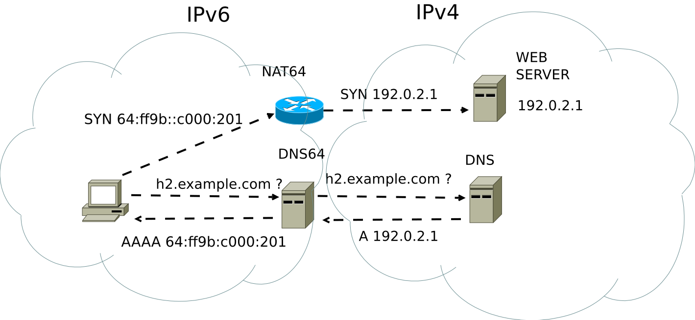

# All of this backbone

All of this backbone is source unique address
and target unique address.

But! MAC addresses are globaly unique!!!
Also many switches support 
[VLAN (IEEE 802)](https://en.wikipedia.org/wiki/IEEE_802.1Q)
which can be used for bridges and virtual hosting.

Etherframes also specify which protocol they encapsulates!!!

MAC addresses must be preserved whan sending IP frames,
because otherway routers would have to be stateful
(remembering possibly milions of frames before response
would be given)


So theoretically knowing source and destination MACs
devices could communicate globally (not needing
registered IP addreses) but finding MACs across the
network is done by IP addresses, and routers
will drop ip frames with global destination address.

(Conclusion, why buing NIC is not equivalent
with buing ip address with similar domain name???!!!)

**Maybe it is IPv6 Unique local address..???**


Links:

* https://stackoverflow.com/questions/40430423/does-a-ping-response-contain-mac-address
* [send_an_arbitrary_ethernet_frame_using_an_af_packet_socket_in_c](http://www.microhowto.info/howto/send_an_arbitrary_ethernet_frame_using_an_af_packet_socket_in_c.html)
* https://www.lifewire.com/tracing-mac-address-stolen-computer-3971329
* https://www.pcwdld.com/find-device-or-ip-address-using-mac-address


# IPv6

* https://en.wikipedia.org/wiki/IPv6
* https://en.wikipedia.org/wiki/IPv6_address#Stateless_address_autoconfiguration

IPv6 is 128 bit number giving $2^{128}$ possible addresses.
Literal IPv6 addresses are enclosed in square brackets in
resource identifiers.

```
This is IPv6 address:
  2001:0db8:0000:0000:0000:8a2e:0370:7334 
It is equivalent to those: 
  2001:db8:               :8a2e:3700:7334
  2001:db8::8a2e:370:7334

This is URL with port:
  https://[2001:db8:85a3:8d3:1319:8a2e:370:7348]:443/

ZONES:
    The link-local address:
        fe80::1ff:fe23:4567:890a
    could be expressed by
        fe80::1ff:fe23:4567:890a%eth2
    or:
        fe80::1ff:fe23:4567:890a%3
    When zones are used in URI % must be escaped:
        http://[fe80::1ff:fe23:4567:890a%25eth0]/
```

## Address types

| Address block   | Address#   | Usage           | Purpose                    |
|-----------------|------------|-----------------|----------------------------|
| ::/0            | $2^{128}$  | Routing         | Default route.             |
| ::/128          | 1          | Software        | Unspecified address.       |
| ::1/128         | 1          | Host            | Loopback, local host.      |
| ::ffff:0:0/96   | 4294967296 | Software        | IPv4 mapped addresses.     |
| ::ffff:0:0:0/96 | 232        | Software        | IPv4 translated addresses. |
| 64:ff9b::/96    | 232        | Global Internet | IPv4/IPv6 translation.     |
| 100::/64        | 264        | Routing         | Discard prefix.            |
| 2001::/32       | 296        | Global Internet | Teredo tunneling.          |
| 2001:20::/28    | 2100       | Software        | ORCHIDv2.                  |
| 2001:db8::/32   | 296        | Documentation   | Example source code.       |
| 2002::/16       | 2112       | Global Internet | The 6to4 addressing scheme |
| fc00::/7        | 2121       | Private network | Unique local address.      |
| fe80::/10       | 2118       | Link            | Link-local address.        |
| ff00::/8        | 2120       | Global Internet | Multicast address.         |


## Packet

https://en.wikipedia.org/wiki/IPv6_packet


# Addressing

https://en.wikipedia.org/wiki/IPv6_address

https://en.wikipedia.org/wiki/IPv6_address#Stateless_address_autoconfiguration

## Loopback address 

The loopback address: 

`0000:0000:0000:0000:0000:0000:0000:0001` 

is defined in RFC 5156 and is abbreviated to `::1`

## Link local address

https://en.wikipedia.org/wiki/Link-local_address

* Local address is addres starting with `fe80::/10` 10 bits.
* Local address ends with 64 bit network interface card
  (NIC) identifier (oryginally it was MAC address, but now
  it is just number, typically some hash).
  (**This also can replace NAT.**)
* remaining 54 bits are host address


Link-local addresses are not guaranteed to be unique beyond
their network segment, therefore routers do not forward
packets with link-local addresses.

IPv4 link-local addresses are assigned from address block
`169.254.0.0/16` (`169.254.0.0` through `169.254.255.255`). In
IPv6, they are assigned from the block `fe80::/10`.

A link-local address is also based on the interface
identifier, but uses a different format for the network
prefix. 

| bits   | 10      | 54      | 64                   |
|--------|---------|---------|----------------------|
| field  | prefix  | zeroes  | interface identifier |


The prefix field contains the binary value 1111111010.  The
54 zeroes that follow make the total network prefix the same
for all link-local addresses (fe80::/64 link-local address
prefix), **rendering them non-routable**.


## Unique local addresses

https://en.wikipedia.org/wiki/Unique_local_address

* Link-local addresses and 
* the loopback address have link-local scope, which means
  they can only be used on a single directly attached
  network (link)

* Unique local addresses have global scope, 
* but they are not globally administered.
* As a result, only other hosts in the same administrative
  domain (e.g., an organization), or within a cooperating
  administrative domain are able to reach such addresses, if
  properly routed. 
* As their scope is global, these addresses are valid as a
  source address when communicating with any other
  global-scope address, even though it may be impossible to
  route packets from the destination back to the source. 


* Unique local addresses have global (or universal) scope,
* which means they are (or could be) globally routable, and 
* can be used to connect to addresses with global scope
  anywhere, or 
* to addresses with link-local scope on the directly
  attached network. 
* Packets with a source or destination in one scope cannot
  be routed to a different scope.

### Unique local addresses

fc00::/7 — Unique local addresses (ULAs) are intended for
local communication[32] (comparable to IPv4 private
addresses 10.0.0.0/8, 172.16.0.0/12 and 192.168.0.0/16).
They are routable only within a set of cooperating sites.
The block is split into two halves. The lower half of the
block (fc00::/8) was intended for globally allocated
prefixes, but an allocation method has yet to be defined.
The upper half (fd00::/8) is used for "probabilistically
unique" addresses in which the /8 prefix is combined with a
40-bit locally generated pseudorandom number to obtain a /48
private prefix. The way in which such a 40-bit number is
chosen results in only a negligible chance that two sites
that wish to merge or communicate with each other will use
the same 40-bit number, and thus use the same /48 prefix.


## Multicast

https://en.wikipedia.org/wiki/Solicited-node_multicast_address


A multicast address is also used by multiple hosts, which
acquire the multicast address destination by participating
in the multicast distribution protocol among the network
routers. A packet that is sent to a multicast address is
delivered to all interfaces that have joined the
corresponding multicast group.

Unicast address assignments by a local Internet registry for
IPv6 have at least a 64-bit routing prefix, yielding the
smallest subnet size available in IPv6 (also 64 bits). With
such an assignment it is possible to embed the unicast
address prefix into the IPv6 multicast address format, while
still providing a 32-bit block, the least significant bits
of the address, or approximately 4.2 billion multicast group
identifiers. 


Each user of an IPv6 subnet automatically has available a
set of globally routable source-specific multicast groups
for multicast applications.

Multicast addresses are formed according to several specific
formatting rules, depending on the application. 

General multicast address format:
| bits   | 8       | 4    | 4   | 112      |
|--------|---------|------|-----|----------|
| field  | prefix  | flg  | sc  | group ID |

The prefix holds the binary value 11111111 for any multicast
address.

Currently, 3 of the 4 flag bits in the flg field are
defined;[1] the most-significant flag bit is reserved for
future use. 

Multicast address flags:
| bit  | flag            | Meaning when 0              | Meaning when 1             |
|------|-----------------|-----------------------------|----------------------------|
| 8    | reserved        | reserved                    | reserved                   |
| 9    | R (Rendezvous)  | Rendezvous not embedded     | Rendezvous point embedded  |
| 10   | P (Prefix)      | Without prefix information  | Address based on prefix    |
| 11   | T (Transient)   | Well-known multicast addr   | Dynamic multicast addr     |

The 4-bit scope field (sc) is used to indicate where the
address is valid and unique.

There are special multicast addresses, like Solicited Node. 

Solicited-Node multicast address format:
| bits   | 8       | 4    | 4   | 79      | 9     | 24              |
|--------|---------|------|-----|---------|-------|-----------------|
| field  | prefix  | flg  | sc  | zeroes  | ones  | unicast address |

The sc(ope) field holds the binary value 0010 (link-local).
Solicited-node multicast addresses are computed as a
function of a node's unicast or anycast addresses. A
solicited-node multicast address is created by copying the
last 24 bits of a unicast or anycast address to the last 24
bits of the multicast address.

Unicast-prefix-based multicast address format:

| bits   | 8       | 4    | 4   | 4    | 4     | 8     | 64              | 32       |
|--------|---------|------|-----|------|-------|-------|-----------------|----------|
| field  | prefix  | flg  | sc  | res  | riid  | plen  | network prefix  | group ID |

Link-scoped multicast addresses use a comparable format.

### Solicited-node multicast address

The least significant 24 bits of the solicited-node
multicast address group ID are filled with the least
significant 24 bits of the interface's unicast or anycast
address. These addresses allow link layer address resolution
via Neighbor Discovery Protocol (NDP) on the link without
disturbing all nodes on the local network. A host is
required to join a solicited-node multicast group for each
of its configured unicast or anycast addresses. 

## Broadcast equivalent

IPv6 does not implement broadcast addressing. Broadcast's
traditional role is subsumed by: 

* multicast addressing to the all-nodes link-local multicast
  group `ff02::1`. However, the use of the all-nodes group
  is not recommended, and 
* most IPv6 protocols use a dedicated link-local multicast
  group to avoid disturbing every interface in the network.


## Unicast

A unicast address identifies a single network interface. The
Internet Protocol delivers packets sent to a unicast address
to that specific interface. 

## Anycast

An anycast address is assigned to a group of interfaces,
usually belonging to different nodes. A packet sent to an
anycast address is delivered to just one of the member
interfaces, typically the nearest host, according to the
routing protocol's definition of distance. Anycast addresses
cannot be identified easily, they have the same format as
unicast addresses, and differ only by their presence in the
network at multiple points. Almost any unicast address can
be employed as an anycast address. 


Anycast is supported explicitly in IPv6. RFC 4291, which
covers IPv6 addressing architecture, reserves Interface
Identifier 0 within an IPv6 subnet as the "Subnet Router"
anycast address. In addition, RFC 2526 reserves a block of
128 Interface Identifiers within a subnet as anycast
addresses.


## Unicast/Multicast address structure

Unicast and anycast addresses are typically composed of two logical parts: a 64-bit network prefix used for routing, and a 64-bit interface identifier used to identify a host's network interface.

General unicast address format (routing prefix size varies):

| bits   | 48 (or more)    | 16 (or fewer)  | 64                   |
|--------|-----------------|----------------|----------------------|
| field  | routing prefix  | subnet id      | interface identifier |

The network prefix (the routing prefix combined with the
subnet id) is contained in the most significant 64 bits of
the address. The size of the routing prefix may vary; a
larger prefix size means a smaller subnet id size. The bits
of the subnet id field are available to the network
administrator to define subnets within the given network.
The 64-bit interface identifier is either automatically
generated from the interface's MAC address using the
modified EUI-64 format, obtained from a DHCPv6 server,
automatically established randomly, or assigned manually. 


# Global IPv6 addresses


## Global address

Stateless address autoconfiguration (SLAAC) requires a /64
address block, as defined in RFC 4291. Local Internet
registries are assigned at least /32 blocks, which they
divide among subordinate networks.


Internet service providers (ISPs) are increasingly providing
their business and private customers with public-facing IPv6
global unicast addresses. However, if in the local area
network (LAN) IPv4 is still used, and the ISP can only
provide a public facing IPv6, the IPv4 LAN addresses are
translated into the public facing IPv6 address using **NAT64**,
a network address translation (NAT) mechanism. Some ISPs
cannot provide their customers with public-facing IPv4 and
IPv6 addresses, thus supporting dual stack networking,
because some ISPs have exhausted their globally routable
IPv4 address pool.



[Wikipedia NAT64](https://en.wikipedia.org/wiki/NAT64)

## Subnets

The standard size of a subnet in IPv6 is $2^{64}$ addresses.

https://en.wikipedia.org/wiki/Subnetwork#Internet_Protocol_version_6

* A compliant IPv6 subnet always uses addresses with 64 bits
  in the host identifier.  Given the address size of 128
  bits, it therefore has a /64 routing prefix. 
* Although it is technically possible to use smaller
  subnets, they are impractical for local area networks
  based on Ethernet technology, because 64 bits are required
  for stateless address autoconfiguration.
* The Internet Engineering Task Force recommends the use of
  /127 subnets for point-to-point links, which have only two
  hosts.
* IPv6 does not implement special address formats for
  broadcast traffic or network numbers, and thus all
  addresses in a subnet are acceptable for host addressing. 
* The all-zeroes address is reserved as the subnet-router
  anycast address.


# Dual stack services IPv6 / IPv4

## IPv4-mapped IPv6 addresses

Hybrid dual-stack IPv6/IPv4 implementations recognize a
special class of addresses, the IPv4-mapped IPv6 addresses.
These addresses are typically written with a 96-bit prefix
in the standard IPv6 format, and the remaining 32 bits
written in the customary dot-decimal notation of IPv4.

Addresses in this group consist of an 80-bit prefix of
zeros, the next 16 bits are ones, and the remaining,
least-significant 32 bits contain the IPv4 address. For
example, ::ffff:192.0.2.128 represents the IPv4 address
192.0.2.128.


Generally a program must open a separate socket for each IP
protocol it uses.


# Supporting mechanisms

## Uniquenss of address checking

A host bringing up a new IPv6 interface first generates a
unique link-local address using one of several mechanisms
designed to generate a unique address. Should a non unique
address be detected, the host can try again with a newly
generated address. Once a unique link-local address is
established, the IPv6 host determines if the LAN is
connected on this link to any router interface that supports
IPv6. It does so by sending out an ICMPv6 router
solicitation message to the all-routers multicast group
with its link-local address as source. If there is no answer
after a predetermined number of attempts, the host concludes
that no routers are connected. If it does get a response,
known as a router advertisement, from a router, the response
includes the network configuration information to allow
establishment of a globally unique address with an
appropriate unicast network prefix. There are also two
flag bits that tell the host whether it should use DHCP to
get further information and addresses:

* The Manage bit, that indicates whether or not the host
  should use DHCP to obtain additional addresses rather than
  rely on an auto-configured address from the router
  advertisement.
* The Other bit, that indicates whether or not the host
  should obtain other information through DHCP. The other
  information consists of one or more prefix information
  options for the subnets that the host is attached to, a
  lifetime for the prefix, and two flags:
  * On-link: If this flag is set, the host will treat all
    addresses on the specific subnet as being on-link, and
    send packets directly to them instead of sending them to
    a router for the duration of the given lifetime.
  * Address: This is the flag that tells the host to actually create a global address.


## NATs

The design of IPv6 intended to re-emphasize the end-to-end
principle of network design that was originally conceived
during the establishment of the early Internet by rendering
network address translation obsolete.

## Unique addresses

A stable, unique, globally addressable IP address would
facilitate tracking a device across networks. Therefore,
such addresses are a particular privacy concern for mobile
devices, such as laptops and cell phones. To address
these privacy concerns, the SLAAC protocol includes what are
typically called "privacy addresses" or, more correctly,
"temporary addresses", codified in RFC 4941, "Privacy
Extensions for Stateless Address Autoconfiguration in
IPv6". Temporary addresses are random and unstable. A
typical consumer device generates a new temporary address
daily and will ignore traffic addressed to an old address
after one week.

## IPsec

Internet Protocol Security (IPsec) was originally developed
for IPv6, but found widespread deployment first in IPv4, for
which it was re-engineered. IPsec was a mandatory part of
all IPv6 protocol implementations,[2] and Internet Key
Exchange (IKE) was recommended, but with RFC 6434 the
inclusion of IPsec in IPv6 implementations was downgraded to
a recommendation because it was considered impractical to
require full IPsec implementation for all types of devices
that may use IPv6. However, as of RFC 4301 IPv6 protocol
implementations that do implement IPsec need to implement
IKEv2 and need to support a minimum set of cryptographic
algorithms. This requirement will help to make IPsec
implementations more interoperable between devices from
different vendors. The IPsec Authentication Header (AH) and
the Encapsulating Security Payload header (ESP) are
implemented as IPv6 extension headers.


## DHCPv6

https://en.wikipedia.org/wiki/DHCPv6

DHCPv6 uses UDP port number 546 for clients and port number
547 for servers. 


[Example](https://en.wikipedia.org/wiki/DHCPv6#Example),
without rapid-commit present, the server's link-local
address is fe80::0011:22ff:fe33:5566 and the client's
link-local address is fe80::aabb:ccff:fedd:eeff.

* Client sends a solicit from
  `[fe80::aabb:ccff:fedd:eeff]:546` to `[ff02::1:2]:547`.
  (Client messages are sent to the multicast address, per
  section 14 of RFC 8415.)
* Server replies with an advertise from
  `[fe80::0011:22ff:fe33:5566]:547` to
  `[fe80::aabb:ccff:fedd:eeff]:546`.
* Client replies with a request from
  `[fe80::aabb:ccff:fedd:eeff]:546` to `[ff02::1:2]:547`.
* Server finishes with a reply from
  `[fe80::0011:22ff:fe33:5566]:547` to
  `[fe80::aabb:ccff:fedd:eeff]:546`.


The DHCP unique identifier (DUID) is used by a client to get
an IP address from a DHCPv6 server. It has a 2-byte DUID
type field, and a variable-length identifier field up to 128
bytes. Its actual length depends on its type. The server
compares the DUID with its database and delivers
configuration data (address, lease times, DNS servers, etc.)
to the client. The first 16 bits of a DUID contain the DUID
type, of which there are four types. The meaning of the
remaining DUID depends on the type.

Four types are identified in RFC 8415:

* Link-layer address plus time (DUID-LLT)
* Vendor-assigned unique ID based on enterprise number (DUID-EN)
* Link-layer address (DUID-LL)
* UUID-based DUID (DUID-UUID)


## Neighbor Discovery Protocol (NDP)

https://en.wikipedia.org/wiki/Neighbor_Discovery_Protocol

The Neighbor Discovery Protocol (NDP, ND)[1] is a protocol
in the Internet protocol suite used with Internet Protocol
Version 6 (IPv6). It operates at the link layer of the
Internet model (RFC 1122), and is responsible for gathering
various information required for internet communication,
including: 

* the configuration of local connections and 
* the domain name servers and gateways used to communicate
  with more distant systems.


The protocol defines five different ICMPv6 packet types to
perform functions for IPv6 similar to the Address Resolution
Protocol (ARP) and Internet Control Message Protocol (ICMP)
Router Discovery and Router Redirect protocols for IPv4.

The Inverse Neighbor Discovery (IND) protocol extension (RFC
3122) allows nodes to determine and advertise an IPv6
address corresponding to a given link-layer address, similar
to Reverse ARP for IPv4.

These messages are used to provide the following functionality:

* Router discovery: hosts can locate routers residing on
  attached links.
* Prefix discovery: hosts can discover address prefixes that
  are on-link for attached links.
* Parameter discovery: hosts can find link parameters (e.g.,
  MTU).
* Address autoconfiguration: optional stateless
  configuration of addresses of network interfaces (see IPv6
  § Stateless address autoconfiguration (SLAAC) and IPv6
  address § Stateless address autoconfiguration).
* Address resolution: mapping between IP addresses and
  link-layer addresses.
* Next-hop determination: hosts can find next-hop routers
  for a destination.
* Neighbor unreachability detection (NUD): determine that a
  neighbor is no longer reachable on the link.
* Duplicate address detection (DAD): nodes can check whether
  an address is already in use.
* Recursive DNS Server (RDNSS) and DNS Search List (DNSSL)
  assignment via a router advertisement (RA) options.[4]
  This is a proposed standard since 2010[5] and updated in
  March 2017, but not supported by all clients.
* Packet redirection to provide a better next-hop route for
  certain destinations.


## Prefix delegation

https://en.wikipedia.org/wiki/Prefix_delegation

In IPv6 global addresses are used end-to-end, so even home networks need to distribute public, routable IP addresses to hosts.

Since it would not be practical to manually provision networks at scale, in IPv6 networking, DHCPv6 prefix delegation is used to assign a network address prefix and automate configuration and provisioning of the public routable addresses for the network. The way this works for example in case of a home network is that the home router uses DHCPv6 protocol to request a network prefix from the ISP's DHCPv6 server. Once assigned, the ISP routes this network to the customer's home router and the home router starts advertising the new addresses to hosts on the network, either via SLAAC or using DHCPv6.

DHCPv6 Prefix Delegation is supported by most ISPs who provide native IPv6 for consumers on fixed networks. 

Prefix delegation is generally not supported on cellular networks, for example 3G or LTE. Most cellular networks route a fixed /64 prefix to the subscriber. Personal hotspots may still provide IPv6 access to hosts on the network by using a different technique called [Proxy Neighbor Discovery](https://tools.ietf.org/html/rfc4389)


## Bridging

* [Bridging solution](images/IEEE_802_Bridging.pdf)
* https://en.wikipedia.org/wiki/Promiscuous_mode
* [software bridging](https://en.wikipedia.org/wiki/Bridging_(networking))


