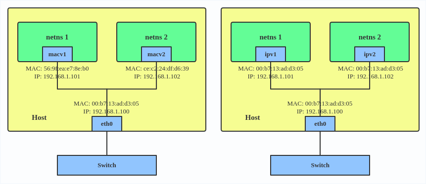

# Links

* vms:
    * [virtualization api](https://wiki.libvirt.org), 
      [libvirt networking wiki](https://wiki.libvirt.org/page/Networking)
    * [Good examples of tasks managing vms, with references](https://github.com/vpenso/vm-tools)
    * https://github.com/mtds/virt-utils
* public vms
    * [AWS notes examples](https://github.com/mtds/aws_notes)
* Administration
    * https://github.com/mtds/sysadmin_notes
    * [Linux certification wikibook](https://en.wikibooks.org/wiki/LPI_Linux_Certification)
    * [IBM Linux Professional Institute (LPI) exam prep](https://www.ibm.com/developerworks/linux/lpi/)
    * http://www.linux-tutorial.info/
    * https://en.wikibooks.org/wiki/Linux_Guide
* SSH
    * https://en.wikipedia.org/wiki/Secure_Shell
    * https://en.wikipedia.org/wiki/Secure_copy
    * https://en.wikibooks.org/wiki/Internet_Technologies/SSH
* routing:
    * [SNAT](https://en.wikipedia.org/wiki/Network_address_translation#SNAT), 
      [what is source in NAT hairpinning example](https://en.wikipedia.org/wiki/Network_address_translation#NAT_hairpinning)
    * [DNAT](https://en.wikipedia.org/wiki/Network_address_translation#DNAT),
      [what is destination in NAT hairpinning example](https://en.wikipedia.org/wiki/Network_address_translation#NAT_hairpinning)
    * [IP Masquerade](http://www.tldp.org/HOWTO/IP-Masquerade-HOWTO)
* sniffers:
    * [Wireshark](https://en.wikipedia.org/wiki/Wireshark) GUI and CLI for sniffing
    * [tcpflow](https://pl.wikipedia.org/wiki/Tcpflow) -
      sniffs http communication, eg.: 
      `$ sudo tcpflow -c -i wlp3s0 port 80` starts sniffing server for 
      web browser (port 80) on wifi device (-i wlp3s0).  Now navigate to
      http://info.cern.ch and observe traffic. (To show
      devices `$ ip link show`).
    * [tcpdump](https://en.wikipedia.org/wiki/Tcpdump) - 
      observe tcp packets of browser: `$ sudo tcpdump port 80`,
      list interfaces: `$ sudo tcpdump -D`
    * [nmap](https://en.wikipedia.org/wiki/Nmap) 
      interfaces, ports, OSes, ... discovery!!! eg.:
      ```console
      $ nmap -v -A scanme.nmap.org
      Starting Nmap 7.60 ( https://nmap.org ) at 2020-08-01 18:24 CEST
      NSE: Loaded 146 scripts for scanning.
      NSE: Script Pre-scanning.
      Initiating NSE at 18:24
      Completed NSE at 18:24, 0.00s elapsed
      Initiating NSE at 18:24
      Completed NSE at 18:24, 0.00s elapsed
      Initiating Ping Scan at 18:24
      Scanning scanme.nmap.org (45.33.32.156) [2 ports]
      Completed Ping Scan at 18:24, 0.19s elapsed (1 total hosts)
      Initiating Parallel DNS resolution of 1 host. at 18:24
      Completed Parallel DNS resolution of 1 host. at 18:24, 0.00s elapsed
      Initiating Connect Scan at 18:24
      Scanning scanme.nmap.org (45.33.32.156) [1000 ports]
      Discovered open port 80/tcp on 45.33.32.156
      Discovered open port 22/tcp on 45.33.32.156
      Discovered open port 31337/tcp on 45.33.32.156
      Discovered open port 9929/tcp on 45.33.32.156  
      $
      ```
    * [ethercap](https://en.wikipedia.org/wiki/Ettercap_(software)) - 
      sniffer and man in the middle CLI, gCLI, GUI


# netfilter netlink

* https://en.wikipedia.org/wiki/Netfilter
* https://en.wikipedia.org/wiki/Netlink


# net namespace

Created namespaces are at `/var/run/netns`
Or can be found issuing `mount | grep netns`
or `findmnt | grep netns`.

(`findmnt` command will list all mounted filesystems or
search for a filesystem. The findmnt command is able to
search in `/etc/fstab`, `/etc/mtab` or
`/proc/self/mountinfo`. If device or mountpoint is not
given, all filesystems are shown.)

This is described [here](https://www.admin-magazine.com/Articles/The-practical-benefits-of-network-namespaces/(offset)/3).


```console
$ sudo ip netns add ns1
$ findmnt | grep netns
│ ├─/run/netns       tmpfs[/netns]          tmpfs rw,nosuid,
│ │ │                                             noexec,relatime,
│ │ │                                             size=802956k,
│ │ │                                             mode=755
│ │ └─/run/netns/ns1 nsfs[net:[4026533028]] nsfs  rw
│ └─/run/netns/ns1   nsfs[net:[4026533028]] nsfs  rw
$ sudo ip netns delete ns1
$
```

The set command adds a device that already exists in a host
system into a namespace. However, because it is exclusive,
the device disappears from then on in the host namespace.

## documentation true source

* https://www.kernel.org/doc/Documentation/networking/


## overall namespaces overview

* [LVN.net Namespaces in operation](https://lwn.net/Articles/531114/#series_index)
* https://www.redhat.com/sysadmin/container-namespaces-nsenter
* https://developers.redhat.com/blog/tag/virtual-networking/

## network namespace elements

* https://developers.redhat.com/blog/2018/10/22/introduction-to-linux-interfaces-for-virtual-networking/


## SSH at namespace

* [Example](https://www.admin-magazine.com/Articles/The-practical-benefits-of-network-namespaces/(offset)/3)


## Bridging

* [Examples](https://wiki.linuxfoundation.org/networking/bridge)
* https://hicu.be/bridge-vs-macvlan


## in docker context

* https://hicu.be/docker-networking-macvlan-bridge-mode-configuration
* https://hicu.be/docker-networking-macvlan-vlan-configuration
* https://hicu.be/


## NAT

* [Linux IP Masquerade HOWTO](http://www.tldp.org/HOWTO/IP-Masquerade-HOWTO/index.html) 
* https://pl.wikipedia.org/wiki/Dnsmasq
* https://en.wikipedia.org/wiki/Dnsmasq
* [Linux 2.4 NAT HOWTO](https://www.netfilter.org/documentation/HOWTO/NAT-HOWTO.html)


## Routing

* https://lartc.org/howto/
* http://www.policyrouting.org/iproute2.doc.html
* http://www.policyrouting.org/PolicyRoutingBook/ONLINE/TOC.html
* https://www.networkworld.com/article/2707620/unix---getting-from-here-to-there--routing-basics-.html


# Network namespace elements

With network namespaces, you can virtualize network devices,
IPv4 and IPv6 protocol stacks, routing tables, ARP tables,
and firewalls separately, as well as `/proc/net`,
`/sys/class/net/`, QoS policies, port numbers, and sockets in
such a way that individual applications can find a
particular network setup without the use of containers.
Several services can use namespaces to connect without
conflict to the same port on the very same system, and each
is able to hold its own routing table.

The handle for the network namespaces is
`/proc/<PID>/ns/net`; since kernel 3.8, these are symbolic
links. Its name comprises a string with the namespace type
and the inode number:

```console
$ readlink /proc/$$/ns/net
net:[4026531956]
```

Bind mounts (`mount --bind`) keep the network namespace
alive, even if all processes within the namespace have come
to an end. If you open the file (or a file mounted there),
you will be sent a file handle for the relevant namespace.
You could then change the namespace with setns.


```
          +----------------+
          |   Socket API   |
          +-------+--------+
                  |
       User space |
+-------------------------------+
     Kernel space |
                  |
        +---------+---------+
        |    Raw Ethernet   |
        +---------+---------+
                  |
        +---------+---------+
        |  Network Stack    |
        +---------+---------+
                  |
              +---+----+
              |  eth0  |
              +---+----+
                  |
              +---+----+
              |  NIC   |
              +--------+
```


https://developers.redhat.com/blog/2018/10/22/introduction-to-linux-interfaces-for-virtual-networking/

[Github mtds/lvn.md](https://gist.github.com/mtds/4c4925c2aa022130e4b7c538fdd5a89f)

Everything is described in manual:

```console
$ ip link help
$ ip netns help
$ ip addr help
$ man 8 ip
$ # and ip subcategories, e.g.:
$ man 8 ip-netns
$ man 7 namespaces
$ man 7 network_namespaces
$ man 4 veth
$ man 1 nsenter
```

## veth

The VETH (virtual Ethernet) device is a local Ethernet
tunnel. Devices are created in pairs.

VETH configuration is used when namespaces need to communicate to
the main host namespace or between each other.

If those interfaces will have assigned ip, namespaces can
communicate each other.


Example of creating 2 network namespaces and connecting
them using 

```console
$ ip netns add net1
$ ip netns add net2
$ ip link add veth1 netns net1 type veth peer name veth2 netns net2
$ # ip netns exec net1  <- specify to run some program in ns context
$ ip netns exec net1 ip addr add '10.0.0.10/24' dev veth1
$ ip netns exec net1 ip addr show
$ ip netns exec net2 ip addr add '10.0.0.11/24' dev veth2
$ ip netns exec net2 ip addr show
$ ip netns exec net1 ip link set dev veth1 up
$ ip netns exec net2 ip link set dev veth2 up
$ # this will start shell with associated net1 namespace
$ nsenter -n/var/run/netns/net1
$ # -I specyfies source address of frame
$ # -c specyfies number of tries to ping
$ ping -I 10.0.0.10 -c1 10.0.0.11
PING 10.0.0.11 (10.0.0.11) from 10.0.0.10 : 56(84) bytes of data.
64 bytes from 10.0.0.11: icmp_seq=1 ttl=64 time=0.090 ms

--- 10.0.0.11 ping statistics ---
1 packets transmitted, 1 received, 0% packet loss, time 0ms
rtt min/avg/max/mdev = 0.090/0.090/0.090/0.000 ms
$ # now log out from subshell ctrl+d
$ # same as above but without running shell in different ns ctx
$ sudo ip netns exec net1 ping -I 10.0.0.10 -c1 10.0.0.11
PING 10.0.0.11 (10.0.0.11) from 10.0.0.10 : 56(84) bytes of data.
64 bytes from 10.0.0.11: icmp_seq=1 ttl=64 time=0.066 ms

--- 10.0.0.11 ping statistics ---
1 packets transmitted, 1 received, 0% packet loss, time 0ms
rtt min/avg/max/mdev = 0.066/0.066/0.066/0.000 ms
$ # where are files of namespaces??
$ mount | grep netns
tmpfs on /run/netns type tmpfs (rw,nosuid,noexec,relatime,size=802956k,mode=755)
nsfs on /run/netns/net1 type nsfs (rw)
nsfs on /run/netns/net1 type nsfs (rw)
nsfs on /run/netns/net2 type nsfs (rw)
nsfs on /run/netns/net2 type nsfs (rw)
$ # delete link device
$ ip netns exec net1 ip link delete veth1 type veth
$ ip netns exec net1 ip link show
1: lo: <LOOPBACK,UP,LOWER_UP> mtu 65536 qdisc noqueue state UNKNOWN mode DEFAULT group default qlen 1000
    link/loopback 00:00:00:00:00:00 brd 00:00:00:00:00:00
$ ip netns exec net2 ip link show
1: lo: <LOOPBACK> mtu 65536 qdisc noop state DOWN mode DEFAULT group default qlen 1000
    link/loopback 00:00:00:00:00:00 brd 00:00:00:00:00:00
$ # delete namespaces
$ ip netns delete net1
$ ip netns delete net2
$ mount | grep netns
tmpfs on /run/netns type tmpfs (rw,nosuid,noexec,relatime,size=802956k,mode=755)
$ 
```


## bridge (is switch or router virtual device)

A Linux bridge behaves like a network switch. It forwards
packets between interfaces that are connected to it. It’s
usually used for forwarding packets on routers, on gateways,
or between VMs and network namespaces on a host. It also
supports STP, VLAN filter, and multicast snooping.


```console
# ip link add br0 type bridge
# ip link set eth0 master br0
# ip link set tap1 master br0
# ip link set tap2 master br0
# ip link set veth1 master br0
```

Use a bridge when you want to establish communication
channels between VMs, containers, and your hosts.

## VLAN

(**requires that switch connected to the host is able to
handle VLAN tags, for example, by setting the switch port to
trunk mode**)

A VLAN, aka virtual LAN, separates broadcast domains by
adding tags to network packets. VLANs allow network
administrators to group hosts under the same switch or
between different switches.


```console
$ ip link add link eth0 name eth0.2 type vlan id 2
$ ip link add link eth0 name eth0.3 type vlan id 3
```

## TUN/TAP

[Definitive explanation from kernel documentation](https://www.kernel.org/doc/Documentation/networking/tuntap.txt)!!!

TUN devices work at the IP level or layer three level of the
network stack and are usually point-to-point connections. A
typical use for a TUN device is establishing VPN connections
since it gives the VPN software a chance to encrypt the data
before it gets put on the wire. Since a TUN device works at
layer three it can only accept IP packets and in some cases
only IPv4.

TAP devices, in contrast, work at the Ethernet level or
layer two and therefore behave very much like a real network
adaptor. Since they are running at layer two they can
transport any layer three protocol and aren’t limited to
point-to-point connections. TAP devices can be part of a
bridge and are commonly used in virtualization systems to
provide virtual network adaptors to multiple guest machines.

Example (from [here](http://www.naturalborncoder.com/virtualization/2014/10/17/understanding-tun-tap-interfaces/)):

```console
$ ip tuntap add name tap0 mode tap
$ ip link show
1: lo: <LOOPBACK,UP,LOWER_UP> mtu 65536 qdisc noqueue state UNKNOWN mode DEFAULT group default qlen 1000
    link/loopback 00:00:00:00:00:00 brd 00:00:00:00:00:00
2: enp2s0: <NO-CARRIER,BROADCAST,MULTICAST,UP> mtu 1500 qdisc mq state DOWN mode DEFAULT group default qlen 1000
    link/ether 20:89:84:9e:69:15 brd ff:ff:ff:ff:ff:ff
3: wlp3s0: <BROADCAST,MULTICAST,UP,LOWER_UP> mtu 1500 qdisc noqueue state UP mode DORMANT group default qlen 1000
    link/ether 24:fd:52:75:64:8d brd ff:ff:ff:ff:ff:ff
4: tap0: <BROADCAST,MULTICAST> mtu 1500 qdisc noop state DOWN mode DEFAULT group default qlen 1000
    link/ether 92:20:0f:4d:c7:c7 brd ff:ff:ff:ff:ff:ff
$ ip tuntap del name tap0 mode tap
$ ip link show
1: lo: <LOOPBACK,UP,LOWER_UP> mtu 65536 qdisc noqueue state UNKNOWN mode DEFAULT group default qlen 1000
    link/loopback 00:00:00:00:00:00 brd 00:00:00:00:00:00
2: enp2s0: <NO-CARRIER,BROADCAST,MULTICAST,UP> mtu 1500 qdisc mq state DOWN mode DEFAULT group default qlen 1000
    link/ether 20:89:84:9e:69:15 brd ff:ff:ff:ff:ff:ff
3: wlp3s0: <BROADCAST,MULTICAST,UP,LOWER_UP> mtu 1500 qdisc noqueue state UP mode DORMANT group default qlen 1000
    link/ether 24:fd:52:75:64:8d brd ff:ff:ff:ff:ff:ff
```


## VXLAN

(**this practically works only in local network!!!**)

* this is the best in connection with IPv6 and multicast, but those requirements are not practical in mixed wide/local networks
* so it have to be done on unicast or 
* external libraties as vSwitch

VXLAN is typically deployed in data centers on virtualized
hosts, which may be spread across multiple racks.


```console
$ ip link add vx0 type vxlan id 100 local 1.1.1.1 remote 2.2.2.2 dev eth0 dstport 4789
```
VXLAN (Virtual eXtensible Local Area Network) is a tunneling
protocol designed to solve the problem of limited VLAN IDs
(4,096) in IEEE 802.1q. It is described by IETF RFC 7348.

With a 24-bit segment ID, aka VXLAN Network Identifier
(VNI), VXLAN allows up to 2^24 (16,777,216) virtual LANs,
which is 4,096 times the VLAN capacity.

VXLAN encapsulates Layer 2 frames with a VXLAN header into a
UDP-IP packet

### VXLAN links

https://vincent.bernat.ch/en/blog/2017-vxlan-linux

https://www.kernel.org/doc/Documentation/networking/vxlan.txt

## IPVLAN

(**external switch support one mac address
per interface (connector)**)

IPVLAN is similar to MACVLAN with the difference being that
the endpoints have the same MAC address.

* IPVLAN L2 mode acts like a MACVLAN in bridge mode. The
  parent interface looks like a bridge or switch.
* In IPVLAN L3 mode, the parent interface acts like a router
  and packets are routed between endpoints, which gives
  better scalability.



## MACVLAN

(**external switch support many mac addresses
per interface (connector)**)

With MACVLAN, you can bind a physical interface that is
associated with a MACVLAN directly to namespaces, without
the need for a bridge.

Modes:

* Private: doesn’t allow communication between MACVLAN
  instances on the same physical interface, even if the
  external switch supports hairpin mode.
* VEPA: data from one MACVLAN instance to the other on the
  same physical interface is transmitted over the physical
  interface. Either the attached switch needs to support
  hairpin mode or there must be a TCP/IP router forwarding
  the packets in order to allow communication.
* Bridge: all endpoints are directly connected to each other
  with a simple bridge via the physical interface.
* Passthru: allows a single VM to be connected directly to
  the physical interface.
* Source: the source mode is used to filter traffic based on
  a list of allowed source MAC addresses to create MAC-based
  VLAN associations.

Use a MACVLAN when you want to connect directly to a
physical network from containers.

Here’s how to set up a MACVLAN:

```console
$ ip link add macvlan1 link eth0 type macvlan mode bridge
$ ip link add macvlan2 link eth0 type macvlan mode bridge
$ ip netns add net1
$ ip netns add net2
$ ip link set macvlan1 netns net1
$ ip link set macvlan2 netns net2
```

## MACVTAP/IPVTAP

MACVTAP/IPVTAP is a new device driver meant to simplify
virtualized bridged networking. When a MACVTAP/IPVTAP
instance is created on top of a physical interface, the
kernel also creates a character device/dev/tapX to be used
just like a TUN/TAP device, which can be directly used by
KVM/QEMU.

With MACVTAP/IPVTAP, you can replace the combination of
TUN/TAP and bridge drivers with a single module:


Typically, MACVLAN/IPVLAN is used to make both the guest and
the host show up directly on the switch to which the host is
connected. The difference between MACVTAP and IPVTAP is same
as with MACVLAN/IPVLAN.

Here’s how to create a MACVTAP instance:

```console
$ ip link add link eth0 name macvtap0 type macvtap
```
(above is probably command at host, than device
must be mounted at VM)

## Dummy

A dummy interface is entirely virtual like, for example, the
loopback interface. The purpose of a dummy interface is to
provide a device to route packets through without actually
transmitting them.

Use a dummy interface to make an inactive SLIP (Serial Line
Internet Protocol) address look like a real address for
local programs. Nowadays, a dummy interface is mostly used
for testing and debugging.

Here’s how to create a dummy interface:

```console
$ ip link add dummy1 type dummy
$ ip addr add 1.1.1.1/24 dev dummy1
$ ip link set dummy1 up
```


## IFB

https://wiki.linuxfoundation.org/networking/ifb

The IFB (Intermediate Functional Block) driver supplies a
device that allows the concentration of traffic from several
sources and the shaping incoming traffic instead of dropping
it.

Use an IFB interface when you want to queue and shape
incoming traffic.

Here’s how to create an IFB interface:
```console
$ ip link add ifb0 type ifb
$ ip link set ifb0 up
$ tc qdisc add dev ifb0 root sfq
$ tc qdisc add dev eth0 handle ffff: ingress
$ tc filter add dev eth0 parent ffff: u32 match u32 0 0 action mirred egress redirect dev ifb0
```

This creates an IFB device named ifb0 and replaces the root
qdisc scheduler with SFQ (Stochastic Fairness Queueing),
which is a classless queueing scheduler. Then it adds an
ingress qdisc scheduler on eth0 and redirects all ingress
traffic to ifb0.

## NLMON

NLMON is a Netlink monitor device.

Netlink is communication channel between kernel and user
space.

## MACsec

MACsec (Media Access Control Security) is an IEEE standard
for security in wired Ethernet LANs. Similar to IPsec, as a
layer 2 specification, MACsec can protect not only IP
traffic but also ARP, neighbor discovery, and DHCP. 

