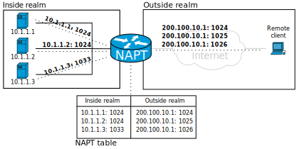
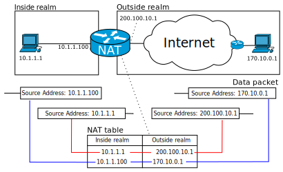
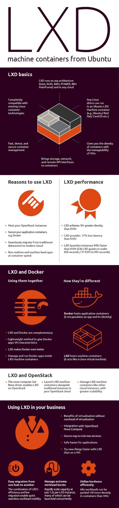

# Sources

* [Internet Protocol Suite](https://en.wikipedia.org/wiki/Internet_protocol_suite)


# Virtual hosting

https://en.wikipedia.org/wiki/Virtual_hosting

## Port-based

* The default port number for HTTP is 80. 
* However, most webservers can be configured to operate on
  almost any port number, provided the port number is not in
  use by any other program on the server. 
* There is the HTTP Secure special port 443 that needs
  special configuration (see Server Name Indication).

## Name-based

Name-based virtual hosts use multiple host names for the
same IP address. 

This requires target hostname in HTTP request.


For instance, a server could be receiving requests for two
domains, `www.example.com` and `www.example.net`, both of
which resolve to the same IP address. For www.example.com,
the server would send the HTML file from the directory
`/var/www/user/Joe/site/`, while requests for
`www.example.net` would make the server serve pages from
`/var/www/user/Mary/site/`.

Problems:
* The biggest issue with name-based virtual hosting is that it
  is difficult to host multiple secure websites running
  SSL/TLS. 
  * Because the SSL/TLS handshake takes place before
    the expected hostname is sent to the server, the server
    doesn't know which certificate to present in the handshake.
  * It is possible for a single certificate to cover multiple
    names either through: 
    * the "subjectaltname" field or through
    * wildcards but the practical application of this approach is
      limited by administrative considerations and by the matching
      rules for wildcards. 
    * There is an extension to TLS called
      Server Name Indication, that presents the name at the start
      of the handshake to circumvent that issue,
* If the Domain Name System (DNS) is not
  properly functioning, it is difficult to access a
  virtually-hosted website even if the IP address is known.
  * If the user tries to fall back to using the IP address to
    contact the system, as in http://10.23.45.67/, the web
    browser will send the IP address as the host name. Since
    the web server relies on the web browser client telling it
    what server name (vhost) to use, the server will respond
    with a default website—often not the site the user
    expects. 
  * A workaround in this case is to add the IP address and
    host name to the client system's hosts file. However any
    changes to the true mapping between host name and IP
    address will be overridden by the local setting.


## IP-based

When IP-based virtual hosting is used, each site (either a
DNS host name or a group of DNS host names that act the
same) points to a unique IP address.

Than the webserver is configured with:
* multiple physical network interfaces, 
* virtual network interfaces on the same physical interface or 
* multiple IP addresses on one interface.

The web server can be configured to either: 
* open separate listening sockets for each IP address, (as
  for example separate processes)
* or it can listen on all interfaces with a single socket
  (and obtain the IP address the TCP connection was received
  on after accepting the connections). (For example main
  server acts as a proxy and dispatch traffic to requested
  ip identified services)


# TCP implementation

TCP/IP is Transport/Internet layer above Link layer.

The Internet protocol suite does not presume any specific
hardware or software environment. It only requires that
hardware and a software layer exists that is capable of
sending and receiving packets on a computer network. As a
result, the suite has been implemented on essentially every
computing platform. 

A minimal implementation of TCP/IP
includes the following: 

* Internet Protocol (IP), 
* Address Resolution Protocol (ARP), 
* Internet Control Message Protocol (ICMP), 
* Transmission Control Protocol (TCP), 
* User Datagram Protocol (UDP), and 
* Internet Group Management Protocol (IGMP).
* (IPv6) Neighbor Discovery Protocol (NDP),
* (IPv6) ICMPv6, and 
* (IPv6) IGMPv6 
* (IPv6) integrated IPSec security layer. 

Most IP implementations are accessible to programmers
through sockets and APIs. 

TCP/IP may not only be restricted to hardware
implementations of link layer, but can also function over
virtual link layers such as virtual private networks and
networking tunnels. 


# Link layer

The link includes all hosts accessible without traversing a
router.

The TCP/IP model includes specifications for translating the
network addressing methods used in the Internet Protocol to
link-layer addresses, such as media access control (MAC)
addresses.

# Internet layer

Internetworking requires sending data from the source
network to the destination network. This process is called
routing and is supported by host addressing and
identification using the hierarchical IP addressing system.


IP carries data for a variety of different upper layer
protocols. 

The Internet Protocol is the principal component of the
internet layer, and it defines two addressing systems to
identify network hosts and to locate them on the network.: 

* Internet Protocol version 4 (IPv4). It uses a 32-bit IP
  address and is therefore capable of identifying
  approximately four billion hosts. 
* Internet Protocol version 6 (IPv6) which uses 128-bit
  addresses.


# Port forwarding

Usually only one of the private hosts can use a specific
forwarded port at one time, but configuration is sometimes
possible to differentiate access by the originating host's
source address.

When configuring port forwarding, 
* the network administrator sets aside one port number on
  the gateway for the exclusive use of communicating with a
  service in the private network, located on a specific
  host. 
* External hosts must know this port number and the address
  of the gateway to communicate with the network-internal
  service. 
* Often, the port numbers of well-known Internet services,
  such as port number 80 for web services (HTTP), are used
  in port forwarding, so that common Internet services may
  be implemented on hosts within private networks.





Typical applications include the following:

* Running a public HTTP server within a private LAN
* Permitting Secure Shell access to a host on the private
  LAN from the Internet
* Permitting FTP access to a host on a private LAN from the
  Internet
* Running a publicly available game server within a private
  LAN


Administrators configure port forwarding in the gateway's
operating system. In Linux kernels, this is achieved by
packet filter rules in the iptables or netfilter kernel
components.

* When used on gateway devices, a port forward may be
  implemented with a single rule to translate the
  destination address and port. (On Linux kernels, this is
  DNAT rule). The source address and port are, in this case,
  left unchanged. 
* When used on machines that are not the default gateway of
  the network, the source address must be changed to be the
  address of the translating machine, or packets will bypass
  the translator and the connection will fail.
* When a port forward is implemented by a proxy process
  (such as on application layer firewalls, SOCKS based
  firewalls, or via TCP circuit proxies), then no packets
  are actually translated, only data is proxied. This
  usually results in the source address (and port number)
  being changed to that of the proxy machine.

## Special port numbers

Unix-like operating systems sometimes use port forwarding
where port numbers smaller than 1024 can only be created by
software running as the root user. Running with superuser
privileges (in order to bind the port) may be a security
risk to the host, therefore port forwarding is used to
redirect a low-numbered port to another high-numbered port,
so that application software may execute as a common
operating system user with reduced privileges. 


# Private (local) IP addresses

[Wide area network WAN](https://en.wikipedia.org/wiki/Wide_area_network)

The IP address space is managed globally by: 
* the Internet Assigned Numbers Authority (IANA), 
* and by five regional Internet registries (RIRs) 
  responsible in their designated territories 
  for assignment to local Internet registries,
  such as Internet service providers, and other end users.

 

Now:
* IPv4 addresses were distributed by IANA to the RIRs in
  blocks of approximately 16.8 million addresses each, but
  have been exhausted at the IANA level since 2011.  Only
  one of the RIRs still has a supply for local assignments
  in Africa.  
* Some IPv4 addresses are reserved for
  private networks and are not globally unique.


Packets addresses in the private network ranges are not
routable in the public Internet; they are ignored by all
public routers. Therefore, private hosts cannot directly
communicate with public networks, but require network
address translation at a routing gateway for this purpose. 

| Name         | CIDR block     | Address range                 | Count    | Classful description  |
|--------------|----------------|-------------------------------|----------|-----------------------|
| 24-bit block | 10.0.0.0/8     | 10.0.0.0 – 10.255.255.255     | 16777216 | Class A.              |
| 20-bit block | 172.16.0.0/12  | 172.16.0.0 – 172.31.255.255   | 1048576  | 16 Class B blocks.    |
| 16-bit block | 192.168.0.0/16 | 192.168.0.0 – 192.168.255.255 | 65536    | 256 Class C blocks.   |

These addresses are commonly used for local area networks
(LANs) in residential, office, and enterprise environments.


Since two private networks, e.g., two branch offices, cannot
directly interoperate via the public Internet, the two
networks must be bridged across the Internet via a virtual
private network (VPN) or an IP tunnel, which encapsulates
packets, including their headers containing the private
addresses, in a protocol layer during transmission across
the public network. Additionally, encapsulated packets may
be encrypted for the transmission across public networks to
secure the data. 

# Multicast Broadcast Unicast

https://en.wikipedia.org/wiki/IP_address

## Unicast

Communicate one-to-one.

## Broadcast

Use all ones for subnetwork. For example for network:
`192.168.1.x/24` broadcast address will be `192.168.1.255`.
For all internet broadcast address is `255.255.255.255`.

## Multicast

A multicast address is associated with a group of interested
receivers. In IPv4, addresses `224.0.0.0` through
`239.255.255.255` (the former Class D addresses) are
designated as multicast addresses.

Specifics may by found in:

https://en.wikipedia.org/wiki/IP_multicast

# Local network IPs

Network administrators assign an IP address to each device
connected to a network. Such assignments may be on a static
(fixed or permanent) or dynamic basis, depending on network
practices and software features. 

# Routers with NAT

All IP packets have a source IP address and a destination IP
address. 

NAT mechanizm:

* Typically packets passing from the private network to the
  public network will have their source address modified, 
* while packets passing from the public network back to the
  private network will have their destination address
  modified. 
* To avoid ambiguity in how replies are translated, further
  modifications to the packets are required. The vast bulk
  of Internet traffic uses Transmission Control Protocol
  (TCP) or User Datagram Protocol (UDP). For these protocols
  the port numbers are changed so that the combination of IP
  address and port information on the returned packet can be
  unambiguously mapped to the corresponding private network
  destination. 
* RFC 2663 uses the term network address and port
  translation (NAPT) for this type of NAT. Other names
  include port address translation (PAT), IP masquerading,
  NAT overload and many-to-one NAT. This is the most common
  type of NAT and has become synonymous with the term "NAT"
  in common usage.

Outcome:

* This method enables communication through the router only
  when the conversation originates in the private network
  since the initial originating transmission is what
  establishes the required information in the translation
  tables. 
* A web browser in the masqueraded network can, for example,
  browse a website outside, but a web browser outside cannot
  browse a website hosted within the masqueraded network.
* Protocols not based on TCP and UDP require other
  translation techniques.





# Socket = address/protocol/port triplet

# Transport layer

The transport layer establishes basic data channels that
applications use for task-specific data exchange. The layer
establishes host-to-host connectivity, meaning it provides
end-to-end message transfer services that are independent of
the structure of user data and the logistics of exchanging
information for any particular specific purpose and
independent of the underlying network. The protocols in this
layer may provide error control, segmentation, flow control,
congestion control, and application addressing (port
numbers).

For the purpose of providing process-specific transmission
channels for applications, the layer establishes the concept
of the network port. This is a numbered logical construct
allocated specifically for each of the communication
channels an application needs. For many types of services,
these port numbers have been standardized so that client
computers may address specific services of a server computer
without the involvement of service announcements or
directory services.

The applications at any given network address are
distinguished by their TCP or UDP port. By convention
certain well known ports are associated with specific
applications.


# Proxy

## Reverse proxies

A proxy server connecting the Internet to an internal
network.  A reverse proxy taking requests from the Internet
and forwarding them to servers in an internal network. Those
making requests connect to the proxy and may not be aware of
the internal network.

Applications include:

* Encryption / SSL acceleration: when secure web sites are created, the Secure Sockets Layer (SSL) encryption is often not done by the web server itself, but by a reverse proxy that is equipped with SSL acceleration hardware. 
* Load balancing: the reverse proxy can distribute the load to several web servers, each web server serving its own application area. In such a case, the reverse proxy may need to rewrite the URLs in each web page (translation from externally known URLs to the internal locations).
* Serve/cache static content: A reverse proxy can offload the web servers by caching static content like pictures and other static graphical content.
* Compression: the proxy server can optimize and compress the content to speed up the load time.
* Spoon feeding: reduces resource usage caused by slow clients on the web servers by caching the content the web server sent and slowly "spoon feeding" it to the client.


## SOCKS

[Wikipedia SOCKS](https://en.wikipedia.org/wiki/SOCKS)

Bill, or any client for that matter, wishes to communicate
with Chris over the internet, but a firewall between them
exists on his network, where Bill is not authorized to
communicate with Chris directly. So, Bill connects to the
SOCKS proxy on his network, informing it about the
connection he wishes to make to Chris; the SOCKS proxy opens
a connection through the firewall and facilitates the
communication between Bill and Chris. 


## HTTP

[Wikipedia SOCKS](https://en.wikipedia.org/wiki/SOCKS)

Bill wishes to download a web page from Jane, who runs a web
server. Bill cannot directly connect to Jane's server, as a
firewall has been put in place on his network. In order to
communicate with the server, Bill connects to his network's
HTTP proxy. His web browser communicates with the proxy in
exactly the same way that it would directly with Jane's
server if that were possible; that is, it sends a standard
HTTP request header. The HTTP proxy connects to Jane's
server, and then transmits back to Bill any data that Jane's
server returns.

# Connectors

* A
  [router](https://en.wikipedia.org/wiki/Router_(computing))
  is a networking device that forwards data packets between
  computer networks. A router is connected to two or more
  data lines (links) from different IP networks.
* A
  [gateway](https://en.wikipedia.org/wiki/Gateway_(telecommunications))
  is a piece of networking hardware that allows data to flow
  from one discrete network to another. Gateways are
  distinct from routers or switches in that they communicate
  using more than one protocol to connect a bunch of
  networks and can operate at any of the seven layers of the
  open systems interconnection model (OSI).
* The term gateway can also loosely refer to a computer or
  computer program configured to perform the tasks of a
  gateway, such as a default gateway or router. 
* A
  [firewall](https://en.wikipedia.org/wiki/Firewall_(computing))
  is a network security system that monitors and controls
  incoming and outgoing network traffic based on
  predetermined security rules. A firewall typically
  establishes a barrier between a trusted internal network
  and untrusted external network, such as the Internet.
* A network
  [switch](https://en.wikipedia.org/wiki/Network_switch) is
  networking hardware that connects devices on a computer
  network by using packet switching to receive and forward
  data to the destination device. It is used to forward data
  at the data link layer.


# Routing (finding route, one of many)

[IP routing](https://en.wikipedia.org/wiki/IP_routing)
involves the determination of a suitable path for a network
packet from a source to its destination in an IP network.
The process uses static configuration rules or dynamically
obtained status information to select specific packet
forwarding methods to direct traffic to the next available
intermediate network node one hop closer to the desired
final destination, a total path potentially spanning
multiple computer networks. 


Routing is the process of selecting a path for traffic in a
network or between or across multiple networks.

In large networks, structured addressing (routing, in the
narrow sense) outperforms unstructured addressing
(bridging). Routing has become the dominant form of
addressing on the Internet. Bridging is still widely used
within local area networks. 


## Mechanizm

```
Given a destination IP address, D, and network prefix, N:

if ( N matches a directly connected network address )
    Deliver datagram to D over that network link;
else if ( The routing table contains a route for N )
    Send datagram to the next-hop address listed in the routing table;
else if ( a default route exists )
    Send datagram to the default route;
else
    Send a forwarding error message to the originator;
```

## Routing table

The following presents a typical routing table in a Unix-like operating system:

Kernel IP routing table

| Destination | Gateway     | Genmask        | Flags | Metric | Ref | Use Iface |
|-------------|-------------|----------------|-------|--------|-----|-----------|
| 0.0.0.0     | 71.46.14.1  | 0.0.0.0        | UG    | 0      | 0   |  0 ppp0   |
| 10.0.0.0    | 0.0.0.0     | 255.0.0.0      | U     | 0      | 0   |  0 eth0   |
| 71.46.14.1  | 0.0.0.0     | 255.255.255.255| UH    | 0      | 0   |  0 ppp0   |
| 169.254.0.0 | 0.0.0.0     | 255.255.0.0    | U     | 0      | 0   |  0 eth0   |
| 172.16.0.0  | 0.0.0.0     | 255.240.0.0    | U     | 0      | 0   |  0 eth0   |
| 192.168.0.0 | 0.0.0.0     | 255.255.0.0    | U     | 0      | 0   |  0 eth0   |
| 192.168.1.0 | 192.168.96.1| 255.255.255.0  | UG    | 0      | 0   |  0 eth0   |
| 192.168.96.0| 0.0.0.0     | 255.255.255.0  | U     | 0      | 0   |  0 eth0   |


A **default route** is recognized by:
* the destination 0.0.0.0 
* and the flag G. 

A **network router** is identified by: 
* the network mask 255.255.255.255 
* and the flag H.

## Default route


The [defaultroute](https://en.wikipedia.org/wiki/Default_route)
in Internet Protocol Version 4 (IPv4) is designated as the:

* zero-address `0.0.0.0/0` in CIDR notation. The subnet mask
  is given as `/0`, which effectively specifies all networks,
  and is the shortest match possible. A route lookup that
  does not match any other route, falls back to this route. 
* Similarly, in IPv6, the default route is specified by
  `::/0`. 


In computer networking, the default route is a setting on a
computer that defines the packet forwarding rule to use when
no specific route can be determined for a given Internet
Protocol (IP) destination address. All packets for
destinations not established in the routing table are sent
via the default route. 

The device to which the default route points is often called
the default gateway, and it often carries out other
functions such as packet filtering, firewalling, or proxy
server operations. 


## Hops

The default route generally points to another router, which
treats the packet the same way: if a route matches, the
packet is forwarded accordingly, otherwise the packet is
forwarded to the default route of that router. The route
evaluation process in each router uses the longest prefix
match method to obtain the most specific route. The network
with the longest subnet mask that matches the destination IP
address is the next-hop network gateway. The process repeats
until a packet is delivered to the destination. Each router
traversal counts as one hop in the distance calculation for
the transmission path.


# Default gateway

A [default gateway](https://en.wikipedia.org/wiki/Default_gateway) 
is the node in a computer network using
the internet protocol suite that serves as the forwarding
host (router) to other networks when no other route
specification matches the destination IP address of a
packet.

In a home or small office environment, the default gateway
is a device, such as a **DSL router** or cable router, that
connects the local network to the Internet. It serves as the
default gateway for all network devices.

## Single router

The following example shows IP addresses that might be used
with an office network that consists of six hosts plus a
router. The six hosts addresses are:

* `192.168.4.3`
* `192.168.4.4`
* `192.168.4.5`
* `192.168.4.6`
* `192.168.4.7`
* `192.168.4.8`

The router's inside address is:

* `192.168.4.1`

The network has a subnet mask of:

* 255.255.255.0 (/24 in CIDR notation)

The address range assignable to hosts is: 
* from `192.168.4.1` 
* to `192.168.4.254`. 
* TCP/IP defines the addresses `192.168.4.0` 
* and `192.168.4.255` for special functions.

The office's hosts send packets to addresses within this
range directly, by resolving the destination IP address into
a MAC address with the **Address Resolution Protocol (ARP)**
sequence and then encapsulates the IP packet into a MAC
frame addressed to the destination host.

A packet addressed outside of this range, for this example,
addressed to `192.168.12.3`, cannot travel directly to the
destination. Instead it must be sent to the default gateway
for further routing to their ultimate destination. In this
example, the default gateway uses the IP address
`192.168.4.1`, which is resolved into a MAC address with ARP
in the usual way. The destination IP address remains
`192.168.12.3`, but the next-hop MAC address is that of the
gateway, rather than of the ultimate destination. 

## Multi-router

Example based on Wikipedia article 
[Default gateway](https://en.wikipedia.org/wiki/Default_gateway#Multi-router).

A network with: 
* three routers and 
* three hosts (in respective routers networks)
* is connected to the Internet through Router1. 

Routers function as fallows:
* Router2 manages its attached networks and default gateway; 
* router 3 does the same; 
* router 1 manages all routes within the internal networks. 


Company network devices configuration:
* Host1: 
  * IP `10.1.1.100/24`, (1st address space)
  * default gateway `10.1.1.1/24` (Router1)
* Host2: 
  * IP `172.16.1.100/24`, (2nd address space)
  * default gateway `172.16.1.1/24` (Router2)
* Host3: 
  * IP `192.168.1.100/24`, (3rd address space)
  * default gateway `192.168.1.96/24` (Router3)
* Router1: 
  * Interface 1 `5.5.5.2/24` (public IP) (assigned by ISP)
  * Interface 2 `10.1.1.1/24` (Host1) (1st address space)
* Router2: 
  * Interface 1 `10.1.1.2/24` (1st address space)
  * Interface 2 `172.16.1.1/24` (Host2) (2nd address space)
* Router3: 
  * Interface 1 `10.1.1.3/24` (1st address space)
  * Interface 2 `192.168.1.96/24` (Host3) (3rd address space)


Router1 Routing Table (part):

| Network ID    | Network mask   | Gateway   |
|---------------|----------------|-----------|
| 0.0.0.0 (DR)  | 0.0.0.0        | 5.5.5.1   |
| 10.1.1.0      | 255.255.255.0  | 10.1.1.1  |
| 172.16.1.0    | 255.255.255.0  | 10.1.1.2  |
| 192.168.1.0   | 255.255.255.0  | 10.1.1.3  |

Router2 Routing Table (part):

| Network ID    | Network mask   | Gateway     |
|---------------|----------------|-------------|
| 0.0.0.0 (DR)  | 0.0.0.0        | 10.1.1.1    |
| 172.16.1.0    | 255.255.255.0  | 172.16.1.1  |

Router3 Routing Table (part):

| Network ID    | Network mask   | Gateway     |
|---------------|----------------|-------------|
| 0.0.0.0 (DR)  | 0.0.0.0        | 10.1.1.1    |
| 192.168.1.0   | 255.255.255.0  | 192.168.1.96|


* DR is default route


# Special use IPv4 addresses

* [RFC 5735](https://tools.ietf.org/html/rfc5735)
* [0.0.0.0 Wikipedia](https://en.wikipedia.org/wiki/0.0.0.0)


## 0.0.0.0

### As a host address

* A way to specify "any IPv4 address at all". It is used in
  this way when configuring servers (i.e. when binding
  listening sockets). This is known to TCP programmers as
  INADDR_ANY. (bind(2) binds to addresses, not interfaces.)
* The address a host claims as its own when it has not yet
  been assigned an address. Such as when sending the initial
  DHCPDISCOVER packet when using DHCP.
* The address a host assigns to itself when address request
  via DHCP has failed, provided the host's IP stack supports
  this. This usage has been replaced with the APIPA
  mechanism in modern operating systems.
* A way to explicitly specify that the target is
  unavailable.
* A way to route request to a nonexistent target instead of
  the original target. Often used for adblocking purposes.

In the context of servers, 0.0.0.0 can mean "all IPv4
addresses on the local machine". If a host has two IP
addresses, 192.168.1.1 and 10.1.2.1, and a server running on
the host is configured to listen on 0.0.0.0, it will be
reachable at both of those IP addresses.

### Routing

In the context of routing tables, a network destination of
0.0.0.0 is used with a network mask of 0 to depict the
default route as a destination subnet. This destination is
expressed as "0.0.0.0/0" in CIDR notation. It matches all
addresses in the IPv4 address space and is present on most
hosts, directed towards a local router.

In routing tables, 0.0.0.0 can also appear in the gateway
column. This indicates that the gateway to reach the
corresponding destination subnet is unspecified. This
generally means that no intermediate routing hops are
necessary because the system is directly connected to the
destination.


# NAT

https://www.cisco.com/c/en/us/td/docs/ios-xml/ios/ipaddr_nat/configuration/12-4t/nat-12-4t-book/iadnat-addr-consv.html

NAT uses the following definitions:

* **Inside local address** -The IP address that is assigned to a
  host on the inside network. The address is probably not a
  legitimate IP address assigned by the NIC or service
  provider.
* **Inside global address** -A legitimate IP address (assigned
  by the NIC or service provider) that represents one or
  more inside local IP addresses to the outside world.
* **Outside local address** -The IP address of an outside host
  as it appears to the inside network. Not necessarily a
  legitimate address, it is allocated from the address space
  routable on the inside.
* **Outside global address** -The IP address assigned to a host
  on the outside network by the owner of the host. The
  address is allocated from a globally routable address or
  network space.


# DNS

DNS - domain name system, is hierarchical system of names:

* Domain hierarchy nodes are separated with dot (`.`).
* Domain name may contain:
  * letters [A-Za-z]
  * numbers [0-9]
  * hyphen `-`
* Top level domains (TLD) resolution to IP networks are 
  provided by Internet root servers. Those root servers
  contain links to next lower level DNS servers.
* Every domain must contain at least 2 DNS servers (in case
  of failure).
* DNS servers have master-slave hierarchy. So in case of
  inconsistency or errors oracle DNS servers are asked.
* Every DNS server may keep additional time expiring DNS entris 
  for caching.
* Many DNS entries may point to one IP
* Also Many IPs may point one DNS entry
* Usually clients (users) asks for domain name resolution
  using UDP with port number 53
* Informations exchanged between DNS servers are usually
  pervormed via TCP with port nuber 53

## DNS entries types

Record types:

* A (IP address) : domain -> IPv4
* AAAA (IP address) : domain -> IPv6
* CNAME (domain name aliases) : alias for domain
* MX (SMTP mail exchangers) : domain -> email domain
* PTR (pointers for reverse DNS lookups) : IPv4 -> domain
* PTR : IPv6 -> domain
* NS (name servers) : domain -> DNS for domain
* SOA (Start of Authority) : domain -> DNS TTL server

## Tools programs.

Usually DNS configuration is automatic, provided
by DHCP protocol.

To diagnose DNS one may use following programs:

* nslookup, 
* host 
* dig
* `/etc/hosts` contains local DNS mappings
* `/etc/resolv.conf` file containing DNS servers addresses


For local DNS DHCP server one may use 
[dnsmasq](https://en.wikipedia.org/wiki/Dnsmasq).

## `/etc/hosts` example

```hosts
# comments after hash #
# <IP> <space> <name> [<space> <name> ]...
127.0.0.1  localhost loopback
::1        localhost
```


# DHCP

The Dynamic Host Configuration Protocol (DHCP) is a network
management protocol used on Internet Protocol networks
whereby a DHCP server dynamically assigns an IP address and
other network configuration parameters to each device on a
network so they can communicate with other IP networks.

DHCP can be implemented on networks ranging in size from home networks to large campus networks and regional Internet service provider networks.

* A router or a residential gateway can be enabled to act as
  a DHCP server. 
* Most residential network routers receive a globally unique
  IP address within the ISP network. 
* Within a local network, a DHCP server assigns a local IP
  address to each device connected to the network. 


# URI

https://en.wikipedia.org/wiki/Uniform_Resource_Identifier


```
URI = scheme:[//authority]path[?query][#fragment]
authority = [userinfo@]host[:port]
```

## Delimiter characters

Permitted characters within a URI are the ASCII characters for: 
* the lowercase and uppercase letters of the modern English alphabet, 
* the Arabic numerals, 
* hyphen, 
* period, 
* underscore, 
* and tilde. 
  
Octets represented by any other character must be percent-encoded
(character code of ascii character prefixed with pecent % character).

Of the ASCII character set, 
* the characters `: / ? # [ ] @` are reserved for use as
  delimiters of the generic URI components and must be
  percent-encoded – for example, `%3F` for a question mark. 
* The characters `! $ & ' ( ) * + , ; =` are permitted by
  generic URI syntax to be used unencoded in the user
  information, host, and path as delimiters. 
* Additionally, `:` and `@` may appear unencoded within the
  path, query, and fragment; 
* and `?` and `/` may appear unencoded as data within the
  query or fragment.


Octets represented by any other character must be percent-encoded.

## Example

For example:

```
https://michal@www.my.host.com:80/dir/sub?key1=value1&key2=value2#fragmentString
* scheme = https
* authority user = michal
* host = www.my.host.com
* host port = 80
* path = dir/sub
* query = key1=value1&key2=value
* fragment = fragmentString


https://michal@192.168.1.1:8080/pathTopDir/ChildDir?key1=value1&key2=value2#fragmentString
* scheme = https
* user = michal
* host = 192.168.1.1
* host port = 80
* path = dir/sub
* query = key1=value1&key2=value
* fragment = fragmentString


mailto:John.Doe@example.com
* scheme = mailto
* path = John.Doe@example.com


tel:+1-816-555-1212
* scheme = tel
* path = +1-816-555-1212


ldap://[2001:db8::7]/c=GB?objectClass?one
* scheme = ldap
* authority host IP = [2001:db8::7]
* path = c=GB
* query = objectClass?one
```


## URI resolution

Resolving a URI reference against a base URI results in a
target URI. This implies that the base URI exists and is an
absolute URI. The base URI can be obtained, in order of
precedence, from:

* the reference URI itself if it is a URI;
* the content of the representation;
* the entity encapsulating the representation;
* the URI used for the actual retrieval of the representation;
* the context of the application.

Example:

```
Lets have base URI:

http://hostX/b/c/d;p?q

A relative references will give:

""        -> "http://hostX/b/c/d;p?q"
"."       -> "http://hostX/b/c/"
"./"      -> "http://hostX/b/c/"
".."      -> "http://hostX/b/"
"../"     -> "http://hostX/b/"
"../g"    -> "http://hostX/b/g"
"../.."   -> "http://hostX/"
"../../"  -> "http://hostX/"
"../../g" -> "http://hostX/g"

"g:h"     -> "g:h"
"g"       -> "http://hostX/b/c/g"
"./g"     -> "http://hostX/b/c/g"
"g/"      -> "http://hostX/b/c/g/"
"/g"      -> "http://hostX/g"
"//g"     -> "http://g"
"?y"      -> "http://hostX/b/c/d;p?y"
"g?y"     -> "http://hostX/b/c/g?y"
"#s"      -> "http://hostX/b/c/d;p?q#s"
"g#s"     -> "http://hostX/b/c/g#s"
"g?y#s"   -> "http://hostX/b/c/g?y#s"
";x"      -> "http://hostX/b/c/;x"
"g;x"     -> "http://hostX/b/c/g;x"
"g;x?y#s" -> "http://hostX/b/c/g;x?y#s"


```


# Virtual machines

For fun select one and read the docs:
https://www.techradar.com/best/best-virtual-machine-software
(https://www.virtualbox.org/manual/UserManual.html)

On ubuntu there are available few virtualization technologies:
https://help.ubuntu.com/community/Virtualisation

Some popular virtual machines on Ubuntu: 
https://help.ubuntu.com/community/VirtualMachines


For efficient computations on Ubuntu one can use paravirtualization
technology such as LXD.

GUI use example: https://www.howtogeek.com/117635/how-to-install-kvm-and-create-virtual-machines-on-ubuntu/


## LXD - machine containers

* [Docker vs LXD discussion](https://unix.stackexchange.com/questions/254956/what-is-the-difference-between-docker-lxd-and-lxc)
* [Overview](https://ubuntu.com/blog/infographic-lxd-machine-containers-from-ubuntu)
* [Documentation](https://linuxcontainers.org/lxd/getting-started-cli/)
* [Simple Try It](https://linuxcontainers.org/lxd/try-it/)





# Kubernetes

https://kubernetes.io/docs/concepts/overview/what-is-kubernetes/

https://microk8s.io/?utm_source=rtp


# Private cloud

https://multipass.run/docs

https://www.techrepublic.com/article/multipass-is-a-new-tool-for-launching-virtual-machines/

https://cloudinit.readthedocs.io/en/latest/topics/availability.html


# Remote access - netcat

https://en.wikipedia.org/wiki/Netcat

netcat (often abbreviated to nc) is a computer networking utility for reading from and writing to network connections using TCP or UDP. list of features includes:
* port scanning, 
* transferring files, 
* and port listening, 
* and it can be used as a backdoor.

## Example - Preform HTTP request

```console
$ # Performing an HTTP request
$ printf "GET /index.html HTTP/1.0\r\nHost: info.cern.ch\r\n\r\n" | nc info.cern.ch 80
HTTP/1.1 200 OK
Date: Wed, 29 Jul 2020 14:20:18 GMT
Server: Apache
Last-Modified: Wed, 05 Feb 2014 16:00:31 GMT
ETag: "40521bd2-286-4f1aadb3105c0"
Accept-Ranges: bytes
Content-Length: 646
Connection: close
Content-Type: text/html

<html><head></head><body><header>
<title>http://info.cern.ch</title>
</header>

<h1>http://info.cern.ch - home of the first website</h1>
<p>From here you can:</p>
<ul>
<li><a href="http://info.cern.ch/hypertext/WWW/TheProject.html">Browse the first website</a></li>
<li><a href="http://line-mode.cern.ch/www/hypertext/WWW/TheProject.html">Browse the first website using the line-mode browser simulator</a></li>
<li><a href="http://home.web.cern.ch/topics/birth-web">Learn about the birth of the web</a></li>
<li><a href="http://home.web.cern.ch/about">Learn about CERN, the physics laboratory where the web was born</a></li>
</ul>
</body></html>
```

## Example - start web server serving some file

```console
$ { printf 'HTTP/1.0 200 OK\r\nContent-Length: %d\r\n\r\n' "$(wc -c < some.file)"; cat some.file; } | nc -l 8888&
[1] 29035
$
$ curl http://localhost:8888
GET / HTTP/1.1
Host: localhost:8888
User-Agent: curl/7.58.0
Accept: */*

I'v somting to show you..
Bamm!!!
[1]+  Zakończono             { printf 'HTTP/1.0 200 OK\r\nContent-Length: %d\r\n\r\n' "$(wc -c < some.file)"; cat some.file; } | nc -l 8888
$ 
```

## Example - Making any process a server

netcat can be used to make any process a network server. It
can listen on a port and pipe the input it receives to that
process.

The `-e` option spawns the executable with its input and
output redirected via network socket.

For example, it is possible to expose a bourne shell process
to remote computers.

To do so, on a computer A with IP address `192.168.1.2`, run
this command: 

```console
$ nc -l -p 1234 -e /bin/sh
```

Then, from any other computer on the same network, one could
run this nc command: 

```console
$ nc 192.168.1.2 1234
ls -la
total 4288
drwxr-xr-x 15 dummy users 4096 2009-02-17 07:47 .
drwxr-xr-x  4 dummy users 4096 2009-01-18 21:22 ..
-rw-------  1 dummy users 8192 2009-02-16 19:30 .bash_history
-rw-r--r--  1 dummy users  220 2009-01-18 21:04 .bash_logout
...
```

In this way, the -e option can be used to create a
rudimentary backdoor. Some administrators perceive this as a
risk and thus do not allow netcat on a computer. 

# ncat

https://en.wikipedia.org/wiki/Netcat#ncat

Ncat is a similar tool to netcat provided by Nmap suite.
"While Ncat isn't built on any code from the “traditional”
Netcat (or any other implementation), Ncat is most
definitely based on Netcat in spirit and functionality."

Ncat features includes: ability to chain Ncats together,
redirect both TCP and UDP ports to other sites, SSL support,
and proxy connections via SOCKS4 or HTTP (CONNECT method)
proxies (with optional proxy authentication as well).

* Connect to example.org on TCP port 8080. : 
  `ncat example.org 8080`
* Listen for connections on TCP port 8080. : 
  `ncat -l 8080`
* Redirect TCP port 8080 on the local machine to host on
  port 80. : `ncat --sh-exec "ncat example.org 80" -l 8080 --keep-open`
* Bind to TCP port 8081 and attach /bin/bash for the world
  to access freely. : `ncat --exec "/bin/bash" -l 8081 --keep-open`
* Bind a shell to TCP port 8081, limit access to hosts on a
  local network, and limit the maximum number of
  simultaneous connections to 3:

```console
$ ncat --exec "/bin/bash" --max-conns 3 --allow 192.168.0.0/24 -l 8081 --keep-open
```

* Connect to smtphost:25 through a SOCKS4 server on port 1080: 
  `ncat --proxy socks4host --proxy-type socks4 --proxy-auth user smtphost 25`
* Create an HTTP proxy server on localhost port 8888. : 
  `ncat -l --proxy-type http localhost 8888`
* Send a file over TCP port 9899 from host2 (client) to host1 (server).

```console
user@HOST1$ ncat -l 9899 > outputfile
user@HOST2$ ncat HOST1 9899 < inputfile
```

* Transfer in the other direction, turning Ncat into a “one
  file” server.

```console
user@HOST1$ ncat -l 9899 < inputfile
user@HOST2$ ncat HOST1 9899 > outputfile
```
## Encrypted file transfer

Suppose you have an SSH tunnel, and you want to copy a file
to the remote machine. You could just scp it directly, but
that opens up another connection. The goal is to re-use the
existing connection. You can use netcat to do this:

When you SSH in, add in `-L 31000:127.0.0.1:31000` (this is
port forwarding, sending everything from port 31000 on the
remote machine to the same port on the local machine)

```console
Remote$ ncat -lvnp 31000 127.0.0.1 > file
Local$ ncat -v -w 2 127.0.0.1 31000 < file
```

No extra overhead. TCP takes care of error correction. SSH
has already encrypted the pipe. 

# Command line web access

https://www.fosslinux.com/18554/how-to-access-website-using-command-line-from-the-terminal.htm


* Netcat is a Swiss army knife for hackers, and It gives you a range of options to make your way through the exploitation phase.
* wget is another commonly used tool to access the webpage. You can use it to download anything placed on a particular web server.
* curl is another powerful tool that is used to access the webpages in the command line environment. Enter the following command;
* w3m is a CLI based web browser. It lets you view the page source and access the webpage as if you were accessing it in any GUI browser.


```console
$ nc www.google.com 80
GET / HTTP/1.1
Host:www.google.com
$
$ wget http://192.168.43.177
$
$ curl http://wwww.192.168.43.177/path_to_file/file.html
$
$ w3m www.google.com
```


# SSH

https://en.wikibooks.org/wiki/Internet_Technologies/SSH

https://en.wikipedia.org/wiki/Secure_Shell


