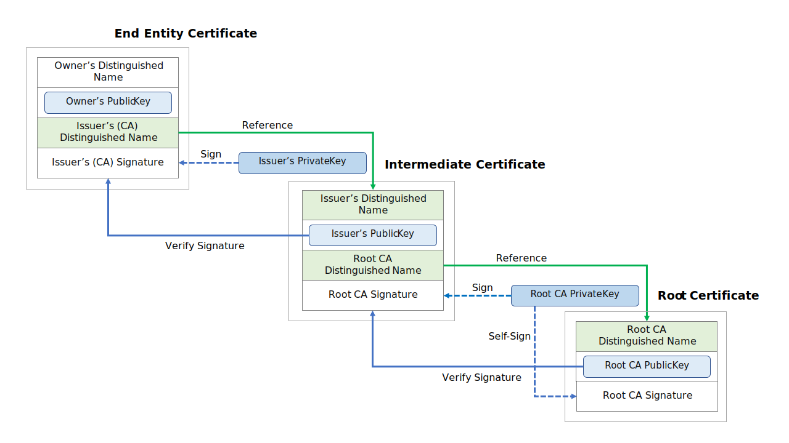
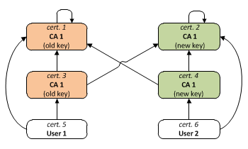

# Private hosting

https://www.nch.com.au/kb/10046.html

Basically private hosting is possible if:

- computer have access to internet
  - so it have to have assigned (temporal) ip
- internet access can be configured to allow incoming requests
  - so connection can be initiated by other computer on internet

## Typical situation

Typical situation:
- DSL router with NAT and local 192.168.*.* network
  (with rarely changing router internet IPv4 address,
  but IPv6 if supported should not change as often..).

Simplest private host setup:
1. Your address is:
   - IP address of router (it could change from time to time)
   - domain name, which must be bought and then it is send to internet DNS servers
     with host IP address, it can be updated from time to time. One can buy a domain 
     e.g. kolodziej.page from GoDaddy/ Namecheap / [No-IP](https://www.noip.com/remote-access)... . 
     It is worth checking if DNS provider supports Dynamic DNS (= often updates).
2. Setup and ran Nginx server on laptop.
3. Configured WiFi router to forward the requests on port 80 and 443 to this server.
4. Serve some web pages as the response.
5. Setup domain to point to this router’s public IP.
   (for dynamic IP one can use [ddclient](https://github.com/ddclient/ddclient))

Example:
1. https://afteracademy.com/blog/how-to-convert-your-laptop-desktop-into-a-server-and-host-internet-accessible-website-on-it-part-1-545940164ab9
2. https://afteracademy.com/blog/how-to-convert-your-laptop-desktop-into-a-server-and-host-internet-accessible-website-on-it-part-2-cdb4b3633fa9


# DHCP and DNS

Server configuration for DHCP and DNS:

- https://en.wikipedia.org/wiki/Dnsmasq
- http://www.thekelleys.org.uk/dnsmasq/docs/dnsmasq-man.html
- https://wiki.archlinux.org/index.php/Dnsmasq
- https://wiki.debian.org/dnsmasq
- https://help.ubuntu.com/community/Dnsmasq

## Virtual hosting and TLS

!!! https://httpd.apache.org/docs/2.0/ssl/ssl_faq.html#vhosts

# HTTP methods

## PUT and POST

https://stackoverflow.com/questions/630453/put-vs-post-in-rest

To choose between PUT and POST it is worth to consider
idempotence of their relative actions:

- PUT implies putting a resource - completely replacing whatever is
  available at the given URL with a different thing. By definition, a
  PUT is idempotent. Do it as many times as you like, and the result
  is the same. x=5 is idempotent. You can PUT a resource whether it
  previously exists, or not (eg, to Create, or to Update)!

- POST updates a resource, adds a subsidiary resource, or causes a
  change. A POST is not idempotent, in the way that x++ is not
  idempotent. 

So:

- PUT tells what to do ("put something here."),
- POST tells what need to be done ("do something with this.").

E.g. set complete resource at specified url is definitely PUT, and
add (partial) resourec somewere right is definitely POST.


# Secure connection and trusted peers

## Secure connection

Making secure connection is always possible without additional stuff
([Diffie-Hellman key exchange](https://en.wikipedia.org/wiki/Diffie%E2%80%93Hellman_key_exchange)):

- Partie propose shared key structure (base 'g' and modulus 'p')
- Parties agree on shared key structure
- Parties chooses their own secret
- Parties produce their own public keys based on thier own secrets and shared key structure 
  - `public_key_A(pivate_key_A , shared_key_structure) = (is isomorphic to) = (private_key_A, shared_key_structure)`
  - `public_key_B(pivate_key_B , shared_key_structure) = (is isomorphic to) = (private_key_B, shared_key_structure)`
  - computation of `public_key(private key , shared_key_structure)` is easy
  - computation of `private_key(public_key , shared_key_structure)` is very hard
- Parties exchange public keys
- Parties produces dependent private keys:
  - `private_public_key_A(pivate_key_A, public_key_B)=private_public_key_A(pivate_key_A, shared_key_structure, private_key_B)`
  - `private_public_key_B(pivate_key_B, public_key_A)=private_public_key_B(pivate_key_B, shared_key_structure, private_key_A)`
  - but above keys are equal so there is only private_public_key
- This way parties have shared secret

## Trusted peers

Trust is different thing than security, to have trust one thing is neccessary:

- there must be at least one thing that is trusted 
- and at least that thing must keep its seceret
  - (but it is independent of us unfortunately)

## Password-authenticated key agreement

https://en.wikipedia.org/wiki/Diffie%E2%80%93Hellman_key_exchange#Password-authenticated_key_agreement

When Alice and Bob share a password, they may use a
password-authenticated key agreement (PK) form of Diffie–Hellman to
prevent man-in-the-middle attacks. One simple scheme is to compare the
hash of shared secret concatenated with the password calculated
independently on both ends of channel.

A feature of these schemes is that an attacker can only test one
specific password on each iteration with the other party, and so the
system provides good security with relatively weak passwords.

Further links:

- https://en.wikipedia.org/wiki/Password-authenticated_key_agreement
- https://en.wikipedia.org/wiki/SPEKE
- https://en.wikipedia.org/wiki/Encrypted_key_exchange
- https://en.wikipedia.org/wiki/Secure_Remote_Password_protocol

# Certificates

https://en.wikipedia.org/wiki/Public_key_certificate

## Abstract certificate


Abstract certificate:

- Data: containing ecnrypted by Private Key:
  - dictionary of key and values, and
  - checksum of this dictionary
- Publik Key (matching private key) and encryption algorithm of signer


Abstract certificate is not trust, it is easely checkable valididy of
contained document. Above properties are enough to be shure that
document was constructed by only someone who knows private key.


Child certificate is abstract certificate (document that can be
created only by someone who knows private key) containing another
public key.

## [Digital signature](https://en.wikipedia.org/wiki/Digital_signature)

A digital signature is a mathematical scheme for verifying the
authenticity of digital messages or documents. A valid digital
signature, where the prerequisites are satisfied, gives a recipient
very strong reason to believe that the message was created by a known
sender, and that the message was not altered in transit.


Process:

- Alice creates a message: "Hello Bob!"
- Alice creates signature of oryginal message by encrypting it with
  her private key. 
- Alice sends a message and signature to Bob.
- Bob receives both the message and signature. 
- Bob uses Alice's public key to verify the authenticity of the
  message, i.e.:
  - that the message, decrypted using the public key, exactly matches
    the original message.


Because of practical reasons usually hash of message is encrypted.


## Certificates interconnections and multiple signatures

Certificates are usually verified by another certificates,
up to root certificates. Also many certificates can sign
one certificate (cross-signed certificates).

Interconnections need some agreement on content of certificate.
Certificates containing public key can also contain other
form of identity identificator (such as URL, Social Security Namber...)
etc, varified by certificate signer. This way interconnections can be
specified inside certificates.

Figure below shows example of typical certificates:




## [Public Key Certificate](https://en.wikipedia.org/wiki/Public_key_certificate) 

Minimal Public Key Certificate (PKC) contains:

- **public key** of subject
  - with key parameters
- **subject** : identity of the owner
- **issuer** : digital signature of entity that verified 
  public key of subject and subject identity

But issuer must also be certificate, so what is first
certificate? Such certificates can be **self signed**,
they must be trusted a priori (or not trusted).
They are called **Root Certificates**.

Common Public Key Certificate filds:

- **Serial Number**: Used to uniquely identify the certificate within
  a CA's systems. In particular this is used to track revocation
  information.
- **Subject**: The entity a certificate belongs to: 
  - a machine, 
  - an individual, 
  - or an organization.
- **Issuer**: The entity that verified the information and signed the
  certificate.
- **Not Before**: The earliest time and date on which the certificate
  is valid. Usually set to a few hours or days prior to the moment the
  certificate was issued, to avoid clock skew problems.
- **Not After**: The time and date past which the certificate is no
  longer valid.
- **Key Usage**: The valid cryptographic uses of the certificate's
  public key. Common values include:
  - digital signature validation,
  - key encipherment,
  - and certificate signing.
- **Extended Key Usage**: The applications in which the certificate
  may be used. Common values include:
  - TLS server authentication,
  - email protection,
  - and code signing.
- **Public Key**: A public key belonging to the certificate subject.
- **Signature Algorithm**: The algorithm used to sign the public key
  certificate.
- **Signature**: A signature of the certificate body by the issuer's
  private key.

## [Attribute Certificate (AC)](https://en.wikipedia.org/wiki/Authorization_certificate)

Using attribute certificate, the service or resource host does not
need to maintain an access control list (or access a central server
like Kerberos). It is similar to the idea of capabilities in which the
permission (or permissions) to use a service or resource is not stored
in the service or resource itself but in the users.


Algorithm, to use a service or a resource that the issuer of an AC
controls may be as fallows:, 

- a user presents both the PKC and the AC to a part of the service or
  resource that functions as an AC verifier. 
- The verifier will first check the identity of the user using the
  PKC, for example, by asking the user to decrypt a message encrypted
  by the user's public key in the PKC. If the authentication is
  successful, 
- the verifier will use the preinstalled public key of the AC issuer
  to check the validity of the presented AC. If the AC is valid, 
- the verifier will check whether or not the PKC specified in the AC
  matches the presented PKC. If it matches, 
- the verifier will check the validity period of the AC. If the AC is
  still valid, 
- the verifier can perform additional checks... If everything is ok, 
- offer the user a particular level of service or resource usage in
  accordance to the attributes contained in the AC.


Contents of a typical attribute certificate:

- **Version**: the version of the certificate.
- **Holder**: the holder of the certificate.
- **Issuer**: the issuer of the certificate.
- **Signature algorithm**: the algorithm by which the certificate is signed.
- **Serial number**: the unique issuance number given by the issuer.
- **Validity period**: the validity period of the certificate.
- **Attributes**: the attributes associated to the certificate holder.
- **Signature value**: the signature of the issuer over the whole data above. 


## TLS Server Certificate

As part of initial connection server is required to present certificate.
A client connecting to that server will perform the [certification 
path validation algorithm](https://en.wikipedia.org/wiki/Certification_path_validation_algorithm):

1. server certificate subject = hostname (domain name of website)
   - primary hostname is listed as the Common Name in the Subject
     field of the certificate
   - A certificate may be valid for multiple hostnames
     -  Such certificates are commonly called: Subject Alternative
        Name (SAN) certificates or Unified Communications Certificates
        (UCC)
     - These certificates contain the field Subject Alternative Name,
       though many CAs will also put them into the Subject Common Name
       field for backward compatibility.
     - If some of the hostnames contain an asterisk (*), a certificate
       may also be called a wildcard certificate. 
2. The certificate is signed by a trusted certificate authority.

## TLS Client Certificate

TLC client certificates are used to identify clients.
**Most client certificates contain an email address 
or personal name rather than a hostname.**

Usually operator of service that requires client certificate
will act as certificate authority (CA) and issue client certificate.

Client certificates are supported by many web browsers 
(but most services use passwords and cookies to authenticate users, 
instead of client certificates).

## [Self-signed certificates](https://en.wikipedia.org/wiki/Self-signed_certificate)

Usage: website owner can use a self-signed certificate to provide
HTTPS services, people who visit that website will see a warning in
their browser. Website visitors who bypass such warnings are exposed
to a risk that a third party could intercept traffic to the website
using the third-party's own self-signed certificate (this is a type of
man-in-the-middle (MitM) attack).

Self-signed certificate is a certificate that is not signed by a
certificate authority (CA), 


## [Root certificates](https://en.wikipedia.org/wiki/Root_certificate) and Certificate Authority (CA)

In cryptography and computer security, a root certificate is a public
key certificate that identifies a root certificate authority (CA).
Root certificates are self-signed (or it is possible for a certificate
to have multiple trust paths, say if the certificate was issued by a
root that was cross-signed) and form the basis of an X.509-based
public key infrastructure (PKI). Either it has matched Authority Key
Identifier with Subject Key Identifier, in some cases there is no
Authority Key identifier, then Issuer string should match with Subject
string


## Cross-signed certificate

https://security.stackexchange.com/questions/14043/what-is-the-use-of-cross-signing-certificates-in-x-509

It's about expanding trust, yes. If you trust both CA1 and CA2, and a
cert is signed by both, you've got a very high level of trust because
two seaparate entities that you trust have verified the cert.

It has the added bonus of increasing the ease of verification of
trust, such as situations where you've got clients that trust CA1 or
CA2 (but not both). In such a case, you can cross-sign a cert to be
trusted by both. This allows more clients to verify trust without
having to distribute separate certs for different CAs.

Another bonus is in situations where a CA's private key is leaked.
Let's say CA1's key leaks and your cert is signed by CA1 and CA2. In
the wake of the leak, CA1 issues a revokation for its public key and
you can no longer trust anything issued by CA1. However, since your
cert is cross-signed to CA2 as well, any client that trusts CA2 can
still maintain a level of trust in your cert.

Example:

> The scheme Let's Encrypt used doesn't require two signatures in a
> single certificate. As far as I understand it, it looks like this:
> 
> - This-CA Root
>   - Intermediate Cert A (Public Key X, signed by CA Root)
> - Other-CA Root
>   - Intermediate Cert A (Public Key X (same!), signed by Other-CA Root)
> 
> In this case there are two instances of the same Intermediate Cert A:
> one signed by your own CA Root, the other signed by Other-CA. They
> have the same RSA Key and all the fields equal, except for the
> signature (one signature per each instance of Intermediate CA). Client
> (like browser) is served with a certificate chain that has only one
> instance of Intermediate certificate, not both, and leads to one of
> two roots. This may be the only compatible way to "cross-sign".
> [Cite form stackexchange](https://security.stackexchange.com/a/216688)

## Cross-certification

https://en.wikipedia.org/wiki/X.509#Example_1:_Cross-certification_at_root_Certification_Authority_(CA)_level_between_two_PKIs


## Graceful Certificate transition

https://en.wikipedia.org/wiki/X.509#Example_2:_CA_certificate_renewal

Some interesting insights first:

- Certificate with Public Key can issue child certificates.
- But what if child certificate would have parent
  public key?
- In this situation we would have 2 certificates containing the
  same public key, chained eventually to the same ancestor.
- This way we would have 2 paths to oryginally issuing certificate,
  but without need to ask issuer to give as new certificate,
  (also issuer can be root certificate).
- Additionally new certificate (equivalent to old) can contain
  additional things like another CA signature.
- Now if for example above certificates are server certificates,
  server may choose which one (with additional intermediate
  certificates) to send to client.
- But in this situation depending on client preinstalled (install
  updated) root CA certificates, client can choose server certificate
  additional signature

Scheme described above allows changing/adding new parents
without changing server public key. Clients can verify
server in moore ways. This techique is useful if this 
exemplary server is or acts as top level CA.




## Certificate files

https://serverfault.com/questions/9708/what-is-a-pem-file-and-how-does-it-differ-from-other-openssl-generated-key-file

https://en.wikipedia.org/wiki/X.509#Certificate_filename_extensions


Certificate semantics is described by 
[ASN.1 protocol](https://en.wikipedia.org/wiki/ASN.1#Example) encoded
in some binary or text file. So every certificate is ASN.1 text file 
additionaly encoded.

Certificate files popular formats:

- **.csr** - This is a Certificate Signing Request. Some applications
  can generate these for submission to certificate-authorities. The
  actual format is PKCS10 which is defined in RFC 2986. It includes
  some/all of the key details of the requested certificate such as
  subject, organization, state, whatnot, as well as the public key of
  the certificate to get signed. These get signed by the CA and a
  certificate is returned. The returned certificate is the public
  certificate (which includes the public key but not the private key),
  which itself can be in a couple of formats.
- **.pem** - Defined in RFCs 1421 through 1424, this is a container
  format that may include just the public certificate (such as with
  Apache installs, and CA certificate files /etc/ssl/certs), or may
  include an entire certificate chain including public key, private
  key, and root certificates. Confusingly, it may also encode a CSR
  (e.g. as used here) as the PKCS10 format can be translated into PEM.
  The name is from Privacy Enhanced Mail (PEM), a failed method for
  secure email but the container format it used lives on, and is a
  base64 translation of the x509 ASN.1 keys.
- **.key** - This is a PEM formatted file containing just the
  private-key of a specific certificate and is merely a conventional
  name and not a standardized one. In Apache installs, this frequently
  resides in /etc/ssl/private. The rights on these files are very
  important, and some programs will refuse to load these certificates
  if they are set wrong.
- **.pkcs12** **.pfx** **.p12** - Originally defined by RSA in the
  Public-Key Cryptography Standards (abbreviated PKCS), the "12"
  variant was originally enhanced by Microsoft, and later submitted as
  RFC 7292. This is a passworded container format that contains both
  public and private certificate pairs. Unlike .pem files, this
  container is fully encrypted. Openssl can turn this into a .pem file
  with both public and private keys: openssl pkcs12 -in
  file-to-convert.p12 -out converted-file.pem -nodes

A few other formats that show up from time to time:

- **.der** - A way to encode ASN.1 syntax in binary, a .pem file is
  just a Base64 encoded .der file. OpenSSL can convert these to .pem
  (openssl x509 -inform der -in to-convert.der -out converted.pem).
  Windows sees these as Certificate files. By default, Windows will
  export certificates as .DER formatted files with a different
  extension. Like...
- **.cert** **.cer** **.crt** - A .pem (or rarely .der) formatted file with a
  different extension, one that is recognized by Windows Explorer as a
  certificate, which .pem is not.
- **.p7b** .keystore - Defined in RFC 2315 as PKCS number 7, this is a
  format used by Windows for certificate interchange. Java understands
  these natively, and often uses .keystore as an extension instead.
  Unlike .pem style certificates, this format has a defined way to
  include certification-path certificates.
- **.crl** - A certificate revocation list. Certificate Authorities
  produce these as a way to de-authorize certificates before
  expiration. You can sometimes download them from CA websites.


## Certificate verification levels

https://comparecheapssl.com/types-of-ssl-certificate/

As per the applications, SSL Certificates can be classified into three
types:

- Domain Validation SSL
- Organization Validation SSL
- Extended Validation SSL

## Free verified certificates

[Let's encrypt](https://letsencrypt.org/certificates/) is webservice
certyfying servers.

It provides automatic program for hostname ovnership named
[certbot](https://certbot.eff.org/lets-encrypt/ubuntubionic-other).

## Firefox preinstalled certificates

https://ccadb-public.secure.force.com/mozilla/CACertificatesInFirefoxReport

https://wiki.mozilla.org/CA/Included_Certificates


# cURL getting things

## From open resources

https://curl.haxx.se/docs/manual.html


Different resources behind different protocols
can be printed to console:

```sh
# source code of web server response
curl http://www.netscape.com/

# with port specification
curl http://www.weirdserver.com:8000/

# or from IP(6) address:
curl "http://[2001:1890:1112:1::20]/"

# and other protocols:
curl ftp://cool.haxx.se/
```

## From protected resources


https://curl.haxx.se/docs/manual.html


```sh
# getting file from FTPS server:
curl --ftp-ssl ftp://files.are.secure.com/secrets.txt

# Get a file from an SSH server using SFTP:
curl -u username sftp://example.com/etc/issue

# Get a file from an SSH server using SCP using 
# a private key (not password-protected) to authenticate:
curl -u username: --key ~/.ssh/id_rsa scp://example.com/~/file.txt

# Get a file from an SSH server using SCP using 
# a private key (password-protected) to authenticate:
curl -u username: 
  --key \
  ~/.ssh/id_rsa \
  --pass private_key_password \
  scp://example.com/~/file.txt
```

## And saving to files

https://curl.haxx.se/docs/manual.html


```sh
# Get a web page and store in a local file with a specific name:
curl -o thatpage.html http://www.netscape.com/

# Automatic file name,
# Get a web page and store in a local file, make the local file 
# get the name of the remote document 
curl -O http://www.netscape.com/index.html
```

# cURL and https

https://kb.vmware.com/s/article/78471

Transfer of sensitive information is typically done under the cover of
digital certificates. The certificate will help confirm to the
recipient that the sender is actually who they claim they are. Digital
certificates are issued by certificate authorities or CAs. A list of
trusted certificate authorities and their root certificates are
installed on a server when a digital certificate is applied to the
server. For transactions over HTTPS this information will be exchanged
for communication. When a server CA is received via cURL that isn't
signed by one of the trusted certificates in the installed CA
certificate store, this will cause SSL to report an error ("failed to
verify the legitimacy of the server") during the handshake. SSL will
then refuse further communication with that server.


# TLS

Very good faq: https://httpd.apache.org/docs/2.0/ssl/ssl_faq.html

Usage: https://en.wikipedia.org/wiki/HTTPS

Client-Certificate based authentication example: https://www.ssltrust.com.au/help/setup-guides/client-certificate-authentication

Client-Certificate google chrome devices example: https://support.google.com/chrome/a/answer/6080885?hl=en


## Name based virtual servers

https://en.wikipedia.org/wiki/Transport_Layer_Security#Support_for_name-based_virtual_servers


From the application protocol point of view, TLS belongs to a lower
layer, although the TCP/IP model is too coarse to show it. This means
that the TLS handshake is usually (except in the STARTTLS case)
performed before the application protocol can start. In the name-based
virtual server feature being provided by the application layer, all
co-hosted virtual servers share the same certificate because the
server has to select and send a certificate immediately after the
ClientHello message. This is a big problem in hosting environments
because it means either sharing the same certificate among all
customers or using a different IP address for each of them.

There are two known workarounds provided by X.509:

- If all virtual servers belong to the same domain, a wildcard
  certificate can be used. Besides the loose host name selection
  that might be a problem or not, there is no common agreement about
  how to match wildcard certificates. Different rules are applied
  depending on the application protocol or software used.
- Add every virtual host name in the subjectAltName extension. The
  major problem being that the certificate needs to be reissued
  whenever a new virtual server is added.

To provide the server name, RFC 4366 **Transport Layer Security
(TLS)** Extensions allow clients to include a [**Server Name
Indication**](https://en.wikipedia.org/wiki/Server_Name_Indication)
extension (**SNI**) in the extended ClientHello message. This extension
hints to the server immediately which name the client wishes to
connect to, so the server can select the appropriate certificate to
send to the clients.

RFC 2817 also documents a method to implement name-based virtual
hosting by upgrading HTTP to TLS via an HTTP/1.1 Upgrade header.
Normally this is to securely implement HTTP over TLS within the main
"http" URI scheme (which avoids forking the URI space and reduces the
number of used ports), however, few implementations currently support
this.

# TLS protocol details

https://en.wikipedia.org/wiki/Transport_Layer_Security#Protocol_details


# SSL (TLS) faq notes!

https://httpd.apache.org/docs/2.0/ssl/ssl_faq.html


# HTTPs technical info notes

https://en.wikipedia.org/wiki/HTTPS#Technical


# Developer certificates (subject: localhost)

.Net Core have store for certificates and keys. For
developement certificates there is CLI program named `dotnet-dev-certs`
[(with self documenting open source code at GitHub)](https://github.com/aspnet/DotNetTools/blob/master/src/dotnet-dev-certs/Program.cs)
This program can be accessed on PATH with following command:

```sh
dotnet dev-certs https <options>
```

For working with certificates OpenSSL can be used: 

```sh
openssl <command> <command_options>
```

## dotnet dev-certs https

https://github.com/aspnet/DotNetTools/blob/master/src/dotnet-dev-certs/Program.cs

```console
$ # ******************************************************************
$ # dotnet certificates store CLI help:
$ # ******************************************************************
$ dotnet dev-certs https --help
  
  Usage: dotnet dev-certs https [options]
 
  Options:
    -ep|--export-path  Full path to the exported certificate
    -p|--password      Password to use when exporting the certificate 
                       with the private key into a pfx file
    -c|--check         Check for the existence of the certificate but 
                       do not perform any action
    --clean            Cleans all HTTPS development certificates from 
                       the machine.
    -v|--verbose       Display more debug information.
    -q|--quiet         Display warnings and errors only.
    -h|--help          Show help information
```

Important:

- Calling `dotnet dev-certs https --export-path cert.crt` will create
  certificate and private key in .Net Core store if those didn't exist.
- `dotnet dev-certs https --export-path cert.crt` : will output only 
  certificate 'cert.crt' file in '.der' format.
- `dotnet dev-certs https --export-path cert_and_key.pfx --password 'supSecret` :
  will output certificate and private key inside 'cert_and_key.pfx' file
  in PKCS12 format.

## OpenSSL Help


```sh
# manual:
man openssl x509
# synthax:
openssl x509 --help
# exemples how to work with (Windows) pfx files:
man openssl pkcs12
```

Links:

- https://wiki.cac.washington.edu/display/infra/UW+Certificate+Services
- https://wiki.cac.washington.edu/display/infra/Extracting+Certificate+and+Private+Key+Files+from+a+.pfx+File

## OpenSSL: how to create pfx with private key and certificates

https://stackoverflow.com/questions/6307886/how-to-create-pfx-file-from-certificate-and-private-key

```sh
# Create a PKCS#12 file:
#  - dont parse PKCS#12 file, create one (-export)
#  - save output with name 'domain.name.pfx' (-out):
#  - add private key (pem format) in file 'domain.name.key' (-inkey)
#  - dont encrypted private key by DES (-nodes)
#  - add certificates chain (-in)
openssl pkcs12 \
  -export \
  -out domain.name.pfx \
  -inkey domain.name.key \
  -nodes
  -in domain.name.crt \
  -in intermediate.crt \
  -in rootca.crt

# print some info about pfx file (dont output pem):
openssl pkcs12 -in domain.name.pfx -info -noout

# convert to pem and dont encrypt priv key:
openssl pkcs12 -in domain.name.pfx -out domain.name.pem -nodes

# Output only certificates to a file:
openssl pkcs12 \
  -in domain.name.pfx \
  -nokeys \
  -out domain.name.certs.pem

# Output only private key to a file (without encrypting):
openssl pkcs12 \
  -in domain.name.pfx \
  -nocerts \
  -nodes
  -out domain.name.key

# remove the passphrase from the private key: 
# (probably u will be prompted for passphrase)
openssl rsa -in key.pem -out server.key 


# Output only client certificates to a file:
openssl pkcs12 \
  -in domain.name.pfx \
  -clcerts \
  -out domain.name.client_certs.pem
# Output only CA certificates to a file:
openssl pkcs12 \
  -in domain.name.pfx \
  -cacerts \
  -out domain.name.ca_certs.pem
```


# ASP .Net Core Https SSL configuration

- https://docs.servicestack.net/grpc-ssl
- https://devblogs.microsoft.com/aspnet/configuring-https-in-asp-net-core-across-different-platforms/
- https://www.hanselman.com/blog/DevelopingLocallyWithASPNETCoreUnderHTTPSSSLAndSelfSignedCerts.aspx
- https://docs.microsoft.com/en-us/aspnet/core/security/enforcing-ssl?view=aspnetcore-2.2&tabs=netcore-cli#trust-the-aspnet-core-https-development-certificate-on-windows-and-macos
- https://docs.servicestack.net/grpc-ssl
- https://www.thesslstore.com/blog/how-to-make-ssl-certificates-play-nice-with-asp-net-core/
- https://medium.com/@the.green.man/set-up-https-on-local-with-net-core-and-docker-7a41f030fc76
- https://stackoverflow.com/questions/38138952/bypass-invalid-ssl-certificate-in-net-core
- https://stackoverflow.com/questions/56974302/self-hosted-asp-net-core-app-does-not-work-with-ssl
- https://stackoverflow.com/questions/52167612/unable-to-create-a-dev-certificate-for-an-asp-net-core-web-app-in-a-docker-conta
- https://github.com/dotnet/AspNetCore.Docs/issues/6199
- https://docs.microsoft.com/en-us/aspnet/core/security/enforcing-ssl?view=aspnetcore-3.1&tabs=netcore-cli

# ASP .Net Core Certificate Authentication

- https://docs.microsoft.com/en-us/aspnet/core/security/authentication/certauth?view=aspnetcore-3.1
- https://docs.microsoft.com/en-us/aspnet/core/host-and-deploy/linux-nginx?view=aspnetcore-3.1#https-configuration
- https://docs.microsoft.com/en-us/aspnet/core/host-and-deploy/linux-apache?view=aspnetcore-3.1#https-configuration


# How to extract and register dev certificate


```sh
## ******************************************************************
## dotnet check if ther is valid certificate:
## ******************************************************************
dotnet dev-certs https --check --verbose
# A valid certificate was found.


## ******************************************************************
## Adding new developer certificate and private key 
## or retriving existing certificate (without key).
##
## IMPORTANT!!! 
##   - On Ubuntu bionic following command will output file in .der format
##   - .der is binary encoded ASN.1 syntax (certificate data), 
##   - .pem file is base64 encoded .der file 
##   - on windows it would be probably named .crt
## ******************************************************************
dotnet dev-certs https --export-path my_dev_cert.crt 
openssl x509 -inform der -in my_dev_cert.crt -text
## convert der to pem:
openssl x509 -inform der -in my_dev_cert.crt -out my_dev_cert.pem
## display pem:
openssl x509 -text -in my_dev_cert.pem
# Certificate:
#     Data:
#         Version: 3 (0x2)
#         Serial Number: 5747736622853871796 (0x4fc4100173b558b4)
#         Signature Algorithm: sha256WithRSAEncryption
#         Issuer: CN = localhost
#         Validity
#             Not Before: Jul 14 00:15:26 2020 GMT
#             Not After : Jul 14 00:15:26 2021 GMT
#         Subject: CN = localhost
# <other things ...>
## save readable version to file:
openssl x509 -text -in my_dev_cert.pem >my_dev_cert.readable


## ******************************************************************
## Adding new developer certificate and private key 
## or retriving existing certificate with private key
## as one pfx (pkcs12 format) file password protected:
## ******************************************************************
dotnet dev-certs https \
--export-path my_passworded_dev_cert_and_key.pfx \
--password 'kami87K!!!'

## print some info:
openssl pkcs12 -in my_dev_cert_and_key.pfx -info -noout
# Enter Import Password:
# MAC: sha1, Iteration 2048
# MAC length: 20, salt length: 8
# PKCS7 Encrypted data: pbeWithSHA1And40BitRC2-CBC, Iteration 2048
# Certificate bag
# PKCS7 Data
# Shrouded Keybag: pbeWithSHA1And3-KeyTripleDES-CBC, Iteration 2048

## print certificate and private key as pem 
## (without encrypting private key)
## if no passphrase provided, U will be asked.
openssl pkcs12 -in my_dev_cert_and_key.pfx -passin 'pass:kami87K!!!' -nodes

## convert to pem (without encrypting private key)
openssl pkcs12 \
  -in my_passworded_dev_cert_and_key.pfx \
  -passin 'pass:kami87K!!!' \
  -nodes \
  -out my_dev_cert_and_key.pem

## print human readable
openssl x509 -in my_dev_cert_and_key.pem -text

## lets extract key:
## (if key should be encrypted better use openssl pkcs8)
openssl rsa -in my_dev_cert_and_key.pem -out my_dev_cert.key 

## ******************************************************************
## Trusting certificate:
##   - On Ubuntu bionic following is not allowed:
##     dotnet dev-certs https --trust
##   - For ubuntu to trust certificate:
## ******************************************************************

## ******************************************************************
## cURL and dev certificates:
##   - cURL uses CA certificate store
##   - CA is very important, trusted signatures must have 
##     certificate authority property
##   - cURL can use custom CA certificate store by pointin pem file
##     (by CLI option --cacert path/to/cacert.crt). If certificate
##     is for exemple self signed (end user) certificate (not CA cert)
##     than this will not work
##   - this is because cURL needs CA cert to verify any cert
##   - to trust cert without verification one can use option '-k' (--insecure)
## ******************************************************************


# ignore cert verification:
curl -k https://localhost:5001/api/questions/
curl --insecure https://localhost:5001/api/questions/
# use dev private key to create CA root certificate
# resulting with ca root certificate with the same
# key and distinguished name
# this certificate can be used as dev certificate
# signature info
curl --cacert mkcerts/ca/root-ca-localhost.mk.crt https://localhost:5001/api/questions/

```


# Creating small PKI and cross sign some certificate

- [OpenSSL Tutorial on Simple PKI](https://pki-tutorial.readthedocs.io/en/latest/simple/index.html)
- [Short guide to create root ca cert and user certs](https://gist.github.com/fntlnz/cf14feb5a46b2eda428e000157447309)
- [Description of creating certificates](https://gist.github.com/Soarez/9688998)

In short:
- **root cert** is
  - data containing:
    - subject
    - subject Public Key (and alghoritm info)
    - issuer
    - issuer Public Key (and alghoritm info)
    - property root allowing signing CA certificates
  - hash of data
  - data and hash signature (data and hash encrypted by private key)
- root cert is is self signed meaning that: 
  - subject = issuer
  - subject Public Key = issuer Public Key
- root cert allows signing certificates allowing Certificate Issues
- **ca cert** is:
  - data containing:
    - subject
    - subject Public Key (and alghoritm info)
    - issuer
    - issuer Public Key (and alghoritm info)
    - property Certificate Issuer
    - property Certificate Authority (CA)
  - hash of data
  - data and hash signature (data and hash encrypted by private key)
- ca cert is allowed to sign user certificates


## Getting remote certificates and certificates chains

```sh
# If the remote server is using SNI (that is, sharing multiple SSL 
# hosts on a single IP address) you will need to send the correct 
# hostname in order to get the right certificate.
# 
openssl s_client -showcerts \
  -servername www.app1.example.com \
  -connect www.example.com:443 \
  </dev/null

# server not hosted as virtual host
openssl s_client -showcerts -connect www.example.com:443 </dev/null

# to get chain of certificates to separate pem 's
# https://superuser.com/questions/97201/how-to-save-a-remote-server-ssl-certificate-locally-as-a-file/641396#641396
# https://unix.stackexchange.com/questions/366898/generate-hpkp-fingerprints-for-all-certificate-chain
# https://unix.stackexchange.com/questions/368123/how-to-extract-the-root-ca-and-subordinate-ca-from-a-certificate-chain-in-linux
# openssl s_client ... simulates TLS connection and outputs negotiation as text
# this text contains certificates chain
# unfortunately openssl -x509 ... will extract only first certificate of chain!!!!
# so certificates are extracted "manually" using awk:
server_host=localhost
openssl s_client -showcerts \
  -connect "$server_host":443 \
  < /dev/null \
  | awk '/BEGIN/,/END/{ if(/BEGIN/){a++}; out="'$server_host'."a".pem"; print >out}'

# extracting certs to subject CN name:
for cert in "$server_host".*.pem; do 
  newname=$(openssl x509 -noout -subject -in $cert \
  | sed -n 's/^.*CN=\(.*\)$/\1/; s/[ ,.*]/_/g; s/__/_/g; s/^_//g;p').pem; 
  mv $cert $newname; 
done

```


## Everything needs private key (and associated public key)!

```sh
# generate RSA key with 2048 bit length
openssl genrsa -out mk_root.key 2048
openssl genrsa -out mk_ca.key 2048
openssl genrsa -out mk_server.key 2048
# to inspect selected key:
openssl rsa -in mk_root.key -noout -text
# generate associated public keys:
openssl rsa -in mk_root.key -pubout -out mk_root.pubkey
openssl rsa -in mk_ca.key -pubout -out mk_ca.pubkey
openssl rsa -in mk_server.key -pubout -out mk_server.pubkey
# to generate certificate first Certificate Signing Request
# .csr file must be constructed
# to construct .csr file csr config file is needed
```

## Interactive CA certificate generation

```console
$ # first generate private-public key
$ openssl genrsa -out mk.ca.key 2048
$ 
$ # start interactive CA cert generation
$ openssl req -new -x509 -key mk.ca.key -out mk.ca.cert
```

## Scripted certificate generation

Besides public-private key values, there are needed:
- keys alghoritms,
- identities,
- usage validities,
- other agreed words and restrictions


Above can be specified in `.conf` file(s).
Exemplary certificate request configuration file
is shown below:

```conf
# The main section is named req because 
# the command we are using is openssl req
[ req ]


# prompt for filling unspecified certificate fields?
# no means fill from this conf file
prompt = no

# strings utf8 encoded? no -> ascii, yes -> utf8
utf8 = yes


# **************************************
# req: alghoritms parameters
# **************************************

# default autogenerated key size in bits
# applys when -new and no -key
# overriden by -newkey
default_bits = 2048

# default filename to write a private key to
# not specified means std out
# overriden by -keyout
default_keyfile = private.key

# encrypt private key?
# setting no is equivalent to -nodes
encrypt_key = no

# digest algorithm to use: md5 sha1 mdc2
# md5 is not safe
default_md = sha1


# **************************************
# req: subject identity
# **************************************

# subject identities and informations
# as pointer to section
distinguished_name = my_req_distinguished_name

# **************************************
# req: extensions
# **************************************

# pointer to the configuration file section containing a list of extensions
# can be overridden by the -reqexts
req_extensions = my_extensions

# **************************************
# Referenced sections
# **************************************

# referenced section for subject (distinguished_name)
[ my_req_distinguished_name ]
C = PT                     # country
ST = Lisboa                # state
L = Lisboa                 # city
O  = Oats In The Water     # organization
CN = *.oats.org            # common name (with wildcards)


# referenced section for extensions
[ my_extensions ]
basicConstraints=CA:FALSE            # constraints string
                                     # CA means Certificate Authority
subjectAltName=@my_subject_alt_names # pointer to section with list of DNS
subjectKeyIdentifier = hash          # ...


[ my_subject_alt_names ]
DNS.1 = *.oats.org
DNS.2 = *.oats.net
DNS.3 = *.oats.in
DNS.4 = oats.org
DNS.5 = oats.net
DNS.6 = oats.in

```

Everything certificate have without signature is typically
saved in `.csr` (Certificate Sign Request) file which can
be generated from `.conf` file:

```sh
openssl req -new -out oats.csr -config oats.conf
```

# Simple PKI Example (with openssl)

Based on: [Simple PKI - OpenSSL PKI Tutorial](https://pki-tutorial.readthedocs.io/en/latest/simple/index.html).

## Root CA request config

Creating root CA certificate includes generating
certificate request file. This file contains public key
and statements which will be verified by issuer.

Since it is root certificate, it is then self signed.

For openssl request file is generated from conf file.


Root CA certificate request config (`etc/root-ca.mk.req.conf`):

```conf
# The [default] section contains global constants that can be referenced

[ default ]
ca                      = root-ca               # CA name
dir                     = .                     # Top dir

# req command section

[ req ]
default_bits            = 2048                  # RSA key size
encrypt_key             = no                    # Protect private key
default_md              = sha1                  # MD to use
utf8                    = yes                   # Input is UTF-8
string_mask             = utf8only              # Emit UTF-8 strings
prompt                  = no                    # Don't prompt for DN
distinguished_name      = ca_dn                 # DN section
req_extensions          = ca_root_req_ext       # Desired extensions

[ ca_dn ]
commonName              = $ENV::ca_name

[ ca_root_req_ext ]
keyUsage                = critical,keyCertSign,cRLSign
basicConstraints        = critical,CA:true
subjectKeyIdentifier    = hash
```

## Selfsigning Root CA request config

Root CA certificate signing config
(`etc/root-ca.mk.ca.conf`):

```conf
# The [default] section contains global constants 

[ default ]
ca                      = root-ca         # CA name
dir                     = .                     # Top dir

# The remainder of the configuration file is used by the openssl ca command.

[ ca ]
default_ca              = root_ca               # The default CA section

[ root_ca ]
certificate             = $dir/ca/$ENV::ca_name.crt       # The CA cert
private_key             = $dir/ca/$ENV::ca_name/private/$ENV::ca_name.key # CA private key
new_certs_dir           = $dir/ca/$ENV::ca_name           # Certificate archive
serial                  = $dir/ca/$ENV::ca_name/db/$ENV::ca_name.crt.srl # Serial number file
crlnumber               = $dir/ca/$ENV::ca_name/db/$ENV::ca_name.crl.srl # CRL number file
database                = $dir/ca/$ENV::ca_name/db/$ENV::ca_name.db # Index file

unique_subject          = no                    # Require unique subject
default_days            = 3652                  # How long to certify for
default_md              = sha1                  # MD to use
policy                  = any_pol               # Default naming policy
email_in_dn             = no                    # Add email to cert DN
preserve                = no                    # Keep passed DN ordering
name_opt                = ca_default            # Subject DN display options
cert_opt                = ca_default            # Certificate display options
copy_extensions         = none                  # Copy extensions from CSR
x509_extensions         = root_ca_ext           # Default cert extensions
                                                # It actually define cert type
default_crl_days        = 365                   # How long before next CRL
crl_extensions          = crl_ext               # CRL extensions
                                                # (Certificate Revocation List)

# Naming policies control which parts of a DN end up in the certificate and
# under what circumstances certification should be denied.

[ any_pol ]
domainComponent         = optional
countryName             = optional
stateOrProvinceName     = optional
localityName            = optional
organizationName        = optional
organizationalUnitName  = optional
commonName              = optional
emailAddress            = optional

# Certificate extensions define what types of certificates the CA is able to
# create.

[ root_ca_ext ]
keyUsage                = critical,keyCertSign,cRLSign
basicConstraints        = critical,CA:true
subjectKeyIdentifier    = hash
authorityKeyIdentifier  = keyid:always

# CRL (Certificate Revocation List) extensions exist solely to point to the 
# CA certificate that has issued the CRL.

[ crl_ext ]
authorityKeyIdentifier  = keyid:always
```

## Intermediate CA request config

Intermediate CA certificate request config (`etc/inter-ca.mk.req.conf`):

```conf

[ default ]
ca                      = inter-ca              # CA name
dir                     = .                     # Top dir

[ req ]
default_bits            = 2048                  # RSA key size
encrypt_key             = no                    # Protect private key
default_md              = sha1                  # MD to use
utf8                    = yes                   # Input is UTF-8
string_mask             = utf8only              # Emit UTF-8 strings
prompt                  = no                    # Don't prompt for DN
distinguished_name      = ca_dn                 # DN section
req_extensions          = ca_reqext             # Desired extensions

[ ca_dn ]
commonName              = $ENV::ca_name

[ ca_reqext ]
keyUsage                = critical,keyCertSign,cRLSign
basicConstraints        = critical,CA:true,pathlen:0
subjectKeyIdentifier    = hash

```

## Signing Intermediate CA request config

Intermediate CA certificate signing config (`etc/inter-ca.mk.ca.conf`):

```conf

[ default ]
ca                      = inter-ca              # CA name
dir                     = .                     # Top dir

[ ca ]
default_ca              = signing_ca            # The default CA section

[ signing_ca ]
certificate             = $dir/ca/$ENV::ca_name.crt       # The CA cert
private_key             = $dir/ca/$ENV::ca_name/private/$ENV::ca_name.key # CA private key
new_certs_dir           = $dir/ca/$ENV::ca_name           # Certificate archive
serial                  = $dir/ca/$ENV::ca_name/db/$ENV::ca_name.crt.srl # Serial number file
crlnumber               = $dir/ca/$ENV::ca_name/db/$ENV::ca_name.crl.srl # CRL number file
database                = $dir/ca/$ENV::ca_name/db/$ENV::ca_name.db # Index file
unique_subject          = no                    # Require unique subject
default_days            = 730                   # How long to certify for
default_md              = sha1                  # MD to use
policy                  = any_pol               # Default naming policy
email_in_dn             = no                    # Add email to cert DN
preserve                = no                    # Keep passed DN ordering
name_opt                = ca_default            # Subject DN display options
cert_opt                = ca_default            # Certificate display options
copy_extensions         = copy                  # Copy extensions from CSR
x509_extensions         = email_ext             # Default cert extensions
default_crl_days        = 7                     # How long before next CRL
crl_extensions          = server_ext            # CRL extensions

# Naming policies control which parts of a DN end up in the certificate and
# under what circumstances certification should be denied.

[ any_pol ]
domainComponent         = optional
countryName             = optional
stateOrProvinceName     = optional
localityName            = optional
organizationName        = optional
organizationalUnitName  = optional
commonName              = optional
emailAddress            = optional

# Certificate extensions define what types of certificates the CA is able to
# create.

[ server_ext ]
keyUsage                = critical,digitalSignature,keyEncipherment
basicConstraints        = CA:false
extendedKeyUsage        = serverAuth,clientAuth
subjectKeyIdentifier    = hash
authorityKeyIdentifier  = keyid:always

# CRL extensions exist solely to point to the CA certificate that has issued
# the CRL.

[ crl_ext ]
authorityKeyIdentifier  = keyid:always
```

## Root certificate generation

Init script creating structure for signing mutliple certificates.
It creates root CA certificate and intermediate CA certificate.

Root generation:

```sh
export ca_name=root-ca.mk
export ca_sign=$ca_name
# etc dir must exist and contain configuration files
# in the forms: 
#   $etc/$ca_name.req.conf (for request building)
#   $etc/$ca_sign.ca.conf  (for request signing = cert generation)
etc=etc


mkdir ca                                     # For certificate authorities

mkdir -p ca/$ca_name/private                 # Root Certificate Authority staff
chmod 700 ca/$ca_name/private                # Root private keys 
                                             # read/write/execute only owner

mkdir -p ca/$ca_name/db                      # Root Certificate Authority staff
cp /dev/null ca/$ca_name/db/$ca_name.db      # signed certificates index database
cp /dev/null ca/$ca_name/db/$ca_name.db.attr # ...?
echo 01 > ca/$ca_name/db/$ca_name.crt.srl    # certificates signing history,
                                             # every signing must have unique 
                                             # hex number, lets start with 01
echo 01 > ca/$ca_name/db/$ca_name.crl.srl    # certificates signing history,
                                             # every signing must have unique 
                                             # hex number, lets start with 01

mkdir crl                                    # certificates revocatiol list 
mkdir certs                                  # user certificates

# create root ca request
openssl req -new \
    -config $etc/$ca_name.req.conf \
    -out ca/$ca_name.csr \
    -keyout ca/$ca_name/private/$ca_name.key

# selfsign root ca request
openssl ca -selfsign \
    -config $etc/$ca_sign.ca.conf \
    -in ca/$ca_name.csr \
    -out ca/$ca_name.crt
```

## Intermediate CA generation


```sh
export ca_name=inter-ca.mk
export ca_sign=root-ca.mk
# etc dir must exist and contain configuration files
# in the forms: 
#   $etc/$ca_name.req.conf (for request building)
#   $etc/$ca_sign.ca.conf  (for request signing = cert generation)
etc=etc


mkdir ca                                     # For certificate authorities

mkdir -p ca/$ca_name/private                 # Certificate Authority staff
chmod 700 ca/$ca_name/private                # private keys 
                                             # read/write/execute only owner

mkdir -p ca/$ca_name/db                      # Certificate Authority staff
cp /dev/null ca/$ca_name/db/$ca_name.db      # signed certificates index database
cp /dev/null ca/$ca_name/db/$ca_name.db.attr # ...?
echo 01 > ca/$ca_name/db/$ca_name.crt.srl    # certificates signing history,
                                             # every signing must have unique 
                                             # hex number, lets start with 01
echo 01 > ca/$ca_name/db/$ca_name.crl.srl    # certificates signing history,
                                             # every signing must have unique 
                                             # hex number, lets start with 01

# create root ca request
openssl req -new \
    -config $etc/$ca_name.req.conf \
    -out ca/$ca_name.csr \
    -keyout ca/$ca_name/private/$ca_name.key

# root sign ca request
openssl ca \
    -config $etc/$ca_sign.ca.conf \
    -in ca/$ca_name.csr \
    -out ca/$ca_name.crt
```

## Requesting and signing of end entity certificate

`etc/localhost.req.conf`:

```conf
# TLS server certificate request

# This file is used by the openssl req command. The subjectAltName cannot be
# prompted for and must be specified in the SAN environment variable.

[ default ]
SAN                     = DNS:localhost         # Default value

[ req ]
default_bits            = 2048                  # RSA key size
encrypt_key             = no                    # Protect private key
default_md              = sha1                  # MD to use
utf8                    = yes                   # Input is UTF-8
string_mask             = utf8only              # Emit UTF-8 strings
prompt                  = no                    # use DN as in config
distinguished_name      = server_dn             # DN template
req_extensions          = server_reqext         # Desired extensions

[ server_dn ]
commonName              = $ENV::ca_name

[ server_reqext ]
keyUsage                = critical,digitalSignature,keyEncipherment
extendedKeyUsage        = serverAuth
subjectKeyIdentifier    = hash
subjectAltName          = $ENV::SAN
```

```sh
export ca_name=localhost
export ca_sign=inter-ca.mk
# etc dir must exist and contain configuration files
# in the forms: 
#   $etc/$ca_name.req.conf (for request building)
#   $etc/$ca_sign.ca.conf  (for request signing = cert generation)
etc=etc

mkdir crl                                    # certificates revocatiol list 
mkdir certs                                  # user certificates

SAN=DNS:localhost \
openssl req -new \
    -config $etc/server.conf \
    -out certs/$ca_name.csr \
    -keyout certs/$ca_name.key

openssl ca \
    -config $etc/$ca_sign.ca.conf \
    -in certs/$ca_name.csr \
    -out certs/$ca_name.crt
```

# Adding certs to linux stores

https://unix.stackexchange.com/questions/90450/adding-a-self-signed-certificate-to-the-trusted-list

Non Interactive Approach (Oct'18) for recent debian based systems

There's a distinction between adding a cert to the host's store and
activating it so that applications really utilize those. An existing
cert in the store isn't necessarily used (although i have to admit
that still a lot of packages are getting it wrong anyway) This can get
confusing when you setup a package which considers
`/etc/ca-certificate.conf` and simply refuses to use your cert although
it has been added without error. You need to tell
update-ca-certificates explicitly to (not just copy but) activate the
cert by adding it to `/etc/ca-certificate.conf` or
`/etc/ca-certificate/update.d`.

```sh
CERT=mycert.crt
cp /mypath/to/$CERT /usr/share/ca-certificates/$CERT
    # notice the + sign which tells to activate the cert!!!
echo "+$CERT" >/etc/ca-certificates/update.d/activate_my_cert
dpkg-reconfigure ca-certificates;
```

Now here it gets confusing as there's a way to implicitly trust a
certificate by using a different path:

```sh
CERT=mycert.crt
cp /mypath/to/$CERT /usr/local/share/ca-certificates/$CERT
update-ca-certificates;
```

https://www.techrepublic.com/article/how-to-install-ca-certificates-in-ubuntu-server/


# Further OpenSSL reading and examples

- [mkcert zero config utility for dev PKI on Ubuntu](https://kifarunix.com/how-to-create-self-signed-ssl-certificate-with-mkcert-on-ubuntu-18-04/)
- cURL:
  - https://curl.haxx.se/docs/sslcerts.html
  - https://curl.haxx.se/docs/manual.html
  - https://unix.stackexchange.com/questions/451207/how-to-trust-self-signed-certificate-in-curl-command-line
- OpenSSL:
  - [ca command](https://www.openssl.org/docs/man1.1.1/man1/ca.html)
  - [conf files](https://www.openssl.org/docs/man1.1.1/man5/config.html)
  - [extended extensions](https://www.openssl.org/docs/man1.1.1/man5/x509v3_config.html)
  - cheetsheet
    - https://www.sslshopper.com/article-most-common-openssl-commands.html
    - https://www.sslshopper.com/ssl-converter.html
- Apache and Nginx:
  - https://www.digitalocean.com/community/tutorials/how-to-create-a-self-signed-ssl-certificate-for-apache-in-ubuntu-18-04
  - https://www.akadia.com/services/ssh_test_certificate.html
- Ubuntu cert store:
  - https://askubuntu.com/questions/645818/how-to-install-certificates-for-command-line
  - https://stackoverflow.com/questions/17597457/why-wont-curl-recognise-a-self-signed-ssl-certificate/21262787#21262787
  - https://knowledge.broadcom.com/external/article/171331/curl-is-showing-certificate-error-when-a.html
- Local dev certs (simplificated PKI):
  - https://deliciousbrains.com/ssl-certificate-authority-for-local-https-development/
  - [self-signed-certificate-with-custom-ca](https://gist.github.com/fntlnz/cf14feb5a46b2eda428e000157447309)
- PKI:
  - https://pki-tutorial.readthedocs.io/en/latest/index.html
  - https://blog.thinkbox.dev/posts/0011-pki-with-openssl/
  - https://github.com/rlassche/ssl-factory/blob/master/README-ssl.md
  - https://chromium.googlesource.com/chromium/src/net/+/master/data/ssl/scripts/generate-multi-root-test-chains.sh
  - https://chromium.googlesource.com/chromium/src/net/+/master/data/ssl/scripts/ca.cnf
  - https://chromium.googlesource.com/chromium/src/net/+/master/data/ssl/scripts/generate-cross-signed-certs.sh
  - https://gist.github.com/Soarez/9688998
  - simple PKI creation for dev, example for MySQL: 
    - https://dev.mysql.com/doc/refman/8.0/en/creating-ssl-files-using-openssl.html#creating-ssl-files-using-openssl-unix-script
    - https://dev.mysql.com/doc/refman/5.7/en/creating-ssl-rsa-files.html
    - https://stackoverflow.com/questions/19726138/openssl-error-18-at-0-depth-lookupself-signed-certificate?lq=1
- Cross signing, chain verification:
  - https://security.stackexchange.com/questions/14043/what-is-the-use-of-cross-signing-certificates-in-x-509
  - https://security.stackexchange.com/questions/73661/cross-signed-end-entity-certificates-usage-in-apache-openssl-gnutls
  - https://security.stackexchange.com/questions/199380/how-can-i-use-x-509-cross-signing-to-replace-a-ca
  - https://security.stackexchange.com/questions/133221/how-to-properly-create-and-use-cross-signed-cas-and-certificates
  - https://security.stackexchange.com/questions/133221/how-to-properly-create-and-use-cross-signed-cas-and-certificates


# cURL REST api testing

```sh
# ignore cert verification:
curl -k https://localhost:5001/api/questions/
curl --insecure https://localhost:5001/api/questions/
# use dev private key to create CA root certificate
# resulting with ca root certificate with the same
# key and distinguished name
# this certificate can be used as dev certificate
# signature info
curl --cacert mkcerts/ca/root-ca-localhost.mk.crt https://localhost:5001/api/questions/

curl --cacert mkcerts/ca/root-ca-localhost.mk.crt \
  --request POST \
  --url https://localhost:5001/api/questions/answer \
  --header 'content-type: application/json' \
  --header 'user-agent: vscode-restclient' \
  --data '{"questionId": 1,"content": "To improve the development expirience.","userId": "3","userName": "fred.test@test.com","created": "2019-05-23T13:07:00"}'
```

# Registering certificate in system (Ubuntu)


```sh
# where are certificates?
openssl version -d       # what folder contains openssl configuration?
ls -al /usr/lib/ssl      # what is inside this folder?
ls -al /etc/ssl/certs/   # what certs openssl uses?
                         # and where they came from? (-a)
                         #   mozzila probably here: 
                         #   /usr/share/ca-certificates/mozilla/

# create folder for private certificates:
sudo mkdir /usr/local/share/ca-certificates/net.core

# get server certificate:
openssl s_client \
  -showcerts \
  -connect localhost:5001 \
  </dev/null \
  | openssl x509 \
    -inform pem \
    -outform der \
    -out localhost-server.crt

# copy to system ca folder:
sudo cp ./localhost-server.crt /usr/local/share/ca-certificates/net.core/dev-localhost.core.crt

# check folder and file permissions (x = 1, w=2, r=4):
stat -c "%a %n" /usr/local/share/ca-certificates/net.core/ # 755 (rwx rx rx)
stat -c "%a %n" /usr/local/share/ca-certificates/net.core/localhost-server.crt # 644 (rw r r)
ls -al /usr/local/share/ca-certificates/net.core/
# update system ca database:
sudo update-ca-certificates

# test:
curl --request POST \
  --url https://localhost:5001/api/questions/answer \
  --header 'content-type: application/json' \
  --header 'user-agent: vscode-restclient' \
  --data '
  {
    "questionId": 1,
    "content": "To improve the development expirience.",
    "userId": "3",
    "userName": "fred.test@test.com",
    "created": "2019-05-23T13:07:00"
  }
  '

```

