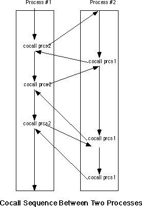

# Must read

https://devblogs.microsoft.com/pfxteam/executioncontext-vs-synchronizationcontext/

Async framework is based on queues and minimal
control: https://www.codeproject.com/Articles/5274751/Understanding-the-SynchronizationContext-in-NET-wi

Interesting Polish programming blog: 
https://cezarywalenciuk.pl/ , 
https://cezarywalenciuk.pl/blog/programing/asynchroniczny-c--synchronizationcontext-i-taskscheduler

# Thereads and base connectors

It seems that every Thread have message queue 
and some control structure (all protected by locks).
And it can be configured to some degree.

Use of this can be for providing support for logical
threads (tasks), without memory protection (as supported by OS)...


# SynchronizationContext

Exemplary usage of SynchronizationContext:
(https://stackoverflow.com/questions/18097471/what-does-synchronizationcontext-do)

```cs
SynchronizationContext originalContext = SynchronizationContext.Current;
ThreadPool.QueueUserWorkItem(delegate {
    string text = File.ReadAllText(@"c:\temp\log.txt");
    originalContext.Post(delegate {
        myTextBox.Text = text;
    }, null);
});
```


https://docs.microsoft.com/en-us/archive/msdn-magazine/2011/february/msdn-magazine-parallel-computing-it-s-all-about-the-synchronizationcontext


ISynchronizeInvoke satisfied two needs:

- determining if synchronization was necessary, and 
- queuing a unit of work from one thread to another. 


SynchronizationContext:

- Includes a way to queue a unit of work to a context. 
  - Note that this unit of work is queued to a context rather than a
    specific thread. 
  - Many implementations of SynchronizationContext aren’t based on a
    single, specific thread. 
- Does not include a mechanism to determine if synchronization is
  necessary, because this isn’t always possible.
- Every thread has a “current” context. 
  - A thread’s context isn’t necessarily unique; 
  - its context instance may be shared with other threads. 
  - It’s possible for a thread to change its current context, but this
    is quite rare.
- Keeps a count of outstanding asynchronous operations. 
  - This enables the use of ASP.NET asynchronous pages and any other
    host needing this kind of count. 
  - In most cases, the count is incremented when the current
    SynchronizationContext is captured, and 
  - the count is decremented when the captured SynchronizationContext
    is used to queue a completion notification to the context.

```cs
// important parts of class:
SynchronizationContext
{
  // Dispatch work to the context.
  void Post(..); // (asynchronously)
  void Send(..); // (synchronously)
  // Keep track of the number of asynchronous operations.
  void OperationStarted();
  void OperationCompleted();
  // Each thread has a current context.
  // If "Current" is null, then the thread's current context is
  // "new SynchronizationContext()", by convention.
  static SynchronizationContext Current { get; }
  static void SetSynchronizationContext(SynchronizationContext);
}
```

## Windows Forms and WPF Synchronization Context

Some SynchronizationContext implementations:

- library file: `System.Windows.Forms.dll:` and context class: 
  `System.Windows.Forms.WindowsFormsSynchronizationContext`.
- Library:`WindowsBase.dll`, class 
  `System.Windows.Threading.DispatcherSynchronizationContext`


https://hamidmosalla.com/2018/06/24/what-is-synchronizationcontext/

SynchronizationContext exposes several virtual methods, but let’s
focus on Post for now.:

- Post accepts a delegate, but the responsibility of determining when
  and where to run that delegate lies with the implementation of it. 
- The default implementation of SynchronizationContext.Post just
  passes it to ThreadPool via QueueUserWorkItem. 
- But frameworks can derive their own context from
  SynchronizationContext and override the Post method. 
- Windows Forms has WindowsFormsSynchronizationContext that implements
  Post and pass the delegate to Control.BeginInvoke. 
- WPF has DispatcherSynchronizationContext, it calls to
  Dispatcher.BeginInvoke


# Continuations

If you've ever done assembler, continuations are very simple. A
continuation is just a structure containing:

- A complete copy of the stack
- A snapshot of all registers (including program counter) 

To create one you just suck this stuff out of the computer. To invoke
one you just copy it all back into the hardware. The effect of
invoking a continuation is to jump the program back to the same state
as when the continuation was created, but only with regards to stack
and registers (the rest of memory is left alone).

Or, in C terms, it's like setjmp() and longjmp() except that it makes
a copy of the stack instead of just taking a pointer. Since invoking
the continuation copies a whole old stack back into memory, you can
call it at any time and as many times as you like, and it will always
take you back to the same place.

People use tricks to avoid actually copying the whole stack all the
time, but that is an implementation detail.

If you understand that explanation you may wonder what all the fuss is
about. Part of it is because continuations are often explained in
terms of DenotationalSemantics instead of assembler (but it amounts to
the same thing both ways). The other part is the hair-raising things
that you can do with them.

If you don't understand this but you do know assembler, then the
description is lacking, so please ask a question. If you don't know
any assembler then the explanation isn't for you, but they can
probably be explained easily in terms of something else that you do
know.

Discussion on realistic implementation moved and refactored to
ContinuationImplementation. 

https://wiki.c2.com/?ContinuationsAreGotos

**Continuations are snapshots of threads.**

Continuations are inactive multiply-resumable threads. So unlike
normal threads, resuming a continuation doesn't use up its power to
execute that particular piece of code. 

https://wiki.c2.com/?ContinuationExplanation

## Continuations used for async programming

https://docs.microsoft.com/en-us/dotnet/standard/parallel-programming/chaining-tasks-by-using-continuation-tasks


# Continuation Implementation

https://wiki.c2.com/?ContinuationImplementation
https://wiki.c2.com/?TheStack


## Heap allocation of ActivationRecords
    
Each activation record is a separate heap object, chained together by
a pointer to its caller. Continuation capture saves the pointer to the
current record, which prevents it and all stack frames under it from
being garbage collected. Continuation reinstatement restores the PC,
registers, and current record. 

**Advantages**: Simple to implement. Continuation capture and
reinstatement are very fast. Flexible; can also inspect and operate
upon individual stack frames. Portable. 

**Disadvantages**: Slow function calls. Puts a heavy load on the
garbage collector. (not necessarily, see
http://portal.acm.org/citation.cfm?id=345125&jmp=references&dl=portal&dl=ACM)


**Implementations**: Smalltalk (aside from optimizations),
StacklessPython, Ruby, Rebol 1.0, SISC Scheme interpreter. SML


## Copying whole stacks

Stack frames are allocated normally, but when a continuation is
captured, the whole stack is copied and saved in the continuation.
Continuation reinstatement restores the register state and sets the
stack and frame pointers to the continuation's stack. The old stack
can be deallocated or freed by the garbage collector. 

**Advantages**: Conceptually simple. No function-calling overhead.
Continuation reinstatement is reasonably fast. 

**Disadvantages**: Very expensive continuation capture. Requires
either assembly language coding, externalized stacks, or fancy C-hacks
(see below) for implementation. 

**Implementations**: Guile, Gambit Scheme (?) 


# co-routine concept

http://www.softpanorama.org/Lang/Cilorama/coroutines_in_c.shtml

Coroutines are closely connected with the notion of pipes and are
subroutines, with neither the caller nor the callee being "in charge".
Instead, they allow program-controlled interleaving of instructions
generated by both. Suppose A calls B. Then B wants to allow A to
perform some more computation. B can "resume A", which then runs until
it "resumes B". Then A can execute until it needs data from B, which
might produce part of that data, and resume A, to examine or compute
with the part produced so far.

## Explanation

http://www.softpanorama.org/Lang/Asmorama/coroutines_in_assembler.shtml

Art of Assembly: Chapter 19-3 explains co-routine concept very nicely.

DOS processes, even when using shared memory, suffer from one primary
drawback - each program executes to completion before returning
control back to the parent process. While this paradigm is suitable
for many applications, it certainly does not suffice for all. A common
paradigm is for two programs to swap control of the CPU back and forth
while executing. This mechanism, slightly different from the
subroutine call and return mechanism, is a coroutine.

Before discussing coroutines, it is probably a good idea to provide a
solid definition for the term process. 
- In a nutshell, a process is a program that is executing. 
  - A program can exist on the disk; 
  - processes exist in memory and have 
    - a program stack (with return addresses, etc.) associated with
      them. 
      - If there are multiple processes in memory at one time, each
        process must have its own program stack.

Behaviour: 
- A cocall operation transfers control between two processes. 
- A cocall is effectively a call and a return instruction all rolled
  into one operation. 
- From the point of view of the process executing the cocall, the
  cocall operation is equivalent to a procedure call; 
- from the point of view of the processing being called, the cocall
  operation is equivalent to a return operation. 
- When the second process cocalls the first, control resumes not at
  the beginning of the first process, but immediately after the cocall
  operation. 
- If two processes execute a sequence of mutual cocalls, control will
  transfer between the two processes in the following fashion:



## Assembler Implementation

Assembler implementation:

- The 80x86 CPUs do not provide a cocall instruction. 
- However, it is easy to implement cocalls with existing instructions.
- Even so, there is little need for you to supply your own cocall
  mechanism, the UCR Standard Library provides a cocall package for
  8086, 80186, and 80286 processors. 
  - This package includes the pcb (process control block) data
    structure and three functions you can call: coinit, cocall, and
    cocalll.


coroutine code preserves all registers across a cocall. This means you
cannot pass information from one process to another in the registers
when using a cocall. You will need to pass data between processes in
global memory locations. Since coroutines generally exist in the same
program, you will not even need to resort to the shared memory
techniques. Any variables you declare in your data segment will be
visible to all coroutines.

## Assembler Example

[Coroutines in Z80 assembly language](https://www-users.cs.york.ac.uk/~fisher/ped/mcp/coro.html):

```Assembly

	  .bss

stack1:	  .space  stksiz
stack2:	  .space  stksiz
coswap:	  .space  2

	  .text

# Initialization code:

	  ld	  sp,stack1+stksiz
	  ld	  hl,task2
	  ld	  (stack2+stksiz-2),hl
	  ld	  hl,stack2+stksiz-2
	  ld	  (coswap),hl
	  jp	  task1

swapco:	  ld	  hl,(coswap)
	  ld	  (coswap),sp
	  ld	  sp,hl
	  ret

# wait -- wait for N ticks, where N is number
# (in range 0 .. 127) in B reg.
#
wait:	  ld	  hl,ticks
	  ld	  a,(hl)
	  add	  a,b
wt1:	  cp	  (hl)
	  jp	  m,wt2
	  call	  swapco
	  jr	  wt1
wt2:	  ret
```

## C Implementation

The simplest way to simulate coroutines n C, is to use C's "setjmp()"
and "longjmp()" library procedures. These procedures are intended for
use in setting exception-handler routines. However, they have the
property that they create concrete realizations of a "stopped" task --
an instruction counter, along with a variable reference context is
stored when a setjmp occurs, and is resumed when a longjmp to the
saved item is performed. The longjmp(Buf, Return) causes the
setjmp(Buf) to return (again), this time returning value Return,
instead of the 0 setjmp(Buf) returns when it is called.

http://www.csl.mtu.edu/cs4411.ck/www/NOTES/non-local-goto/coroutine.html
http://www.softpanorama.org/Lang/Cilorama/coroutines_in_c.shtml


# Pipes

http://www.softpanorama.org/Scripting/pipes.shtml


# Assembler: Cooperative User-Level Threads (Coroutines)

Links:

- https://www.cs.uaf.edu/2015/fall/cs301/lecture/11_16_thread_user.html
- https://www.boost.org/doc/libs/1_53_0/libs/coroutine/doc/html/coroutine/overview.html
- https://github.com/spc476/C-Coroutines
- https://stackoverflow.com/questions/62766352/assembly-coroutines
- https://github.com/xya/coroutines/tree/master/src
- https://www.chiark.greenend.org.uk/~sgtatham/coroutines.html

Here's the 64-bit linux assembly used to switch between coroutines.
Note that because this is a function call interface, we don't need to
save any scratch registers.

```Assembly
; swap64(old,new): switch coroutines
global swap64
swap64:

; Save preserved registers to old stack
push rdi
push rbp
push rbx
push r12
push r13
push r14
push r15

; Save old stack pointer
mov [rdi],rsp
; Load new stack pointer
mov rsp,[rsi]

; Restore preserved regs from new stack
pop r15
pop r14
pop r13
pop r12
pop rbx
pop rbp
pop rdi
ret
```


